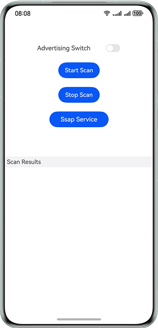
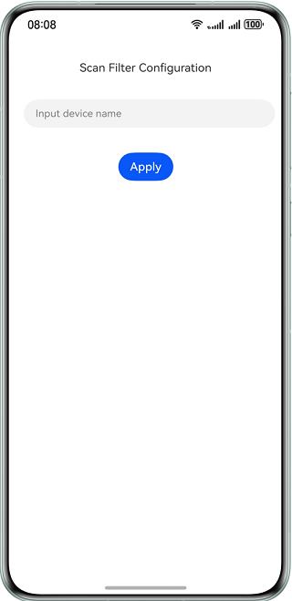
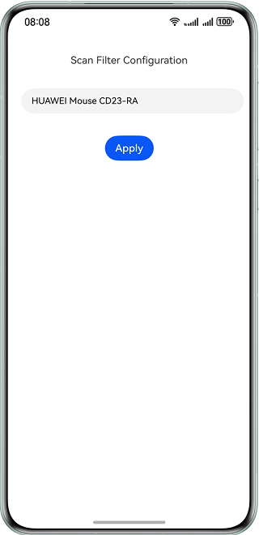
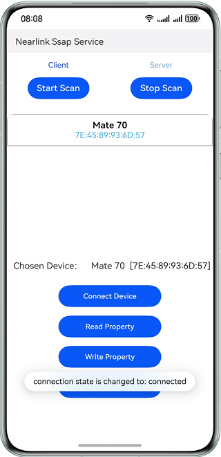

#  NearLink Kit

## Overview

This sample demonstrates how to use the advertising and scanning capabilities provided by NearLink Kit.

This sample simulates how to use the NearLink switch to activate or deactive advertising through NearLink. Tap **Start Scan** to display the scanning configuration screen. Enter the name of a device you want to detect and tap **Apply** to initiate continuous scanning. When a device with a matching name is successfully detected, its device name and MAC address will be displayed in the **Scan Results** list. Tap **Stop Scan** to stop the scanning process.

Make sure the phone in use supports NearLink, as the **@kit.NearLinkKit** API of NearLink Kit will be used.

## Preview

| App's Home Screen                            | NearLink Advertising Switch Turned On        | Scanning Configuration Screen                |
| -------------------------------------------- | -------------------------------------------- | -------------------------------------------- |
|  |  |  |

|          Name of a Specified Device          |               Scanning Result                |            Scanning Result Update            |
| :------------------------------------------: | :------------------------------------------: | :------------------------------------------: |
|  |  |  |

| Device Scanning and Connection               | SSAP Server Screen                           | Property Change Notification                 |
| -------------------------------------------- | -------------------------------------------- | -------------------------------------------- |
|  |  |  |

##  How to Use the Sample Project

###  Instruction

A phone is used as an example, and the method is similar to those for tablets and PCs/2-in-1 devices.

1. Build an app (**entry-default-signed.hap**) and install it on a phone. Taking a Huawei phone as an example, enable NearLink on the settings screen before using the app. You can go to **Settings** > **More connectivity options** > **NearLink** to complete the setting. Note that the setting path may vary across different products or system versions. You can also view or modify the name of the phone in use on this screen.
2. After NearLink is enabled, you can call the advertising or scanning API through the sample app. Tap **Start Scan** on the app's home screen and you will proceed to the scanning configuration screen where you need to enter the name of a device you want to detect.
3. Prepare another device that supports NearLink as the device to be detected. It could be a phone, mouse, stylus, keyboard, and more. Initiate NearLink advertising on this device for it to be detected (if the device is a phone, install the app and refer to step 6 to initiate advertising). You also need to enter the name of the device to be detected on the scanning configuration screen displayed in step 2.
4. Tap **Apply** to start continuous scanning. The app's home screen will then be displayed. In most cases, the device specified in step 3 will be detected, and its name and MAC address will be displayed in the **Scan Results** list, indicating that the scanning is successful.
5. Tap **Stop Scan** to stop scanning.
6. The **Advertising Switch** on the app's home screen is used to start or stop NearLink advertising. The switch is turned off by default. Toggle on **Advertising Switch** to start NearLink advertising. To stop NearLink advertising, toggle it off. After advertising is initiated, you can use another phone installed with the sample app to perform scanning (see steps 2 to 4) and capture logs, so that information such as the advertising data report **AdvertisingReport** can be obtained.
7. Tap **Ssap Service** on the home screen. The SSAP screen will be displayed, on which you can switch between the client and server. The SSAP client screen is displayed by default. You can tap **Server** to switch to the SSAP server screen. To go back to the client screen, tap **Client**.
8. Take two phones as an example. One phone functions as the SSAP client, and the other functions as the SSAP server. The client can scan for the server and proactively initiate a connection. The server initiates advertising to be detected by the client. On the SSAP client screen, you can tap **Start Scan**. The scanning configuration screen will be displayed. You can configure the scanning filter and initiate scanning by referring to steps 2 to 4. On the SSAP server screen, you can toggle on or off **Advertising Switch** to start or stop NearLink advertising by referring to step 6.
9. On the SSAP client screen, initiate scanning and set the device name of the SSAP server as the filter. On the SSAP server screen, start advertising. The name and address of the detected SSAP server device will be displayed on the SSAP client screen. Select the detected device. The selected device's information will be displayed next to **Chosen Device**. Tap **Connect Device**. The SSAP client will then initiate an SSAP connection to the selected device.
10. After the SSAP connection is established, tap **Read Property** on the SSAP client screen. The SSAP client will then send a service property read request to the SSAP server.
11. Tap **Write Property** on the SSAP client screen. The SSAP client will then send a service property write request to the SSAP server.
12. Tap **Notify Property Changed** on the SSAP server screen. The server will then send a property change notification to the client.
13. Tap **Close Client** on the SSAP client screen to close the client instance. Exit the SSAP server screen to close the server instance.

## Project Directory

```
├──entry/src/main/ets                           // Code area.
│  ├──entryability
│  │  └──EntryAbility.ets                       // Entry point class.
│  └──pages
│     ├──Index.ets                              // Screen navigation.
│     ├──MainPage.ets                           // App's home screen.
│     └──ScanConfigPage.ets                     // Scanning configuration screen.
│     └──SsapPage.ets                           // SSAP screen.
│     └──SsapClientPage.ets                     // SSAP client screen.
│     └──SsapServerPage.ets                     // SSAP server screen.
└──entry/src/main/resources                     // App resource directory.
```

## How to Implement

See **MainPage.ets** for details about the app's home screen that controls NearLink advertising and scanning.

- Set advertising parameters and call the **advertising.startAdvertising** API of the **startAdvertising()** function to send advertising data.
- Call the **advertising.stopAdvertising** API of the **stopAdvertising()** function to stop NearLink advertising.
- Call the **scan.on** API of the **onDeviceFound()** function to register a scanning callback.
- Call the **scan.off** API of the **offDeviceFound()** function to unregister a scanning callback.
- Call the **scan.stopScan** API of the **stopScan()** function to stop scanning.

See **ScanDataPage.ets** for details about the scanning configuration screen that initiates NearLink scanning.

- Obtain the scanning parameter **deviceName** and call the **scan.startScan** API of the **startScan** function to initiate scanning.

Implement the SSAP screen for NearLink connection and service property interaction, which supports switch between the SSAP client screen and SSAP server screen. For details, please refer to **SsapPage.ets**.

For details about how to implement the SSAP client screen for SSAP client functions, please refer to **SsapClientPage.ets**.

- Call the **ssap.createClient** and **Client.connect** APIs of the **connectDevice** function to create an SSAP client instance and initiate an SSAP connection.
- Call the **Client.readProperty** API of the **readProperty()** function to send a property read request to the server.
- Call the **Client.writeProperty** API of the **writeProperty()** function to send a property write request to the server.
- Call the **Client.close** API of the **closeClient()** function to close the SSAP client instance.

Similarly, implement the SSAP server screen for SSAP server functions. For details, please refer to **SsapServerPage.ets**.

- Call the **ssap.createServer** API to create a server instance.
- Call the **Server.on('propertyRead')** API to listen for property read requests from the client.
- Call the **Server.on('propertyWrite')** API to listen for property write requests from the client.
- Call the **Server.addService** API of the **addServices()** function to add the SSAP service and its properties.
- Call the **Server.notifyPropertyChanged** API to notify the client of the property value change.

## Required Permissions

NearLink access permission **ohos.permission.ACCESS_NEARLINK** is required for the sample app.

## Dependencies

The device must support NearLink.

## Constraints

1. The sample app is only supported on Huawei phones, tablets, and PCs/2-in-1 devices with standard systems.
2. The HarmonyOS version must be HarmonyOS 5.0.1 Release or later.
3. The DevEco Studio must be DevEco Studio 5.0.1 Release or later.
4. The HarmonyOS SDK must be HarmonyOS 5.0.1 Release SDK or later.

