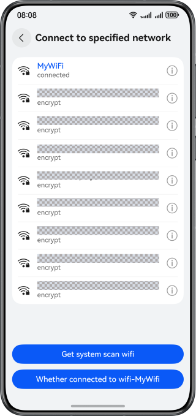
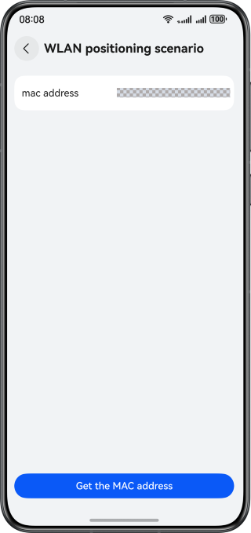
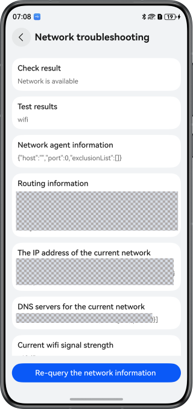

# Network Information Query

### Overview

This sample leverages Network Kit and Telephony Kit to deliver four categories of common network query capabilities. You can refer to these implementations to quickly build such features as network status detection, MAC address query, Wi-Fi list retrieval, cellular network data acquisition, and monitoring of network service and quality changes.

### Effect

| Connecting to a Specified Network           | Network State Awareness                     | WLAN Positioning                            | Network Troubleshooting                     |
|---------------------------------------------|---------------------------------------------|---------------------------------------------|---------------------------------------------|
|  |  |  |  |

**How to Use**

1. Start the application and tap buttons on the home page to access the corresponding scenario.
2. Connecting to a specified network: tap the Get system scan WiFi button at the bottom to retrieve the Wi-Fi list. Select an item from the list and enter the password in the dialog box to establish a connection. Note that the Wi-Fi list data relies on system scanning and may experience delays. You can go to the settings page to refresh the list.
3. Network status awareness: modify the network environment during video playback, such as disconnecting from the network, reconnecting, or switching between Wi-Fi and mobile data.
4. WLAN positioning: tap the bottom button, and the Wi-Fi MAC address will be displayed on the page.
5. Network troubleshooting: tap the bottom button to view the network type and route information. To diagnose network issues using speed and signal strength data, modify the TEST_DOWNLOAD_URL value in the [NetworkDiagnostics.ets](entry/src/main/ets/view/NetworkDiagnostics.ets) file. The network diagnosis results will be displayed after 10 seconds.

### Project Directory

```
├──entry/src/main/ets                           // Code area 
│  ├──common 
│  │  ├──Logger.ets                             // Logger 
│  │  ├──NetworkUtil.ets                        // Network utility class 
│  │  ├──TimeUtil.ets                           // Time format conversion utility class 
│  │  └──ToastUtil.ets                          // Toast utility class 
│  ├──component 
│  │  ├──NetInfoItem.ets                        // Network information list item 
│  │  └──WlanItem.ets                           // WLAN list item 
│  ├──entryability 
│  │  └──EntryAbility.ets                       // Entry point class 
│  ├──entrybackupability 
│  │  └──EntryBackupAbility.ets                 // Data backup and restore class 
│  ├──pages 
│  │  └──Index.ets                              // Application entry page 
│  └──view 
│     ├──NetworkDiagnostics.ets                 // Network troubleshooting 
│     ├──NetworkMonitor.ets                     // Network state awareness 
│     ├──WifiConnector.ets                      // Wi-Fi connection 
│     └──WlanLocation.ets                       // WLAN positioning 
└──entry/src/main/resources                     // Static resources
```

### How to Implement

* Use the APIs in @ohos.net.connection to retrieve network information, resolve domain names, and listen for network status.
* Use the APIs in @ohos.wifiManager (WLAN) to obtain Wi-Fi network information, Wi-Fi list, and manage Wi-Fi connection. Note that the retrieved data may be cached and thus inconsistent with real-time data. For details, see [Periodic Scan](https://developer.huawei.com/consumer/en/doc/harmonyos-guides/scan-development-guide#periodic-scan).
* Use the APIs in @ohos.telephony.radio (network search) to obtain cellular network information.

### Required Permissions

* ohos.permission.INTERNET: allows an application to access the Internet.
* ohos.permission.LOCATION: allows an application to obtain the device location.
* ohos.permission.APPROXIMATELY_LOCATION: allows an application to obtain the approximate location of a device.
* ohos.permission.GET_NETWORK_INFO: allows an application to obtain network status.
* ohos.permission.GET_WIFI_INFO: allows an application to obtain Wi-Fi information.
* ohos.permission.SET_WIFI_INFO: allows an application to configure Wi-Fi devices.

### Dependencies

N/A.

### Constraints

1. This sample is only supported on Huawei phones running standard systems.
2. The HarmonyOS version must be HarmonyOS 5.1.0 Release or later.
3. The DevEco Studio version must be DevEco Studio 5.1.0 Release or later.
4. The HarmonyOS SDK version must be HarmonyOS 5.1.0 Release SDK or later.