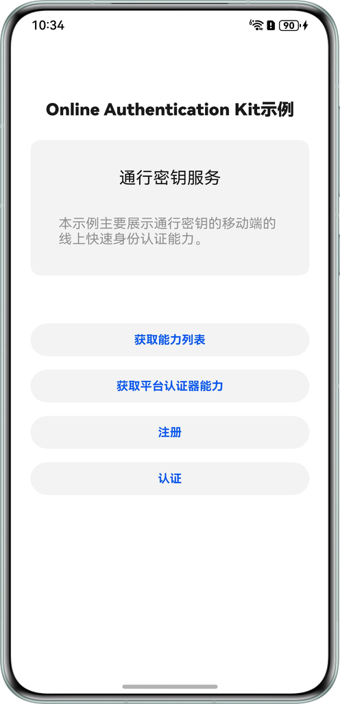
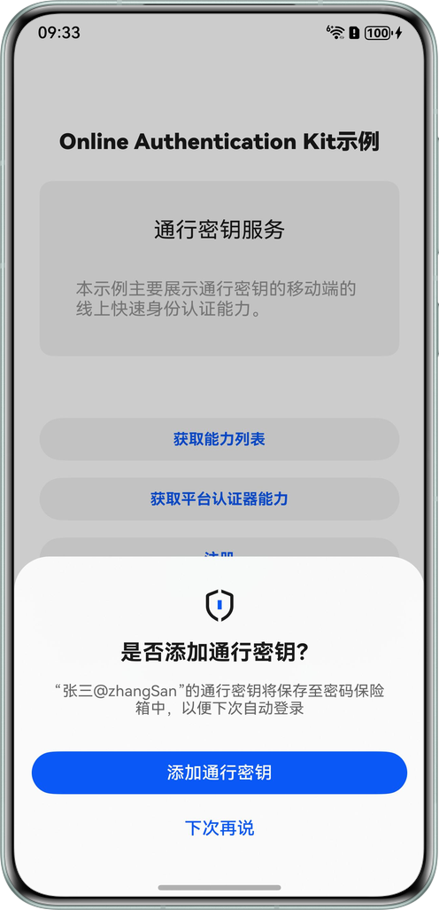

# 基于在线认证服务实现通行密钥功能（ArkTS）

## 介绍

本示例展示了通行密钥服务提供的ArkTS示例代码的使用方法，可实现基于FIDO2协议的通行密钥注册、本地免密认证和跨设备扫码认证能力。
1. 通行密钥注册：支持使用用户身份认证特征（如人脸、指纹、PIN码）作为平台认证器，在本设备上创建应用或网页的通行密钥。
2. 本地免密认证：支持使用用户身份认证特征（如人脸、指纹、PIN码）作为平台认证器，使用通行密钥在本设备上进行应用或网页的免密认证。
3. 跨设备扫码认证：支持使用已注册通行密钥的移动设备作为漫游认证器，使用跨设备扫码的方式，在其他设备上进行应用或网页的免密认证。

## 效果预览

| 应用主页                                                    | 接口使用按钮                                              |
|---------------------------------------------------------|-----------------------------------------------------|
| 应用主页显示在设备屏幕                                             | 点击接口测试按钮调用接口                                        |
|  |  |

## 工程目录
```
└── entry/src/main/ets
     ├── Pages                                                // 连接FIDO服务器，获取注册、认证、注销报文
     │    └── Index.ets                                       // 程序入口类
     └── server
          ├── Fido2NetUtil.ets                                // 连接服务器工具类
          ├── ServerAuthenticationExtensionsClientOutputs.ets // 用于构造注册参数的数据结构类
          ├── ServerAuthenticatorAssertionResponse.ets        // 用于构造认证响应参数的数据结构类
          ├── ServerAuthenticatorAttestationResponse.ets      // 用于构造注册参数的数据结构类
          ├── ServerPublicKeyCredentialCreation.ets           // 用于构造注册响应参数的数据结构类
          ├── ServerPublicKeyCredentialCreationOptions.ets    // 用于构造注册参数pkOptions的数据结构类
          ├── ServerPublicKeyCredentialDescriptor.ets         // 用于构造注册参数的数据结构类
          ├── ServerPublicKeyCredentialRequest.ets            // 用于构造认证请求参数的数据结构类
          ├── ServerPublicKeyCredentialRequestOptions.ets     // 用于构造认证请求参数的数据结构类
          └── ServerPublicKeyCredentialUserEntity.ets         // 用于构造注册参数pkOptions数据结构类
```


## 使用说明

1. 运行前需修改并指定服务器地址(entry/src/main/ets/server/Fido2NetUtil.ets)；
2. 在主界面，每次使用FIDO2功能之前，需要首先点击【获取能力列表】查看客户端当前是否支持该功能；
3. 点击【获取平台认证器能力】查看支持的平台身份验证器列表；
4. 点击【注册】进行注册，页面弹出弹窗提示注册成功；
5. 注册后，点击【认证】进行认证，页面弹出弹窗提示认证成功；


## 具体实现（接口参考@hms.security.fido2）
业务使用时，需要先进行import导入如下fido2 API:
* function getClientCapabilities(context: common.Context): Promise<Map<ClientCapability, boolean>>;
* function getPlatformAuthenticators(context: common.Context): Promise<Array<AuthenticatorMetadata>>;
* function register(context: common.Context, options: CredentialCreationOptions, tokenBinding?: TokenBinding): Promise<PublicKeyAttestationCredential>;
* function authenticate(context: common.Context, options: CredentialRequestOptions, tokenBinding?: TokenBinding): Promise<PublicKeyAssertionCredential>;

具体用例请参考Index.ets。


## 相关权限

1. 获取通行密钥服务权限：ohos.permission.ACCESS_FIDO2_ONLINEAUTH。

## 依赖

不涉及

## 约束与限制

1. 本示例仅支持标准系统上运行，支持设备：华为手机、平板、2in1；
2. 本示例需要使用DevEco Studio 6.0.0 Release才可编译运行；
3. HarmonyOS系统：HarmonyOS 6.0.0 Release及以上；
4. HarmonyOS SDK版本：HarmonyOS 6.0.0 Release SDK及以上；
5. 若使用人脸认证功能，设备须支持3D人脸；
6. 开发者的业务需要接入符合FIDO2标准的协议，并部署符合FIDO2标准协议的FIDO服务端，通行密钥服务接口仅提供FIDO2客户端能力，无法独立进行开启/认证服务；Fido2NetUtil.ets提供连云服务模板，如需连云请通过修改服务器url地址接入云端服务器。