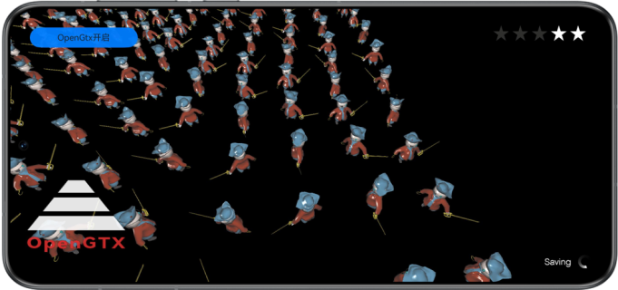

# OpenGTX -- GPU Turbo X的开放式入口

## 介绍

本示例展示了基于Graphics Accelerate Kit提供的OpenGTX API在图形绘制场景功能集成。

需要编译依赖OpenGTX的动态库libopengtx.so。

## 效果预览

|             **桌面**             |                 **主界面**                  |
|:------------------------------:|:----------------------------------------:|
|  |  |

使用说明：

1. 在手机的主屏幕，点击”OpenGTX“，启动应用，进入图形绘制场景。
2. 点击左上角，可手动开启或关闭OpenGTX功能。显示“OpenGTX开启”表示功能已开启，显示“OpenGTX关闭”表示功能已关闭。
3. 退出应用时，自动关闭OpenGTX。

## 工程目录

```
└── entry/src/main                          // 代码区
    ├── cpp
    │    ├── types/libentry
    │    │     └── index.d.ts               // native层接口注册文件
    │    ├── napi_init.cpp                  // native api层接口的具体实现函数
    │    ├── CMakeLists.txt                 // native层编译配置
    │    ├── include                        // 头文件
    │    ├── source                         // C++代码区
    │    │    ├── core.cpp                  // 核心入口，管理生命周期
    │    │    ├── renderer.cpp              // 渲染管理类的实现
    │    │    ├── scene_base.cpp            // OpenGTX基类的实现
    │    │    ├── scene_opengtx.cpp         // OpenGTX类的实现
    │    │    ├── opaque_layer_base.cpp     // 场景绘制基类的实现
    │    │    ├── opaque_layer.cpp          // 场景绘制派生类的实现
    │    │    ├── gui.cpp                   // UI绘制
    │    │    └── ...
    ├── ets
    │    ├── ability 
    │    │     └── EntryAbility.ts          // 程序入口类
    │    ├── pages 
    │    │     └── Index.ets                // 主界面
    └── resources
    │    ├── base/media                     // 图片资源
    │    │   └── logo.png
    │    ├── rawfile                        // 模型和UI资源
    │    │    └── ...
```

## 具体实现

本示例展示的功能使用了在OpenGTX定义的以下API：

* OpenGTX_Context* HMS_OpenGTX_CreateContext(OpenGTX_DeviceInfoCallback deviceInfoCallback);
* OpenGTX_ErrorCode HMS_OpenGTX_SetConfiguration(OpenGTX_Context* context, const OpenGTX_ConfigDescription* config);
* OpenGTX_ErrorCode HMS_OpenGTX_Activate(OpenGTX_Context* context);
* OpenGTX_ErrorCode HMS_OpenGTX_Deactivate(OpenGTX_Context* context);
* OpenGTX_ErrorCode HMS_OpenGTX_DispatchFrameRenderInfo(OpenGTX_Context* context, const OpenGTX_FrameRenderInfo* frameRenderInfo);
* OpenGTX_ErrorCode HMS_OpenGTX_DispatchGameSceneInfo(OpenGTX_Context* context, const OpenGTX_GameSceneInfo* gameSceneInfo);
* OpenGTX_ErrorCode HMS_OpenGTX_DispatchNetworkInfo(OpenGTX_Context* context, const OpenGTX_NetworkInfo* networkInfo);
* OpenGTX_ErrorCode HMS_OpenGTX_DestroyContext(OpenGTX_Context** context);

在场景初始化阶段调用HMS_OpenGTX_CreateContext、HMS_OpenGTX_SetConfiguration、HMS_OpenGTX_Activate等接口完成OpenGTX实例创建、属性配置和激活。
游戏切换不同游戏场景后调用HMS_OpenGTX_DispatchGameSceneInfo接口发送游戏场景信息，包含场景类型、指定帧率、调度帧率范围、当前分辨率等信息。
每帧渲染前调用HMS_OpenGTX_DispatchFrameRenderInfo接口发送游戏帧渲染信息，包含游戏主相机的位置和欧拉角。
每帧渲染前如遇到网络时延档位变化，调用HMS_OpenGTX_DispatchNetworkInfo接口发送游戏网络信息。包含服务器IP地址、网络时延等信息。

## 相关权限

不涉及。

## 依赖

不涉及。

## 约束与限制

1. 本示例仅支持标准系统上运行，支持设备：华为手机、平板设备。
2. HarmonyOS系统：HarmonyOS Next Developer Beta1及以上。
3. DevEco Studio版本：DevEco Studio Next Developer Beta1及以上。
4. HarmonyOS SDK版本：HarmonyOS Next  Developer Beta1及以上。

