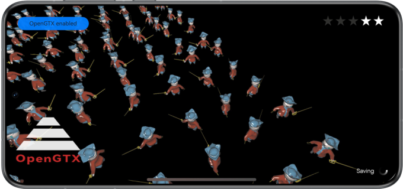

# Open GPU Turbo X (OpenGTX)

## Overview

This sample code illustrates how to implement the OpenGTX capability in graphics rendering scenes based on the OpenGTX APIs provided by Graphics Accelerate Kit.

You need to compile the dependency on the dynamic library **libopengtx.so**.

## Preview

|             **Home screen**            |                 **App UI**                 |
|:------------------------------:|:----------------------------------------:|
|  |  |

Instructions:

1. On the home screen of a mobile phone, tap **OpenGTX** to start the app.
2. Tap the button in the upper left corner to manually enable or disable the OpenGTX capability. If **OpenGTX enabled** is displayed, the capability is enabled. If **OpenGTX disabled** is displayed, the capability is disabled.
3. When you exit the app, the OpenGTX capability is automatically disabled.

## Project Directory

```
└── entry/src/main                          // Code area
    ├── cpp
    │    ├── types/libentry
    │    │     └── index.d.ts               // API registration file at the native layer
    │    ├── napi_init.cpp                  // Functions of APIs at the native layer
    │    ├── CMakeLists.txt                 // Compilation configurations at the native layer
    │    ├── include                        // Header files
    │    ├── source                         // C++ code area
    │    │    ├── core.cpp                  // Core entry for lifecycle management
    │    │    ├── renderer.cpp              // Rendering management class implementation
    │    │    ├── scene_base.cpp            // OpenGTX base class implementation
    │    │    ├── scene_opengtx.cpp         // OpenGTX class implementation
    │    │    ├── opaque_layer_base.cpp     // Base class implementation for scene drawing
    │    │    ├── opaque_layer.cpp          // Derived class implementation for scene drawing
    │    │    ├── gui.cpp                   // UI drawing
    │    │    └── ...
    ├── ets
    │    ├── ability 
    │    │     └── EntryAbility.ts          // Entry point class
    │    ├── pages 
    │    │     └── Index.ets                // App UI
    └── resources
    │    ├── base/media                     // Image resources
    │    │   └── logo.png
    │    ├── rawfile                        // Model and UI resources
    │    │    └── ...
```

## How to Implement

The sample code uses the following APIs defined for the OpenGTX capability:

* OpenGTX_Context* HMS_OpenGTX_CreateContext(OpenGTX_DeviceInfoCallback deviceInfoCallback);
* OpenGTX_ErrorCode HMS_OpenGTX_SetConfiguration(OpenGTX_Context* context, const OpenGTX_ConfigDescription* config);
* OpenGTX_ErrorCode HMS_OpenGTX_Activate(OpenGTX_Context* context);
* OpenGTX_ErrorCode HMS_OpenGTX_Deactivate(OpenGTX_Context* context);
* OpenGTX_ErrorCode HMS_OpenGTX_DispatchFrameRenderInfo(OpenGTX_Context* context, const OpenGTX_FrameRenderInfo* frameRenderInfo);
* OpenGTX_ErrorCode HMS_OpenGTX_DispatchGameSceneInfo(OpenGTX_Context* context, const OpenGTX_GameSceneInfo* gameSceneInfo);
* OpenGTX_ErrorCode HMS_OpenGTX_DispatchNetworkInfo(OpenGTX_Context* context, const OpenGTX_NetworkInfo* networkInfo);
* OpenGTX_ErrorCode HMS_OpenGTX_DestroyContext(OpenGTX_Context** context);

In the scene initialization phase, call the **HMS_OpenGTX_CreateContext**, **HMS_OpenGTX_SetConfiguration**, and **HMS_OpenGTX_Activate** APIs to create an OpenGTX context instance, set attributes, and activate the OpenGTX context instance.
After game scene switchover, call the **HMS_OpenGTX_DispatchGameSceneInfo** API to send game scene information, including the scene type, specified frame rate, frame rate range, and current resolution.
Before the rendering of each frame, call the **HMS_OpenGTX_DispatchFrameRenderInfo** API to send game frame rendering information, including the position and Euler angle of the main camera.
If the network latency level changes before each frame is rendered, call the **HMS_OpenGTX_DispatchNetworkInfo** API to send game network information, including the server IP address and network latency.

## Required Permissions

None

## Dependencies

None

## Constraints

1. The sample app is only supported on Huawei phones and tablets with standard systems.
2. The HarmonyOS version must be HarmonyOS Next Developer Beta1 or later.
3. The DevEco Studio version must be DevEco Studio Next Developer Beta1 or later.
4. The HarmonyOS SDK version must be HarmonyOS Next Developer Beta1 or later.
