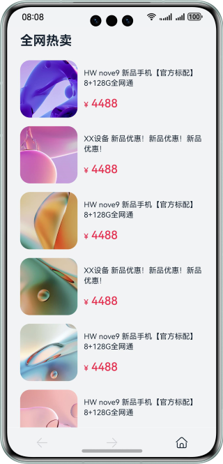
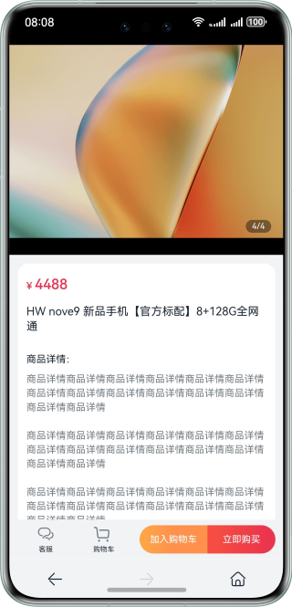

# HTML5 Page Redirection

### Overview

This sample shows how to redirect between an HTML5 page and an ArkTS native page based on the ArkUI framework and web.

### Preview

| Product List                            | Product Details                          | Order confirmation                           |
| --------------------------------------- | ---------------------------------------- | -------------------------------------------- |
|  |  |  |

### How to Use

1. Start the app and view the product list.

2. Click a product to view its details.

3. On the product details page, tap the **Back** button or the **Home** button at the bottom to return to the product list. Then, tap the **Next** button at the bottom to go to the product details page.

4. On the product details page, tap **Buy Now** and view the order confirmation page.

### Project Directory

```
├──entry/src/main/ets                           // Code
│  ├──common
│  │  ├──constants   
│  │  │  └──CommonConstants.ets                 // Constants
│  │  └──utils   
│  │     └──Logger.ets                          // Logging utility  
│  ├──entryability
│  │  └──EntryAbility.ets
│  ├──model
│  │  └──ProductModel.ets                       // Product model
│  └──pages
│     ├──IndexPage.ets                          // Home page
│     └──OrderConfirmPage.ets                   // Order confirm page
└──entry/src/main/resources                     // Resources
```

### Required Permissions

N/A

### Dependencies

N/A

### Constraints

1. The sample is only supported on Huawei phones with standard systems.

2. The HarmonyOS version must be HarmonyOS 5.0.5 Release or later.

3. The DevEco Studio version must be DevEco Studio 5.0.5 Release or later.

4. The HarmonyOS SDK version must be HarmonyOS 5.0.5 Release SDK or later.
