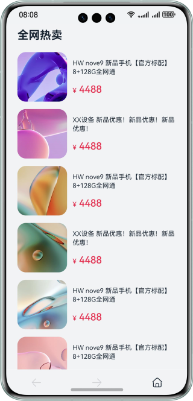
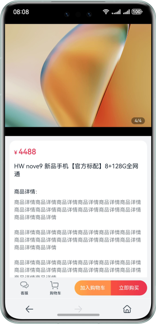
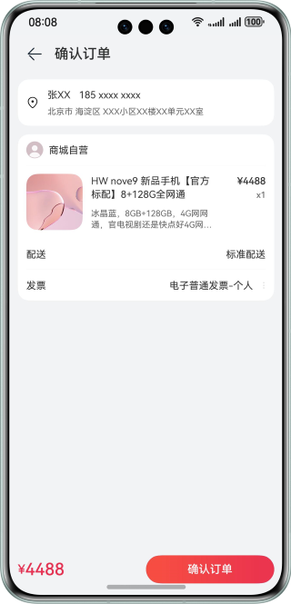

# 基于Web组件实现ArkTS页面与H5页面间跳转的功能

### 介绍

本示例基于ArkUI框架和Web实现了H5页面和ArkTS界面之间的相互跳转。帮助开发者在Web页面开发中掌握H5页面加载，H5页面跳转，H5页面与ArkTS页面参数传递等功能的实现方案。

### 效果预览

| 商品列表                                    | 商品详情                                     | 订单确认                                      |
| --------------------------------------- | ---------------------------------------- | ----------------------------------------- |
|  |  |  |

使用说明

1. 启动应用，查看商品列表。

2. 点击某个商品，查看商品详情。

3. 在商品详情页点击底部返回按钮或者首页按钮返回到商品列表，此时点击底部前进按钮进入商品详情。

4. 在商品详情页点击立即购买按钮，查看订单确认页面。

### 工程目录

```
├──entry/src/main/ets                           // 代码区
│  ├──common
│  │  ├──constants   
│  │  │  └──CommonConstants.ets                 // 常量
│  │  └──utils   
│  │     └──Logger.ets                          // 日志打印  
│  ├──entryability
│  │  └──EntryAbility.ets
│  ├──model
│  │  └──ProductModel.ets                       // 产品模型
│  └──pages
│     ├──IndexPage.ets                          // 首页页面
│     └──OrderConfirmPage.ets                   // 订单确认页面
└──entry/src/main/resources                     // 资源文件夹
```

### 相关权限

不涉及。

### 依赖

不涉及。

### 约束与限制

1. 本示例仅支持标准系统上运行，支持设备：华为手机。

2. HarmonyOS系统：HarmonyOS 5.0.5 Release及以上。

3. DevEco Studio版本：DevEco Studio 5.0.5 Release及以上。

4. HarmonyOS SDK版本：HarmonyOS 5.0.5 Release SDK及以上。
