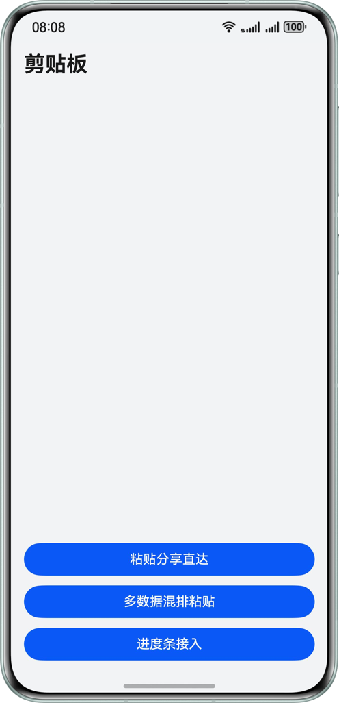
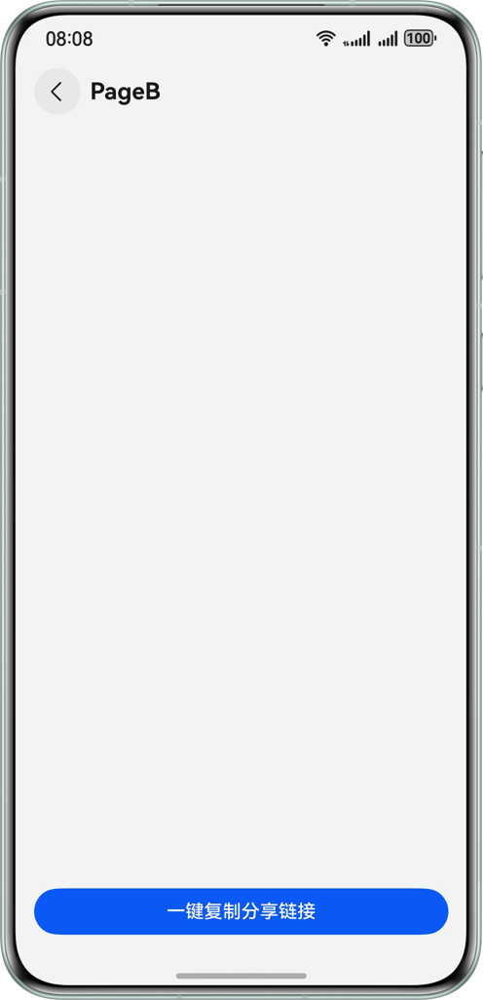
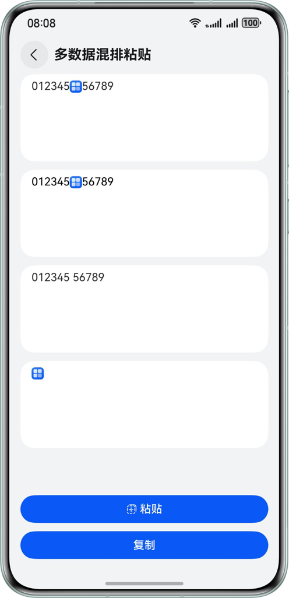
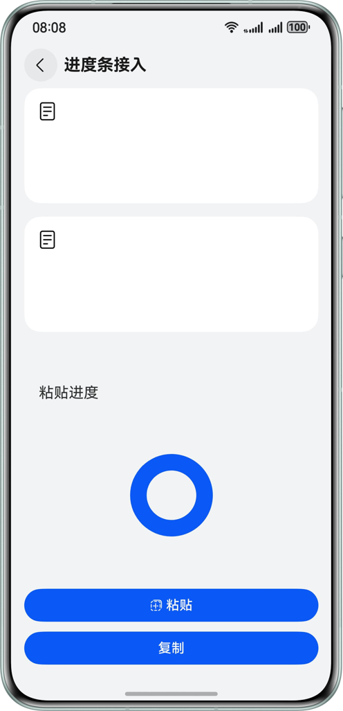

# 实现剪切板复制粘贴的功能

### 介绍

本示例使用PasteButton和@ohos.pasteboard实现剪贴板基本的复制粘贴功能，帮助开发者掌握系统控件PasteButton的使用，了解@ohos.pasteboard接口的相关用法。

### 效果预览

| 首页                                    | 复制分享链接                                 | 多数据混排页                                             | 进度条接入页                                    |
|---------------------------------------|----------------------------------------|----------------------------------------------------|-------------------------------------------|
|  |  |  |  |

### 工程目录

```
├──entry/src/main/ets                     // 代码区
│  ├──common
│  │  ├──CommonConstants.ets              // 常量类
│  │  └──Logger.ets                       // 日志类
│  ├──entryability
│  │  └──EntryAbility.ets                 // 程序入口类
│  ├──entrybackupability
│  │  └──EntryBackupAbility.ets           
│  └──pages
│     ├──Home.ets                         // 首页
│     ├──PageA.ets                        // PageA
│     ├──PageB.ets                        // PageB
│     ├──PasteBoard.ets                   // 多数据混排粘贴页
│     ├──ProgressBar.ets                  // 进度条接入页
│     └──ShareDitect.ets                  // 粘贴分享直达页
└──entry/src/main/resources               // 应用静态资源目录
```

### 使用说明

1. 进入首页，点击多数据混排粘贴按钮，进入多数据混排粘贴页。
2. 点击第一个富文本输入区域，可修改富文本内容，点击复制，将富文本内容存入系统剪贴板，本端或跨端点击粘贴，读取系统剪贴板内容，并将数据分别写入第二个富文本粘贴区，第三个纯文本粘贴区，第四个纯图片粘贴区。
3. 进入首页，点击进度条接入按钮，进入进度条接入页。
4. 点击复制，创建一个2MB的文件写入沙箱路径并存入系统剪贴板，本端或跨端点击粘贴，获取剪贴板的内容和进度。
5. 进入首页，点击粘贴分享直达按钮，进入粘贴分享直达页。
6. 进入粘贴分享直达页，点击Page A或Page B按钮，进入PageA或PageB页。
7. 点击一键复制分享链接，将页面路由地址存入系统剪贴板，本端或跨端进入app时，弹出提示”即将读取剪贴板链接并跳转“的弹窗。
8. 点击跳转，跳转至系统剪贴板存储的页面路由页。

（注：弹窗授权获取剪贴板权限只与读取剪贴板链接并跳转功能有关，其他功能为粘贴控件实现，不受弹窗授权影响。）


### 相关权限

ohos.permission.READ_PASTEBOARD：是受限的user_grant（用户授权）权限，使用自定义控件的应用可以通过申请该权限，在用户授权的场景下访问剪贴板内容。使用“粘贴控件”访问剪贴板内容的应用，可以无需申请权限。

权限申请步骤：

1. 通过ACL方式，申请高级别权限。（具体可参考官网[使用ACL的签名配置指导](https://developer.huawei.com/consumer/cn/doc/harmonyos-guides/ide-signing#section26216104250)）

2. 在module.json5配置文件中声明权限。

3. 通过弹窗向用户申请权限。


### 约束与限制

1. 本示例仅支持标准系统上运行，支持设备：手机、平板、PC/2in1。
2. HarmonyOS系统：HarmonyOS 5.0.5 Release及以上。
3. DevEco Studio版本：DevEco Studio 5.0.5 Release及以上。
4. HarmonyOS SDK版本：HarmonyOS 5.0.5 Release SDK及以上。
5. 双端设备需登录同一个华为账号。
6. 双端设备需打开WiFi和蓝牙开关。
7. 双端设备在过程中需解锁、亮屏。
8. 跨设备复制的数据两分钟内有效。