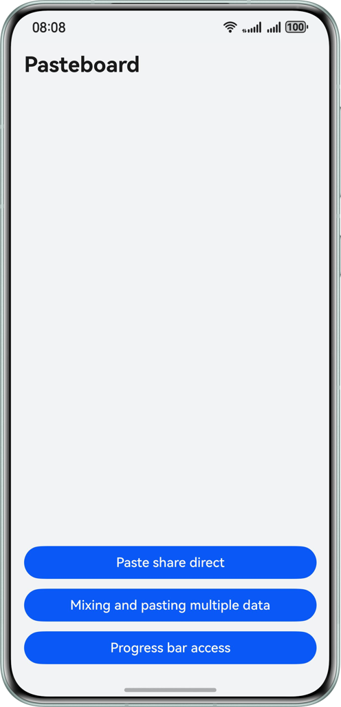
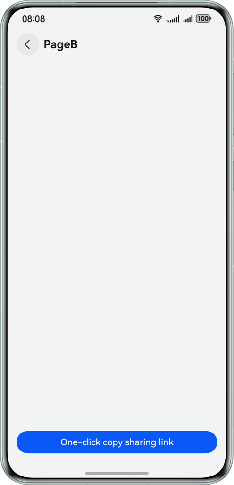
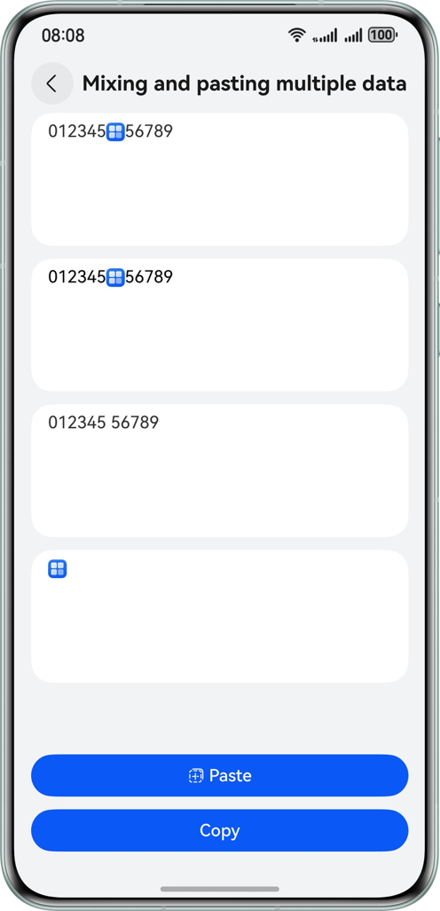
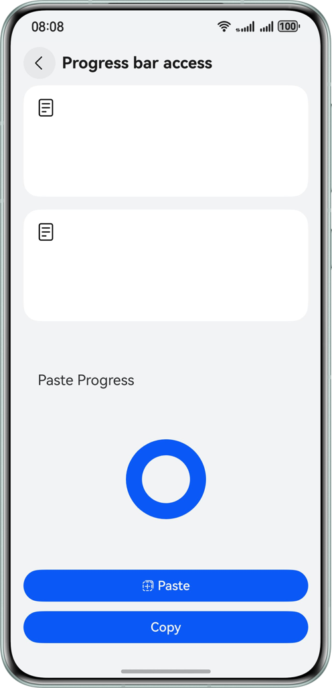

# Pasteboard

### Overview

This sample uses the **PasteButton** component and the interfaces provided by @ohos.pasteboard to implement the basic copy and paste functions of the pasteboard.

### Preview

| Home                                     | Share Direct                              | Multi-data mixed page                                 | Progress bar access page                     |
|------------------------------------------|-------------------------------------------|-------------------------------------------------------|----------------------------------------------|
|  |  |  |  |


### Project Directory

```
├──entry/src/main/ets                     // Core code
│  ├──common
│  │  ├──CommonConstants.ets              // Common constants
│  │  └──Logger.ets                       // log
│  ├──entryability
│  │  └──EntryAbility.ets                 // Entry ability
│  ├──entrybackupability
│  │  └──EntryBackupAbility.ets           
│  └──pages
│     ├──Home.ets                         // Home page
│     ├──PageA.ets                        // PageA
│     ├──PageB.ets                        // PageB
│     ├──PasteBoard.ets                   // Multi-data mixed paste page
│     ├──ProgressBar.ets                  // Progress bar access page
│     └──ShareDitect.ets                  // Paste Share Direct Page
└──entry/src/main/resources               // Static resources
```

### How to Use

1. On the home page, click Paste Multi-Data. The Paste Multi-Data page is displayed.
2. Click the first rich text format input area to modify the rich text content. Click Copy to save the rich text content to the system clipboard. Click Paste to read the system clipboard content and write the data to the second rich text input area.
3. On the home page, click the progress bar access button. The progress bar access page is displayed.
4. Click Copy to create a 2 MB file, write it to the sandbox path, and save it to the system clipboard. Click Paste on the local end or cross-end to obtain the clipboard content and progress.
5. Go to the home page and click the paste sharing direct button to enter the paste sharing direct page.
6. Go to the direct page for pasting and sharing, and click Page A or Page B to go to Page A or Page B.
7. Click the one-click copy sharing link and save the page route address to the system clipboard. When you access the app locally or across devices, a dialog box is displayed, indicating that the clipboard link is about to be read and redirected.
8. Click Jump to go to the page routing page stored in the system clipboard.


### Required Permissions

ohos.permission.READ_PASTEBOARD: restricted user_grant (user authorization) permission. Applications using custom control can apply for this permission to access clipboard content with user authorization. You do not need to apply for permission to access applications that use the Paste Control to access the contents of the clipboard.


### Constraints

1. The sample app is supported only on Huawei phones running the standard system.
2. The HarmonyOS version must be HarmonyOS 5.0.5 Release or later.
3. The DevEco Studio version must be DevEco Studio 5.0.5 Release or later.
4. The HarmonyOS SDK version must be HarmonyOS 5.0.5 Release or later.
5. Dual end devices need to log in to the same Huawei account.
6. Dual end devices require WiFi and Bluetooth switches to be turned on.
7. Dual end devices need to be unlocked and the screen lit during the process.
8. Data replicated across devices is valid within two minutes.
