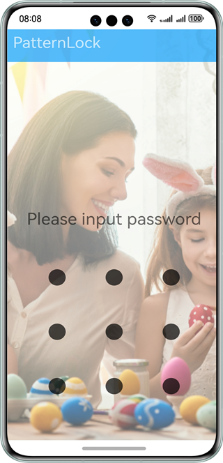
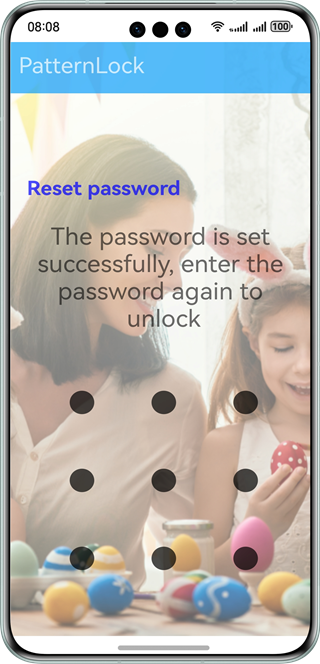
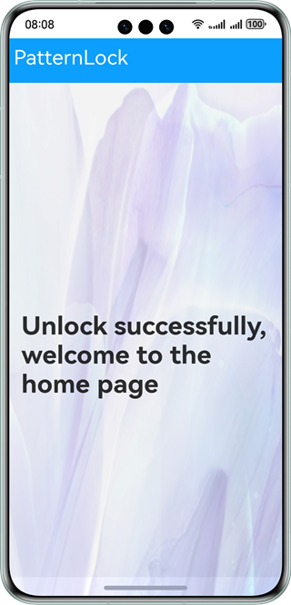

# Pattern Lock Component

### Overview

This sample shows how to use the **<PatternLock>** component to implement password setting, verification, and resetting.

The **<PatternLock>** component allows users to use a pattern password for authentication. It enters the input state once being touched, and exits the input state and sends the entered password to the application once the finger leaves the screen. 

The **@ohos.data.preferences** API is used to asynchronously obtain user-set passwords.


### Preview
| Password setting page                           | Password input                           | Home page                               |
|-------------------------------------------------|------------------------------------------|-----------------------------------------|
|  |  |  |

### How to Use

1. You need to set the password upon the first login. Enter the same password twice and tap **Set password** to set the password. If the password entered for the second time is different from that entered for the first time, the system prompts you to enter the password again.

2. After the password is set, you need to enter the password to unlock the app. After you exit the app and access the app again, you need to enter the password again for verification. After the password is verified, the home page is displayed.

3. After the password is set, the **Reset password** button is displayed on the password input page. After you touch the button, you need to enter the old password. After the old password is verified, you can set a new password. 

### Project Directory

```
├──entry/src/main/ets/
│  ├──common
│  │  └──CommonConstants.ets             // Common constants    
│  ├──entryability
│  │  └──EntryAbility.ets   
│  ├──pages
│  │  ├──Home.ets                        // Home page displayed after the password is input successfully
│  │  └──Index.ets                       // Password lock page that defines the password verification logic
│  ├──utils
│  │  ├──Logger.ets                      // Log file
│  │  └──PreferencesUtils.ets            // Define a user's saved password
│  └──view
│     └──TitleBar.ets                    // Title bar
└──entry/src/main/resources              // Static resources
```

### How to Implement

* Define the password lock component in **pages/Home.ets**. Define two variables **isHasPass** (indicating whether a password has been set) and **isReset** (indicating whether to reset the password).
* Password verification is classified into the following types. For details about the source code, see [Source code] (entry/src/main/ets/pages/Home.ets).
  1. When a user accesses the page for the first time, call **preferences.getPreferences()** through **aboutToAppear()** to obtain the password. In this case, the value of **defaultPassword** is **null** and the value of **isHassPass** is **false**. The user needs to set and confirm the password.
  2. If the password has been set, call **preferences.getPreferences()** through **aboutToAppear()** to obtain the password. In this case, the value of **defaultPassword** is **oldPassword**, and the value of **isHassPass** is **true**. Call **text()** to reset the password.
     A user has to input the password and compare it with **defaultPassword**. If the password is correct, the corresponding page is displayed. If the password is incorrect, the user has to input the password again.
  3. Tap **Reset Password**. The component clears the old password, that is, the value of **defaultPassword** is **null**. In this case, there is no password, which means no password needs to be input for the first login.
* In **pages/index.ets**, define the home page displayed after the password is passed. For details, see [Source Code](entry/src/main/ets/pages/Index.ets).

### Required Permissions

N/A

### Dependencies

N/A

### Constraints

1. The sample app is supported only on Huawei phones running the standard system.

2. The HarmonyOS version must be HarmonyOS 5.0.5 Release or later.

3. The DevEco Studio version must be DevEco Studio 5.0.5 Release or later.

4. The HarmonyOS SDK version must be HarmonyOS 5.0.5 Release SDK or later.
