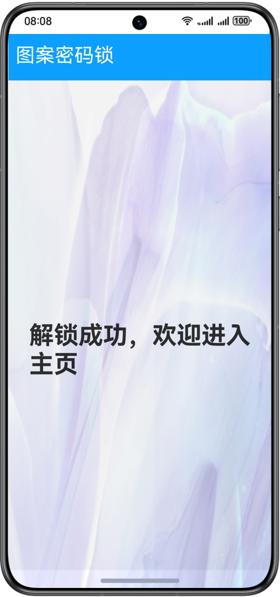

# 实现图案密码锁功能

### 介绍

本示例展示了图案密码锁组件的使用，实现了密码设置、验证和重置功能。

图案密码锁组件：以宫格图案的方式输入密码，用于密码验证。手指触碰图案密码锁时开始进入输入状态，手指离开屏幕时结束输入状态并向应用返回输入的密码。  

使用到用户首选项接口@ohos.data.preferences 异步获取用户设定过的密码。


### 效果预览
| 设置密码页                                        | 输入密码页                                 | 主页                                   |
|----------------------------------------------|---------------------------------------|--------------------------------------|
|  |  |  |

使用说明：

1.首次进入时需要设置密码，需要两次输入密码相同后点击**设置密码**进行设置，如果第二次输入密码和第一次输入密码不同，会提示重新输入。

2.设置密码后，需要输入密码解锁，退出应用后重新进入应用，需要再次输入密码验证，密码验证成功进入主页。

3.设置密码后，在输入密码界面有**重置密码**按钮，点击后需要输入旧密码，旧密码验证成功后开始设置新的密码。  

### 工程目录

```
├──entry/src/main/ets/
│  ├──common
│  │  └──CommonConstants.ets             // 常量    
│  ├──entryability
│  │  └──EntryAbility.ets   
│  ├──pages
│  │  ├──Home.ets                        // 输入密码成功后进入的首页页面
│  │  └──Index.ets                       // 密码锁页面，定义密码验证逻辑
│  ├──utils
│  │  ├──Logger.ets                      // 日志文件
│  │  └──PreferencesUtils.ets            // 定义用户存过的密码
│  └──view
│     └──TitleBar.ets                    // 标题栏组件
└──entry/src/main/resources              // 应用静态资源目录
```

### 具体实现
* 在pages/Home.ets中定义密码锁组件，通过定义两个变量isHasPass：是否已经设过密码;isReset：是否需要重置密码;
* 密码验证分为几种情况：[源码](entry/src/main/ets/pages/Home.ets) 参考。
  1. 首次进入页面， 通过aboutToAppear()初始化调用preferences.getPreferences()获取密码，此时defaultPassword='null'，isHassPass=false，需设置密码并确认密码；
  2. 已经设过密码： 通过aboutToAppear()初始化调用preferences.getPreferences()获取密码，此时defaultPassword='oldPassword'，isHassPass=true，页面渲染重置密码text()。
     需输入密码和defaultPassword比较，正确后跳转相应页面，若失败提示密码错误，需重新输入密码。
  3. 点击重置密码，此时组件清除旧密码，即defaultPassword='null'，此时无密码，走首次无密码流程。
* 在pages/index.ets中定义密码通过后的首页页面，[源码](entry/src/main/ets/pages/Index.ets) 参考。

### 相关权限

不涉及。

### 依赖

不涉及。

### 约束与限制

1.本示例仅支持标准系统上运行，支持设备：华为手机。

2.HarmonyOS系统：HarmonyOS 5.0.5 Release及以上。

3.DevEco Studio版本：DevEco Studio 5.0.5 Release及以上。

4.HarmonyOS SDK版本：HarmonyOS 5.0.5 Release SDK 及以上。