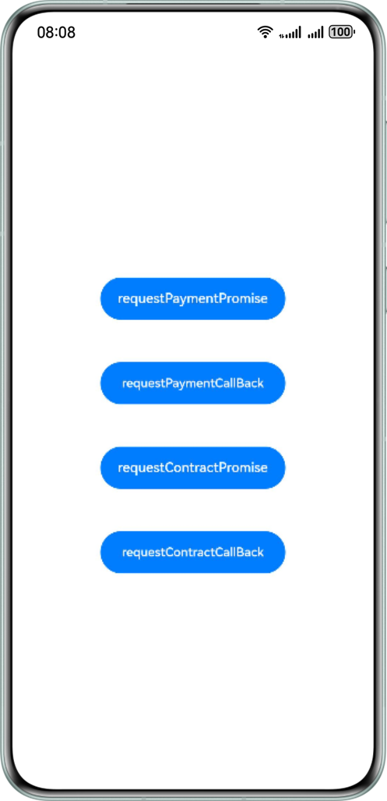
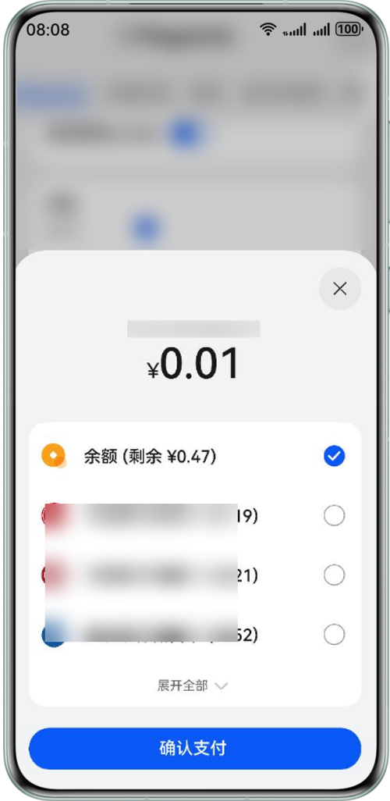
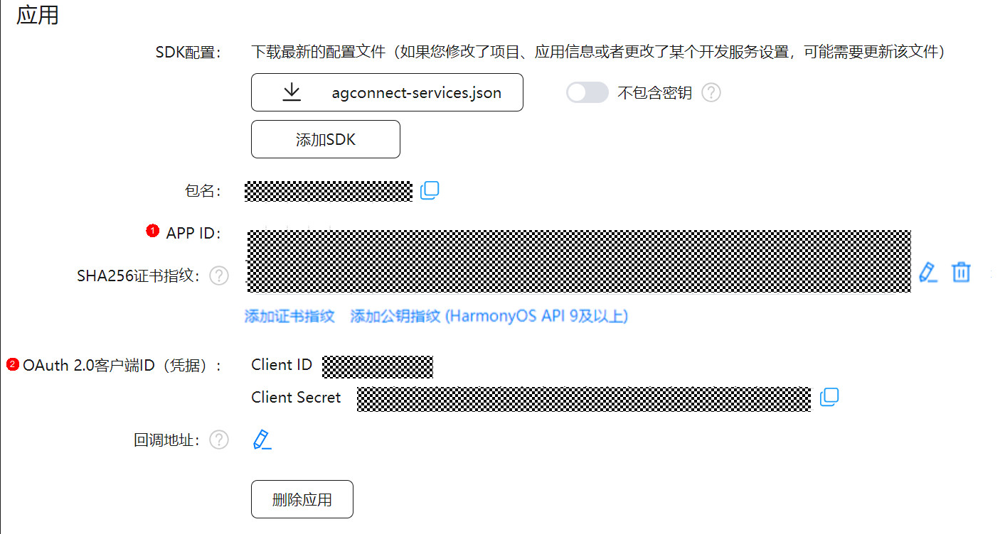

# 实现应用实物支付能力-客户端

## 介绍

本示例展示了使用鸿蒙支付服务提供的单次支付，签约代扣。

需要使用鸿蒙支付服务接口 **@kit.PaymentKit**。

## 效果预览

| **示例应用主页面**           | **支付页面**             |
|-----------------------|-------------------------|
|  |  |

## Sample工程的配置与使用

### 在DevEco中配置Sample工程的步骤如下

1. [创建项目](https://developer.huawei.com/consumer/cn/doc/app/agc-help-createproject-0000001100334664)及[应用](https://developer.huawei.com/consumer/cn/doc/app/agc-help-createapp-0000001146718717)。
2. 打开Sample应用，使用[AppGallery Connect](https://developer.huawei.com/consumer/cn/service/josp/agc/index.html)应用的包名替换app.json5文件中的bundleName属性值。
3. 使用[AppGallery Connect](https://developer.huawei.com/consumer/cn/service/josp/agc/index.html)应用的配置更新module.json5文件相关配置，配置client_id及app_id属性值。
4. 详细可参见指南[开发准备](https://developer.huawei.com/consumer/cn/doc/harmonyos-guides/payment-preparations-0000001716034257)。

## 工程目录
```
entry
  └─src                     
    ├─main                
    │  ├─ets              
    │  │  ├─entryability      // 程序入口类
    │  │  └─pages             // 入口界面
    │  └─resources        
    │      ├─base         
    │      │  ├─element       // 颜色、字体、字符串等资源
    │      │  ├─media         // 图片等资源  
    │      │  └─profile       // 页面配置
```  

## 具体实现
单次支付：
- 商户服务器按照商户模型调用Payment Kit提供的[直连商户预下单](https://developer.huawei.com/consumer/cn/doc/harmonyos-references/payment-prepay)或[服务商/平台类商户预下单](https://developer.huawei.com/consumer/cn/doc/harmonyos-references/payment-agent-prepay)接口获取预下单号（prepayId），然后组建orderStr返回给客户端。
- 商户客户端调用requestPayment接口调起Payment Kit客户端收银台。
- 用户在Payment Kit客户端收银台完成支付操作后，Payment Kit客户端会收到支付结果信息。
- Payment Kit客户端展示支付结果页，用户关闭支付结果页后Payment Kit客户端会返回支付状态给商户客户端。

签约代扣：
- 商户服务器按照商户模型调用Payment Kit提供的[预签约](https://developer.huawei.com/consumer/cn/doc/harmonyos-references/payment-withhold-presign)接口获取预签约号（preSignNo），然后返回给客户端。
- 商户客户端构建contractStr参数，调用requestContract接口调起Payment Kit客户端签约收银台。
- 用户在Payment Kit客户端签约收银台完成签约操作后，Payment Kit客户端会收到签约结果信息。
- Payment Kit客户端展示签约结果页，用户关闭签约结果页后Payment Kit客户端会返回商户客户端。
- 签约完成后，Payment Kit服务器会调用回调接口返回签约结果信息给商户服务器。
- 商户服务器收到签约结果回调响应后，使用SM2验签方式对签约结果进行验签。
- 签约完成后，商户服务器可以调用Payment Kit提供的[申请免密代扣接口](https://developer.huawei.com/consumer/cn/doc/harmonyos-references/payment-withhold-apply-0000001833301829)，完成扣款服务。

参考
1. entry/src/main/ets/pages/Index.ets

## 依赖
1. AppScope/app.json5下"bundleName"配置需要与您在[AppGallery Connect](https://developer.huawei.com/consumer/cn/service/josp/agc/index.html)中[创建应用](https://developer.huawei.com/consumer/cn/service/josp/agc/index.html)时的包名保持一致。
2. 您需要更新entry/src/main/module.json5文件中的[module -> metadata]配置项：
   - 其中app_id的“value”的值为开发者的APP ID（在AppGallery Connect网站点击“我的项目”，在项目列表中找到您的项目，在“项目设置 > 常规”页面的“应用”区域获取“APP ID”的值），详见下图的标号1处。
   - 其中client_id的“value”的值为开发者的OAuth 2.0客户端ID（在AppGallery Connect网站点击“我的项目”，在项目列表中找到您的项目，在“项目设置 > 常规”页面的“应用”区域获取“OAuth 2.0客户端ID（凭据）：Client ID”的值），详见下图的标号2处。
   
   | **AppGallery Connect 应用页面** |
   |-------------------------------|
   |  | 

   配置内容示例如下：
   ```xml
   {
       "module": {
           // ...
           "metadata": [
               {
                   "name": "app_id",
                   "value": "***"
               },
               {
                   "name": "client_id",
                   "value": "***"
               }
          ]
       }
   }
   ```

3. Index组件中的orderStr需要替换成自己的订单数据,contractStr需要替换成自己的签约信息数据。

## 约束与限制
1. HarmonyOS系统：HarmonyOS Next Developer Beta1及以上。
2. DevEco Studio版本：DevEco Studio Next Developer Beta1及以上。
3. HarmonyOS SDK版本：HarmonyOS Next Developer Beta1及以上。
