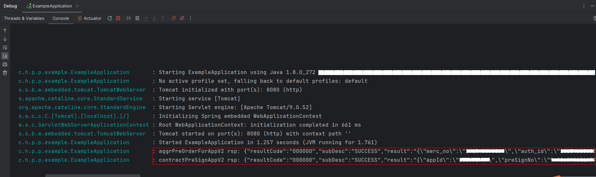

# 实现应用实物支付能力-服务端

## 介绍
华为支付云侧接口 Java SDK Sample。

官方 Java 语言开发库`pay-java`由 `core` 和 `service` 组成：
- `core` 为基础库。包含自动签名和验签的 HTTP 客户端、回调处理、加解密库。
- `service` 为业务服务。基于业务场景提供不同的业务类，其下的方法为对应的http接口。

本示例展示通过`pay-java`请求支付`预下单`，`预签约`API接口并对`回调通知`和`敏感信息加解密`等其他内容进行说明。

需要使用到的接口：
1. 预下单:/api/v2/aggr/preorder/create/app  （参考[直连商户-预下单](https://developer.huawei.com/consumer/cn/doc/harmonyos-references/payment-prepay)）
2. 预签约:/api/v2/contract/presign/app （参考[直连商户-预签约](https://developer.huawei.com/consumer/cn/doc/harmonyos-references/payment-withhold-presign)）
3. 更多接口详细查看：[鸿蒙支付服务API参考](https://developer.huawei.com/consumer/cn/doc/harmonyos-references/payment-rest)

## 效果预览

| **运行成功日志输出**      |
|------------------------|
|  |

## demo工程的配置与使用

### 配置demo工程的步骤如下

1. 配置好java环境：JDK 1.8及以上。
2. 配置好Maven集成环境。
3. 获取商户配置后将配置添加到配置文件petalpayconfig.properties。
4. 启动demo工程：src/main/java/com.huawei.petalpay.paymentservice.example/ExampleApplication.java
5. 详细可参见指南[开发准备](https://developer.huawei.com/consumer/cn/doc/harmonyos-guides/payment-server-connect)。

## 工程目录
```
pay-example
    └─src
        ├─main
        │  ├─java
        │  │  └─com
        │  │      └─huawei
        │  │          └─petalpay
        │  │              └─paymentservice
        │  │                  └─example
        │  │                      ├─common        // 通用类包
        │  │                      └─controller    // 程序接口类包
        │  └─resources                    // 资源目录
        └─test                            // 测试类目录
```

## 具体实现
### 预下单
- 商户服务器按照商户模型调用华为支付提供的[直连商户预下单](https://developer.huawei.com/consumer/cn/doc/harmonyos-references/payment-prepay)或[服务商/平台类商户预下单](https://developer.huawei.com/consumer/cn/doc/harmonyos-references/payment-agent-prepay)接口。
- 获取预下单号（prepayId），然后组建orderStr返回给客户端。

使用示例如下：
```java
/** 预下单请求 */
public class PrepayQuickStart {
    public static PreOrderCreateRequest getRequest() {
        return PreOrderCreateRequestV2.builder()
            .mercOrderNo("pay-example-" + System.currentTimeMillis()) // 每次订单号都要变，请将pay-example-修改为商户自己的订单前缀
            .appId(MercConfigUtil.APP_ID)  // appId，需要配置为与商户绑定的正确的appId
            .mercNo(MercConfigUtil.MERC_NO) // 商户的商户号
            .tradeSummary("请修改为对应的商品简称") // 请修改为商品简称
            .bizType("100002") // (100001：虚拟商品购买,100002：实物商品购买,100003：预付类账号充值,100004：航旅交通服务,100005：活动票务订购,100006：商业服务消费,100007：生活服务消费,100008：租金缴纳,100009：会员费缴纳,100011：其他商家消费,100037：公共便民服务)
            .totalAmount(2L)
            .callbackUrl("https://www.xxxxxx.com/hw/pay/callback") //回调通知地址，通知URL必须为直接可访问的URL，要求为https地址。最大长度为512。请替换为格式正确的结果通知回调地址。
            .build();
    }

    public static void main(String[] args) {
        DefaultPetalPayClient payClient = new DefaultPetalPayClient(MercConfigUtil.getMercConfig());
        // 配置请求参数
        AggrPay aggrPay = new AggrPay(payClient);
        // 组装对象
        PreOrderCreateRequest preOrderReq = getRequest();
        PreOrderCreateResponse response = null;
        try {
            response = aggrPay.aggrPreOrderForApp(preOrderReq);
        } catch (Exception e) {
            log.error("pre order error ", e);
        }
        log.info(JsonUtils.obj2Json(response));
    }
}
```

### 预签约
- 商户服务器按照商户模型调用华为支付提供的[直连商户预签约](https://developer.huawei.com/consumer/cn/doc/harmonyos-references/payment-withhold-presign)接口。
- 获取签约号（preSignNo），构建contractStr参数，然后返回给客户端。

使用示例如下：
```java
import com.huawei.petalpay.paymentservice.core.tools.JsonUtils;

public class PrepayQuickStart {
   public static void main(String[] args) {
      System.out.println(JsonUtils.obj2Json(contractPreSignAppV2()));
   }
   public CommonResponse contractPreSignAppV2() {
      DefaultPetalPayClient payClient = new DefaultPetalPayClient(MercConfigUtil.getMercConfig());
      // 组装对象
      PreSignRequestV2 preSignReq = getPreSignRequestV2();
      PreSignResponse response = null;
      try {
         response = payClient.execute("POST", "/api/v2/contract/presign/app", PreSignResponse.class, preSignReq);
      } catch (Exception e) {
         // todo 异常处理
         log.error("request error ", e);
         return CommonResponse.buildErrorRsp(e.getMessage());
      }
      if (!validResponse(response)) {
         // todo 异常处理
         log.error("response is invalid ", response);
         return CommonResponse.buildFailRsp(response);
      }
      return CommonResponse.buildSuccessRsp(payClient.buildContractStr(response.getPreSignNo()));
   }
   
   public static boolean validResponse(BaseGwRspWithSign rsp) {
      return rsp != null || "000000".equals(rsp.getResultCode());
   }
   
   private PreSignRequestV2 getPreSignRequestV2() {
      return PreSignRequestV2.builder().appId(MercConfigUtil.APP_ID) // appId，需要配置为与商户绑定的正确的appId
              .mercContractCode("pay-example-" + System.currentTimeMillis()) // 签约协议号，每次请求都要变，请将pay-example-修改为商户自己的订单前缀
              .mercNo(MercConfigUtil.MERC_NO) // 商户号
              .planId("100") // 协议模板ID，该模板ID是商户在向华为支付提交代扣权限申请时由华为支付生成。请填写正确的协议模板ID。
              .callbackUrl("https://www.xxxxxx.com/hw/sign/callback") //回调通知地址，通知URL必须为直接可访问的URL，要求为https地址。最大长度为512。请替换为格式正确的结果通知回调地址。
              .build();
   }
}
```
> 从示例可见，使用 SDK 不需要计算请求签名和验证应答签名。

参考:
1. pay-example/src/main/java/com.huawei.petalpay.paymentservice.example/controller/MercApiController.java

### 回调通知
- 开发者需要在开发者的服务器上创建一个公开的 HTTP 端点，接受来自华为支付的回调通知。
- 接收到回调通知，使用VerifyTools.getCallbackResult方法来验证回调通知并实现CallBackHandleInterface接口来处理回调结果。

使用示例如下：
```java
public class CallbackController {
    /**
     * 华为支付通知回调签名公钥
     */
    public static final String HW_PAY_PUBLIC_KEY_FOR_CALLBACK = "";

    /**
     * 支付回调模拟接口（不同的场景，用不同的接口处理）
     *
     * @param request 入参
     * @return CallBackBaseResponse
     */
    @PostMapping(value = "/v1/transation/result", produces = MediaType.APPLICATION_JSON_VALUE)
    public CallBackBaseResponse transationResultNotify(HttpServletRequest request) {
        // TransResultCallbackReq-支付回调实体类
        return VerifyTools.getCallbackResult(request, HW_PAY_PUBLIC_KEY_FOR_CALLBACK, reqString -> {
            NotifyPaymentReq callbackReq = JSONObject.parseObject(reqString, NotifyPaymentReq.class);
            // 商户自行业务处理
            doProcess(callbackReq);
        });
    }

    /**
     * 业务处理
     *
     * @param reqBody
     */
    private void doProcess(Object reqBody) {
        log.info("Please write merchant business process here");
    }
}
```
目前不同通知业务结果的通知类存在差异，对应的映射关系如下：
- NotifyPaymentReq: 支付及代扣结果回调
- NotifyRefundReq: 退款结果回调
- NotifyContractReq: 签约结果回调
- NotifyAllocReq: 分账结果回调
- NotifyReclaimAllocReq: 分账回收结果回调
- NotifyCombinedTransactionReq: 合单支付结果回调

### 敏感信息加解密

为了保证通信过程中敏感信息字段（如用户的住址、银行卡号、手机号码等）的机密性， 华为支付要求加密上送的敏感信息。对应的字段在api接口文档中标注。
使用示例如下：
```java
static class RegisterSubmercReq {
   private String message;
   public RegisterSubmercReq(String message) {
      this.message = message;
   }
}
public static void main(String[] args) {
   PetalPayClient payClient = new DefaultPetalPayClient(MercConfigUtil.getMercConfig());
   String sessionKey = SM4Util.getSM4GCMSessionKey();
   String message = "xxxx";
   RegisterSubmercReq req = new RegisterSubmercReq(SM4Util.getSM4GCMContent(sessionKey, message));
   RequestConfig config = RequestConfig.builder()
           .publicKeyForSessionKey(MercConfigUtil.HW_PUBLIC_KEY_FOR_SESSIONKEY)
           .sessionKey(sessionKey)
           .build();
   try {
      MgmtSubmercRsp response = payClient.execute(
              "POST", "/api/v1/partner/mgmt/submerc/register", MgmtSubmercRsp.class, config, req);
   } catch (Exception e) {
      System.out.println(e);
   }
   System.out.println(JsonUtils.obj2Json(response));
}
```

### 自定义httpClient

SDK 使用 [HttpClient] 作为默认的 HTTP 客户端。 开发者可以直接使用 DefaultPetalPayClient来发起http请求。

开发者如果需要自定义接口请求的client以做请求中的日志打印等操作，可以通过继承PetalpayClient来实现：
```java
public class MercPetalPayClient extends PetalPayClient {
    public MercPetalPayClient(PetalPayConfig petalPayConfig) {
        super(petalPayConfig);
    }

    @Override
    public String doPost(String url, Map<String, String> headers, String requestBody) throws Exception {
        // todo
    }

    @Override
    public String doGet(String url, Map<String, String> headers, String requestBody) throws Exception {
        // todo
    }
}
```

### 新增或拓展业务接口
开发者如果未及时更新SDK，需要使用最新的http接口，可直接调用petalpayClient的execute方法，进行接口请求。

对应的方法示例如下：
```java
    execute(String httpMethod,String apiUrl,Class<T> rspType);
    execute(String httpMethod,String apiUrl,Class<T> rspType, Object requestObj);
    execute(String httpMethod,String apiUrl,Class<T> rspType, RequestConfig requestConfig, Object requestObj);
```

## 依赖
- 仓库地址
```xml
<mirror>
  <id>central</id>
  <mirrorOf>central</mirrorOf>
  <url>https://developer.huawei.com/repo/</url>
</mirror>
```
- Maven依赖
```xml
<dependency>
  <groupId>com.huawei.petalpay</groupId>
  <artifactId>pay-java</artifactId>
  <version>1.0.0.331</version>
</dependency>
```

## 约束与限制
**通知回调接口**
- 对于回调通知，如果华为支付未收到application/json类型响应的数据，或收到应答数据不是{"resultCode":"000000","resultDesc":"Success."} ，华为支付会通过一定的周期定期重新发起通知，但不保证通知最终能成功。
- 相同通知可能多次重复发送给商户服务器，商户服务器需要正确实现以应对重复请求，处理建议：
  - 在商户服务器收到通知进行业务处理前先检查对应业务状态，对于未处理过的场景才进行业务处理。已处理的场景则直接返回成功。
  - 在业务处理时，合理设计同步机制防止并发问题。
- 如果在预期时间内未收到Payment Kit的回调请求，请排查提供的callbackUrl网络是否连通。如排除网络连通性问题，请调用同步查询接口确认订单状态。排查建议：
  - 确认callbackUrl为商户系统真实地址，保证url中的域名或IP是外网可以正常访问的。不能填写localhost、127.0.0.1、192.168.x.x、10.xx.xx.xx等。
  - callbackUrl必须为https://开头的完整地址。
- 对于收到的异步回调请求，请务必进行验签处理并在验签通过后进行后续业务流程。否则可能因为信息泄露导致对商户潜在的攻击，造成资金损失。
- 因商户自身系统实现问题导致的业务异常，资金损失，由商户自行承担。
- 如商户对支付回调地址有IP防火墙策略限制，需要对以下网段开通允许名单，后续有变动时会在此处更新。
  - 124.70.118.0/24
  - 139.159.166.0/24
- 商户系统收到回调通知时，需要在3秒内返回应答响应，否则华为支付会认为通知失败，会触发重试机制。
- 商户系统收到异步通知并返回{"resultCode":"000000","resultDesc":"Success."} 时，服务器异步通知参数 callbackId 才会失效。同一个异步通知请求的多次重试callbackId是不变的。

**接口约束**
- 请勿将开发者的服务器的IP允许清单设置成用于限制华为的出口IP地址。IP允许清单本身并不能提高安全性且会给业务发展带来约束，在消息层面已有更安全的RSA签名机制条件下，没有存在价值。若开发者不遵守此约定带来的后果将由开发者自行承担。
- 地址必须支持HTTPS协议且具有合法商用证书，否则无法正常接收通知消息。
- 支持的TLS协议版本：1.2 / 1.3。
- 支持的加密套件列表：
  > TLS_DHE_RSA_WITH_AES_128_GCM_SHA256,TLS_DHE_RSA_WITH_AES_256_GCM_SHA384,TLS_DHE_DSS_WITH_AES_128_GCM_SHA256,TLS_DHE_DSS_WITH_AES_256_GCM_SHA384,TLS_ECDHE_ECDSA_WITH_AES_128_GCM_SHA256,TLS_ECDHE_ECDSA_WITH_AES_256_GCM_SHA384,TLS_ECDHE_RSA_WITH_AES_128_GCM_SHA256,TLS_ECDHE_RSA_WITH_AES_256_GCM_SHA384,TLS_AES_128_GCM_SHA256

