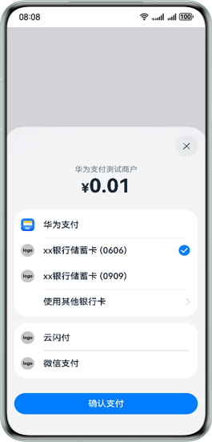

# 鸿蒙支付服务-收银台UI实现
## 介绍
本示例按照鸿蒙收银台UI设计实现支付收银台。协助外部开发者自建收银台界面能够和鸿蒙支付服务的收银台外观设计、用户体验上保持一致。

开发者可在应用项目中实现支付收银台。应用项目由配置文件(module.json5)、页面代码(ets文件)以及资源文件（图片、字符串等）组成，实现的收银台包含以下功能：展示商户信息、金额、支付方式列表（用户选择的支付方式会变成选中状态）和支付按钮。

## 效果预览
实现效果如下：



## 工程目录
项目目录结构如下：
```
├───entry/src/main/ets                        // 根目录
│   ├───data                                 // 数据结构根目录
│   │   ├───CustPayType.ets                  // 支付类型枚举
│   │   ├───PaymentType.ets                  // 支付方式
│   │   └───TestData.ets                     // 测试数据
│   ├───entryability                         // 生命周期根目录
│   │   └───EntryAbility.ets                 // 生命周期入口
│   ├───pages                                // 页面根目录
│   │   └───Index.ets                        // 页面入口
│   ├───ui                                   // 收银台组件根目录
│   │   ├───Amount.ets                       // 金额组件
│   │   ├───CashierBindSheetContainer.ets    // 收银台容器
│   │   ├───CashierComponent.ets             // 收银台首页组件
│   │   ├───ConfirmButton.ets                // 按钮组件
│   │   ├───PaymentItemComp.ets              // 支付方式组件
│   │   └───PaymentOrderComp.ets             // 商户订单组件
│   └───util                                 // 工具类根目录
│       └───PaymentUtil.ets                  // 支付工具
└───entry/src/main/resources                 // 资源根目录
```

## 具体实现

### 页面结构
一个页面通常由自定义组件、自定义构建函数、样式和逻辑交互组成。

1.在ArkUI中，UI显示的内容均为组件，由框架直接提供的称为系统组件，由开发者定义的称为[自定义组件](https://developer.huawei.com/consumer/cn/doc/harmonyos-guides/arkts-create-custom-components)。

2.ArkUI提供了一种轻量的UI元素复用机制@Builder，开发者可以将重复使用的UI元素抽象成一个方法，在build方法里调用。使用说明可参考[自定义构建函数](https://developer.huawei.com/consumer/cn/doc/harmonyos-guides/arkts-builder#%E5%85%A8%E5%B1%80%E8%87%AA%E5%AE%9A%E4%B9%89%E6%9E%84%E5%BB%BA%E5%87%BD%E6%95%B0)

3.自定义组件样式可参考[通用样式](https://developer.huawei.com/consumer/cn/doc/quickApp-References/quickapp-common-styles-0000001170210009)

4.组件间变量传递可以参考 [管理组件拥有的状态](https://developer.huawei.com/consumer/cn/doc/harmonyos-guides/arkts-component-state-management)

示例：
```
import { CashierComponent } from './CashierComponent';

// 自定义组件
@Component
export struct CashierBindSheetContainer {
  @Prop title: ResourceStr = '收银台';

// 自定义构建函数
  @Builder
  CashierBuilder() {
    Column() {
      CashierComponent();
    }
  }

  build() {
    Column() {
      Column() {
      }.bindSheet(true, this.CashierBuilder(), {
        title: () => {},
        height: SheetSize.FIT_CONTENT,
        showClose: true,
        enableOutsideInteractive: false,
        backgroundColor: '#E5FFFFFF',
        blurStyle: BlurStyle.COMPONENT_THICK,
        onWillDismiss: ((action: DismissSheetAction) => {
          // 逻辑交互
        }),
      });
    }.width('100%');
  }
}
```

### 收银台说明
收银台包含以下功能：展示商户信息、金额、支付方式列表和按钮。用户选择的支付方式会变成选中状态。
收银台整体上可分为三个部分：头部-商户信息展示、中部-支付方式列表、底部-支付按钮。

- 商户信息展示：商户信息竖向居中排列，包含商户名称以及订单金额。
- 支付方式列表：用户点击选择的支付方式会变成选中状态。展示可用、不可用的支付方式，添加银行卡以及用户选中支付方式后展示勾选效果。
- 支付按钮：开发者可通过按钮点击事件实现具体支付处理逻辑。

字符串、图片等资源按需要添加到`src/main/resources`相应的目录下。

## 相关权限
暂不涉及。

## 约束与限制
示例代码仅为UI组件示例，当前不强制依赖某一SDK版本， 配置文件中当前定义HarmonyOS SDK版本号为5.0.4 release，故建议在以下版本中运行示例代码：

- HarmonyOS系统：HarmonyOS 5.0.4 Release 及以上。
- DevEco Studio版本：DevEco Studio 5.0.4 Release 及以上。
- HarmonyOS SDK版本：HarmonyOS 5.0.4 Release SDK 及以上。