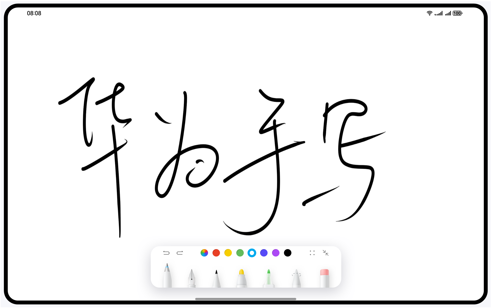

华为手写服务示例代码
===============================

## 目录

* [简介](#简介)
* [效果预览](#效果预览)
* [工程结构](#工程结构)
* [使用说明](#使用说明)
* [相关权限](#相关权限)
* [约束与限制](#约束与限制)


简介
------------
手写笔服务（Pen Kit）是华为提供的一套手写套件，提供笔刷效果、笔迹编辑、报点预测和一笔成形功能，为开发者提供丰富而便捷的手写能力，开发者可以轻松集成实现手写功能，享受优质的手写体验，创造更多的手写应用场景。
另外还单独提供了全局取色、一笔成形、报点预测的能力。
本示例展示了如何接入PenKit手写套件的能力。

效果预览
------------



工程结构
-------
    ├── entryability
    │   └── EntryAbility.ets        // 本地启动ability，可通过loadContent任意切换以下四个demo
    └── pages
        └── HandWritingDemo.ets          // 手写套件界面
        └── ImageFeaturePicker.ets       // 全局取色界面
        └── InstantShapeGenerator.ets    // 一笔成形界面
        └── PointPredictor.ets           // 报点预测界面
    └── utils 
        └── ContextConfig.ts      // 上下文配置

使用说明
-------

业务使用时，需要导入相应模块，使用`import{ HandwriteComponent, HandwriteController }from '@kit.Penkit' `引入。
初始化HandwriteController。 通过callback回调的方式获取HandwriteController数据加载动作已完成的时机，
调用HandwriteController组件，传入已初始化后的HandwriteController，
并传入初始化完成后的callback和缩放后onScale的回调响应。
```c
import { HandwriteComponent, HandwriteController } from '@kit.Penkit';

@Entry
@Component
struct HandWritingComponent {
  controller: HandwriteController = new HandwriteController();
  // 根据应用存储规则，获取到手写文件保存的路径，此处仅为实例参考
  initPath: string = this.getUIContext().getHostContext()?.filesDir + '/aa';

  aboutToAppear() {
    // 加载时设置保存动作完成后的回调。
    this.controller.onLoad(this.callback);
  }

  // 手写文件内容加载完毕渲染上屏后的回调,通知接入用户,可在此处进行自定义行为
  callback = () => {
    // 自定义行为,例如文件加载完毕后展示用户操作指导
  }

  aboutToDisappear() {
  }

  build() {
    Row() {
      Stack({ alignContent: Alignment.TopStart }) {
        HandwriteComponent({
          handwriteController: this.controller,
          onInit: () => {
            // 画布初始化完成时的回调。此时可以调用接口加载和显示笔记内容
            this.controller?.load(this.initPath);
          },
          onScale: (scale: number) => {
            // 画布缩放时的回调方法，将返回当前手写控件的缩放比例，可在此处进行自定义行为。
          }
        })
        Button("save")
          .onClick(async () => {
            //保存
            const path = this.getUIContext().getHostContext()?.filesDir + '/aa';
            await this.controller?.save(path);
          })
      }
      .width('100%')
    }
    .height('100%')
  }
}
```

在EntryAbility中设置contxt
```c
  onWindowStageCreate(windowStage: window.WindowStage): void {
    // Main window is created, set main page for this ability
    hilog.info(0x0000, 'testTag', '%{public}s', 'Ability onWindowStageCreate');

    windowStage.loadContent('pages/HandWritingDemo', (err) => {
      if (err.code) {
        hilog.error(0x0000, 'testTag', `Failed to load the content, error: ${err.code}, ${err.message}`);
        return;
      }
      hilog.info(0x0000, 'testTag', 'Succeeded in loading the content.');
    });
    GlobalContext.setContext(this.context);
  }
```

相关权限
-------
无

约束与限制
-------

1. 设备类型：华为手机、华为平板、华为PC/2in1。
2. HarmonyOS系统：HarmonyOS 6.0.0及以上。
3. DevEco Studio版本：DevEco Studio 6.0.0 Beta2及以上。
4. HarmonyOS SDK版本：HarmonyOS 6.0.0 Beta2 SDK及以上。