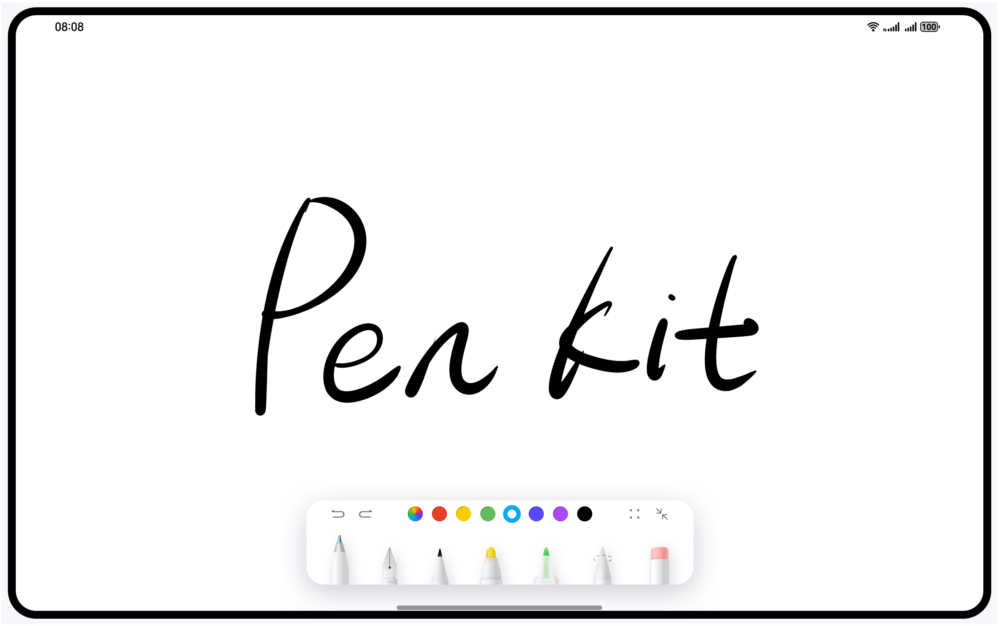

Pen Kit Sample Code
===============================

## Contents

* [Overview](#Overview)
* [Preview](#Preview)
* [Engineering Structure](#Structure)
* [Instruction](#Instruction)
* [Permissions](#Permissions)
* [Constraints](#Constraints)


Overview
------------
Pen Kit is a handwriting suite provided by Huawei. It provides a wide array of enriching features, such as brush effects, handwriting editing, point prediction, and Instant Shape. It allows developers to easily integrate the handwriting feature to the stylus pen for a premium handwriting experience and extends the use of the stylus pen in more scenarios.
Pen Kit also provides the Color picker, Instant Shape, and point prediction capabilities.
This sample code shows how to integrate the capabilities provided by Pen Kit.

Preview
------------



Structure
-------

    ├── entryability
    │   └── EntryAbility.ets        // Ability for local startup. You can switch between the following four demos by calling.
    └── pages
        └── HandWritingDemo.ets          // Basic handwriting interface
        └── ImageFeaturePicker.ets       // Global color selection
        └── InstantShapeGenerator.ets    // brushstroke forming
        └── PointPredictor.ets           // Report point forecast
    └── utils
        └── ContextConfig.ts      // Context Configuration

Instruction
-------

During usage, the corresponding modules need to be imported using `import{ HandwriteComponent, HandwriteController}from '@kit.PenKit' `.
Initialize **HandwriteController**. Obtain the time when the data loading action by **HandwriteController** is complete in callback mode.
Call the **HandwriteComponent**, pass the initialized **HandwriteController**,
and pass the callback after initialization and the callback response of **onScale** after scaling.
```c
import { HandwriteComponent, HandwriteController } from '@kit.Penkit';

@Entry
@Component
struct HandWritingComponent {
  controller: HandwriteController = new HandwriteController();
  // Obtain the path for storing handwritten files based on the application storage rules. The following is for reference only.
  initPath: string = this.getUIContext().getHostContext()?.filesDir + '/aa';

  aboutToAppear() {
    // Set the callback after the save operation is complete during loading.
    this.controller.onLoad(this.callback);
  }

  // Callback after the handwritten file content is loaded and rendered on the screen. It notifies the access user. You can customize the behavior here.
  callback = () => {
    // User-defined behavior, for example, displaying a user operation guide after a file is loaded
  }

  aboutToDisappear() {
  }

  build() {
    Row() {
      Stack({ alignContent: Alignment.TopStart }) {
        HandwriteComponent({
          handwriteController: this.controller,
          onInit: () => {
            // Callback when canvas initialization is complete. In this case, you can call the interface to load and display the note content.
            this.controller?.load(this.initPath);
          },
          onScale: (scale: number) => {
            // Callback method for scaling the canvas. The scaling ratio of the current handwriting control is returned. You can customize the behavior here.
          }
        })
        Button("save")
          .onClick(async () => {
            // save.
            const path = this.getUIContext().getHostContext()?.filesDir + '/aa';
            await this.controller?.save(path);
          })
      }
      .width('100%')
    }
    .height('100%')
  }
}
```

Set context in **EntryAbility**.
```c
  onWindowStageCreate(windowStage: window.WindowStage): void {
    // Main window is created, set main page for this ability
    hilog.info(0x0000, 'testTag', '%{public}s', 'Ability onWindowStageCreate');

    windowStage.loadContent('pages/HandWritingDemo', (err) => {
      if (err.code) {
        hilog.error(0x0000, 'testTag', `Failed to load the content, error: ${err.code}, ${err.message}`);
        return;
      }
      hilog.info(0x0000, 'testTag', 'Succeeded in loading the content.');
    });
    GlobalContext.setContext(this.context);
  }
```

Permissions
-------
None

Constraints
-------

1. Device: Huawei mobile phone, tablet, and 2-in-1 device
2. HarmonyOS: HarmonyOS 6.0.0 or later
3. DevEco Studio: DevEco Studio 6.0.0 Beta2 or later
4. HarmonyOS SDK: HarmonyOS 6.0.0 Beta2 SDK or later