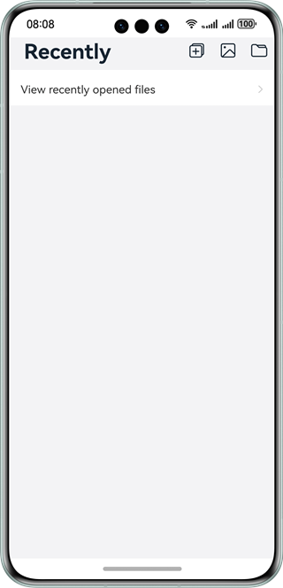
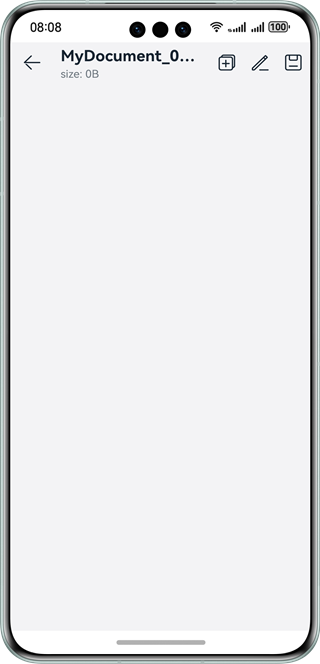
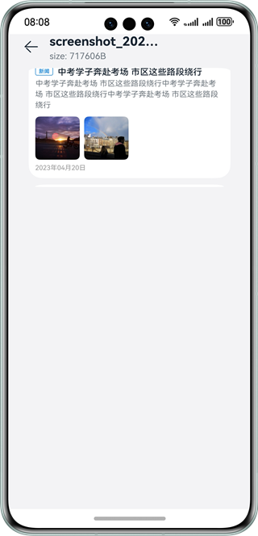
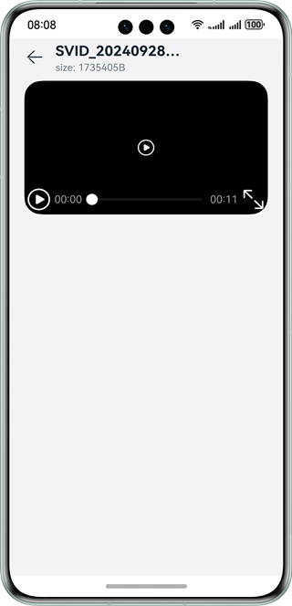

# Selecting and View Documents and Media Files

### Overview

This sample shows how to use the APIs provided by @ohos.file.picker, @ohos.file.photoAccessHelper and @ohos.file.fs to select and save documents, select and view photos in the system album, and select and play videos.

### Preview

| Home page                              | Viewing and editing a document        | Viewing an image                         | Viewing a video                        |
|----------------------------------------|---------------------------------------|------------------------------------------|----------------------------------------|
|  |  |  |  |

### How to Use

1. On the home screen, tap the arrow button to go to the **Files** page and view the recently opened files. Tap the three buttons in the upper right corner to create a document, select and view an image or video, and select and open a document, respectively.
2. On the document viewing page, tap the leftmost button on the upper right to save the document as a new one. Tap the button in the middle to edit the document. The text area becomes editable. After entering data, tap the third button in the upper right corner to save the document content (the system document is not editable).
3. On the page for viewing images, the picker displays the images in the system album. You can select a maximum of three images to view. You can tap an image to view the image name and size.
4. On the page for viewing video, the picker displays the videos in the system album. You can select a maximum of three images to view. You can tap a video to view the video name and size.

### Project Directory

```
├──entry/src/main/ets/
│  ├──common
│  │  ├──Common.ts
│  │  ├──Constants.ets                  // Constants
│  │  └──Logger.ts                      // Logging utility
│  │  └──Utils.ts						
│  ├──entryability
│  │  └──EntryAbility.ets               // Ability
│  ├──media
│  │  └──MediaFileUri.ets               // APIs for media files
│  ├──pages
│  │  ├──EditFile.ets                   // Page for viewing and editing a document
│  │  └──Index.ets                      // Home page
│  │  └──ViewMedia.ets                  // Page for viewing images and videos
│  └──utils
│     └──utils.ts
└──entry/src/main/resources             // Static resources of the app

```

### How to Implement

- The APIs for starting picker to select or save documents and select images or videos are encapsulated in **Index.ets**. For details about the source code, see [Index.ets](entry/src/main/ets/pages/Index.ets).

  * Use **new picker.DocumentViewPicker** to create a document picker instance, use **documentPicker.select** to start picker for the user to select documents, and use **documentPicker.save** to start picker for the user to save documents. For details about the APIs, see @ohos.file.picker.
  * Use **new photoAccessHelper.PhotoViewPicker** to create a **PhotoViewPicker** instance, and use **photoPicker.select** to start picker for the user to select images or videos. For details about the APIs, see @ohos.file.photoAccessHelper.
- The APIs for editing and saving files are encapsulated in **EditFile.ets**. For details about the source code, see [EditFile.ets](entry/src/main/ets/pages/EditFile.ets).

  * Use **fs.openSync**, **fs.writeSync**, **fs.readSync**, and **fs.closeSync** to open, write, read, and close files, respectively. For details about the APIs, see @ohos.file.fs.
- The APIs for starting and viewing images or videos are encapsulated in **ViewMedia.ets**. For details about the source code, see [ViewMedia.ets](entry/src/main/ets/pages/ViewMedia.ets).

### Required Permissions

N/A

### Dependencies

N/A

### Constraints

1. The sample app is supported only on Huawei phones running the standard system.

2. The HarmonyOS version must be HarmonyOS 5.0.5 Release or later.

3. The DevEco Studio version must be DevEco Studio 5.0.5 Release or later.

4. The HarmonyOS SDK version must be HarmonyOS 5.0.5 Release or later.
