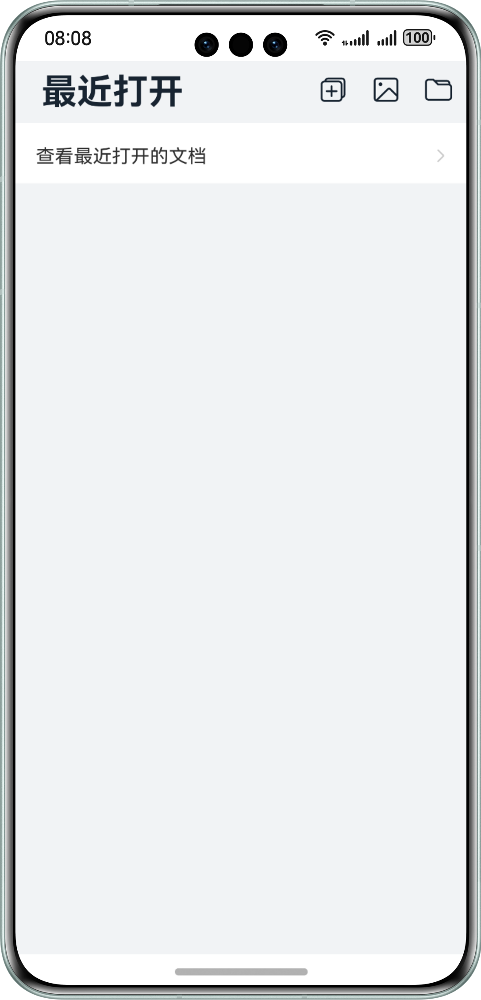
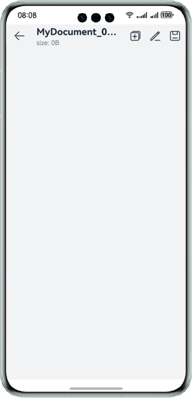

# 实现选择和查看文件功能

### 介绍

应用使用@ohos.file.picker、@ohos.file.photoAccessHelper、@ohos.file.fs等接口，实现了拉起文档编辑保存、拉起系统相册图片查看、拉起视频并播放的功能。

### 效果预览

| 首页                                                        | 查看并编辑文档界面                          | 查看图片界面                                | 查看视频界面                              |
|-----------------------------------------------------------|------------------------------------|---------------------------------------|-------------------------------------|
|  |  |  |  |

使用说明：

1. 在首页，应用显示查看最近打开文档功能的跳转按钮，点击后进入文件管理页面，可以通过最近页面，查看最近打开的文档。通过点击右上方的三个按钮，可以分别实现新建文档、选择图片或视频并打开预览、选择文档并打开的功能。
2. 在查看文档界面，点击右上方左一按钮，可以实现当前文档另存为的功能；点击右上方中间的按钮，开启文档的编辑功能，textArea变成可编辑状态，用户输入数据后点击右上方第三个按钮，可以将当前文档内容进行保存操作（系统文档没有保存权限）。
3. 在查看图片界面，拉起系统相册，用户至多可选择三张图片查看，点击图片可以切换所显示的图片名及大小信息。
4. 在查看视频界面，拉起系统相册，用户至多可选择三个视频查看，点击视频播放并且可以显示的视频名及大小信息。

### 工程目录

```
├──entry/src/main/ets/
│  ├──common
│  │  ├──Common.ts
│  │  ├──Constants.ets                  // 常量
│  │  ├──Logger.ts                      // 日志工具
│  │  └──Utils.ts						
│  ├──entryability
│  │  └──EntryAbility.ets               // ability类
│  ├──media
│  │  └──MediaFileUri.ets               // 媒体文件相关函数
│  ├──pages
│  │  ├──EditFile.ets                   // 查看并编辑文档界面
│  │  ├──Index.ets                      // 首页
│  │  └──ViewMedia.ets                  // 查看图片和视频界面
│  └──utils
│     └──utils.ts
└──entry/src/main/resources             // 应用静态资源目录

```

### 具体实现

- 拉起picker选择文件、拉起picker保存文件、拉起picker选择图片或视频的功能封装在Index.ets，源码参考：[Index.ets](entry/src/main/ets/pages/Index.ets)

  * 使用new picker.DocumentViewPicker来创建文件picker实例，使用documentPicker.select来拉起picker选择文件，使用documentPicker.save来拉起picker保存文件，接口参考：@ohos.file.picker
  * 使用new photoAccessHelper.PhotoViewPicker来创建图库picker实例，使用photoPicker.select来选择图片或视频，接口参考：@ohos.file.photoAccessHelper
- 编辑文件并保存的功能封装在EditFile.ets，源码参考：[EditFile.ets](entry/src/main/ets/pages/EditFile.ets)

  * 使用fs.openSync、fs.writeSync、fs.readSync、fs.closeSync分别用来打开文件、写文件、读文件、关闭文件，接口参考：@ohos.file.fs
- 拉起图片或视频并查看的功能封装在ViewMedia.ets，源码参考：[ViewMedia.ets](entry/src/main/ets/pages/ViewMedia.ets)

### 相关权限

不涉及

### 依赖

不涉及

### 约束与限制

1.本示例仅支持标准系统上运行，支持设备：华为手机。

2.HarmonyOS系统：HarmonyOS 5.0.5 Release及以上。

3.DevEco Studio版本：DevEco Studio 5.0.5 Release及以上。

4.HarmonyOS SDK版本：HarmonyOS 5.0.5 Release SDK及以上。

