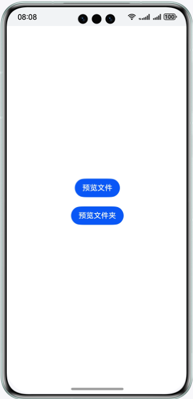
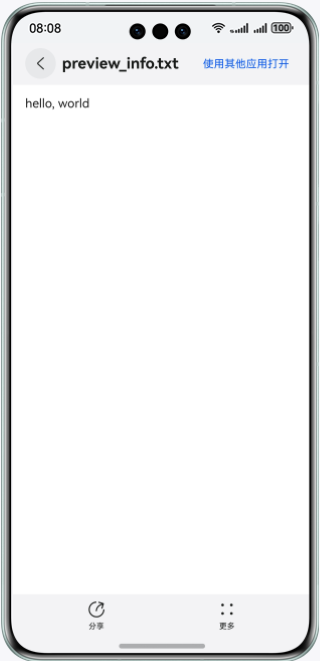
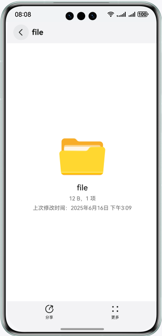

# 文件预览
## 介绍
本示例展示了使用文件预览服务提供的接入预览功能
需要使用文件预览服务接口@kit.PreviewKit
## 效果预览
使用说明
1.在手机的主屏幕，点击 “预览文件” 或者 “预览文件夹” 按钮，启动预览应用





## 工程目录
├─entry/src/main/ets    
│ ├─entryability                
│ │ └─EntryAbility.ets // 本地启动ability     
│ ├─pages                
│ │ └─Index.ets // 基础预览界面

## 具体实现
在@kit.PreviewKit定义了文件预览的接口API：
使用了如下接口进行业务实现：


```
openPreview(context: Context, file: PreviewInfo, info?: DisplayInfo): Promise<void>;
canPreview(context: Context, uri: string): Promise<boolean>;
```

业务使用时，需要先进行import导入
import { filePreview } from '@kit.PreviewKit';
参考entry\src\main\ets\pages\Index.ets文件

## 相关权限
无

## 依赖
依赖于文件预览应用

## 约束与限制
1.设备类型：华为手机、平板和2in1。

2.HarmonyOS系统：HarmonyOS NEXT Developer Beta1及以上。

3.DevEco Studio版本：DevEco Studio NEXT Developer Beta1及以上。

4.HarmonyOS SDK版本：HarmonyOS NEXT Developer Beta1 SDK及以上。