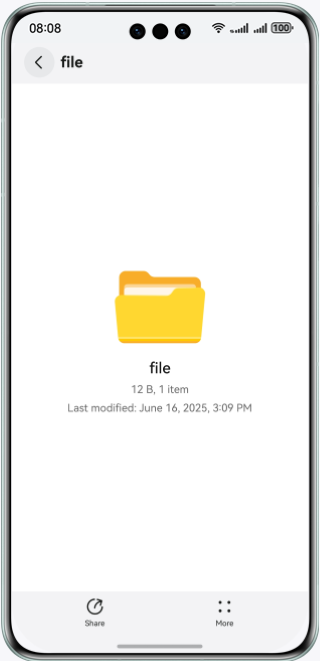

# File Preview
## Introduction
This example shows how to integrate the preview function provided by Preview Kit.
The Preview Kit API **@kit.PreviewKit** is required.
## Preview
Instructions
1. On the home screen of your phone, touch **Preview File** or **Preview Folder** to start the File Preview app.




## Project Directory
├─entry/src/main/ets    
│ ├─entryability                
│ │ └─EntryAbility.ets // Ability for local startup    
│ ├─pages                
│ │ └─Index.ets // Basic preview screen 

## Implementation Details
Define the APIs of Preview Kit in **@kit.PreviewKit**.
The following APIs are used to implement services:


```
openPreview(context: Context, file: PreviewInfo, info?: DisplayInfo): Promise<void>;
canPreview(context: Context, uri: string): Promise<boolean>;
```

Before using the service, you need to import the following:
import { filePreview } from '@kit.PreviewKit';
See the **entry\src\main\ets\pages\Index.ets** file.

## Required Permissions
None

## Dependency
Depends on the File Preview app.

## Constraints
1. Device: Huawei mobile phones, tablets, and 2-in-1 devices

2. HarmonyOS: HarmonyOS NEXT Developer Beta1 or later

3. DevEco Studio: DevEco Studio NEXT Developer Beta1 or later

4. HarmonyOS SDK: HarmonyOS NEXT Developer Beta1 SDK or later
