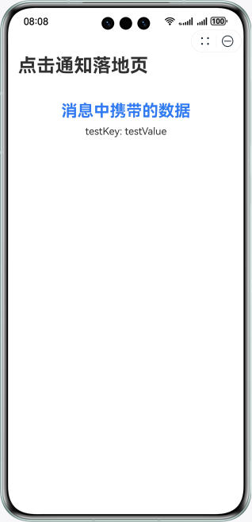

# Push Kit元服务示例代码

## 简介
本示例基于HarmonyOS实现了元服务发起基于账号的订阅请求。


## 相关概念
- Push Kit：Push Kit（推送服务）是华为提供的消息推送平台，建立了从云端到终端的消息推送通道。所有HarmonyOS应用可通过集成Push Kit，实现向应用实时推送消息，使消息易见，构筑良好的用户关系，提升用户的感知度和活跃度。
- serviceNotification：本模块提供服务通知的基础能力，包括请求订阅通知授权。

## 效果预览

| 首页                                  | 订阅服务通知页面                             | 发起订阅                                   | 点击通知进入应用内页                         |
|---------------------------------|--------------------------------------|----------------------------------------|------------------------------------|
|  |  |  |  |

## 工程目录

```
├─entry/src/main/ets               // 代码区  
│ ├─abilities
│ │ ├─ClickActionAbility.ets       // 通知栏点击事件能力类
│ │ └─EntryAbility.ets             // 主程序入口类
│ ├─pages                          // 存放页面文件目录                
│ │ ├─ClickActionInnerPage.ets     // 点击通知落地页面            
│ │ ├─Index.ets                    // 应用主页面
│ │ └─SubscribePage.ets            // 订阅服务通知页面
│ ├─utils                          // 存放工具类文件目录
│ │ └─Logger.ets                   // 日志类，管理系统日志
└─entry/src/main/resources         // 资源文件目录
```

## 开发准备
1. 将app.json5文件中的包名替换为您自己的元服务包名。
2. 开通推送服务，详情请参考[指导](https://developer.huawei.com/consumer/cn/doc/atomic-guides/push-as-prepare)。
3. 开通服务通知并选用订阅模板，详情请参考[指导](https://developer.huawei.com/consumer/cn/doc/atomic-guides/push-as-service-noti)。
4. 将SubscribePage.ets文件中的templateIds替换为在AGC上生效中的模板ID。 
5. 为实现消息展示后可以点击跳转到应用页面，本示例工程已经在module.json5文件中配置好skills标签，如有需要可以参考[指导](https://developer.huawei.com/consumer/cn/doc/atomic-guides/push-as-send-sub-noti#section83531248142116)自行修改。
6. 本示例工程涉及到华为账号登录，相关开发准备请参考[指导](https://developer.huawei.com/consumer/cn/doc/atomic-guides/account-atomic-client-id)。
 
## 使用说明
1. 打开元服务，完成华为账号登录，获取登录用户的openID，关于华为账号登录的开发可参考[指导](https://developer.huawei.com/consumer/cn/doc/atomic-guides/account-atomic-silent-login)。
2. 在“推送功能主页”页面点击**订阅服务通知**，在弹窗中点击“允许”。
3. 使用[服务通知-推送服务-服务端DEMO](https://gitee.com/harmonyos_samples/Push-kit-service-notification-sample-code-java)，或根据[指导](https://developer.huawei.com/consumer/cn/doc/atomic-guides/push-as-send-sub-noti)使用Postman等其它调试工具，推送基于账号的订阅消息。
4. 下拉状态栏，在通知中心查看消息。
5. 点击通知栏消息，跳转元服务的落地页。

## 相关权限
不涉及

## 约束与限制
1. 本示例仅支持标准系统上运行，支持设备：华为手机、平板。
2. HarmonyOS系统：HarmonyOS NEXT Developer Beta5及以上。
3. DevEco Studio版本：DevEco Studio NEXT Developer Beta5及以上。
4. HarmonyOS SDK版本：HarmonyOS NEXT Developer Beta5 SDK及以上。