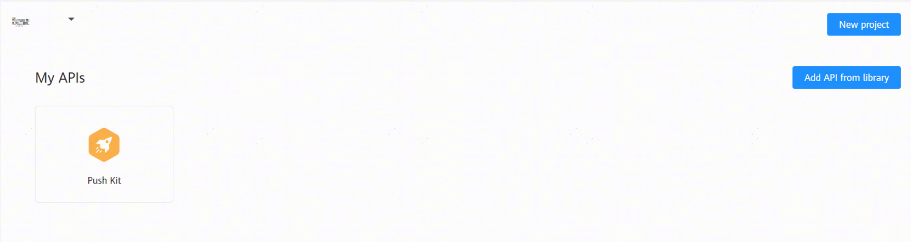
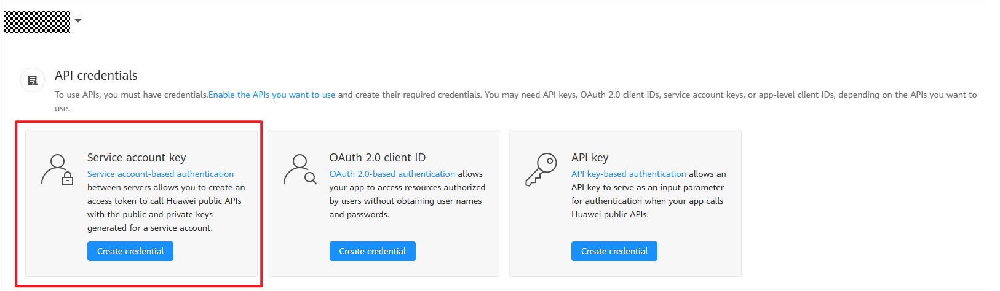
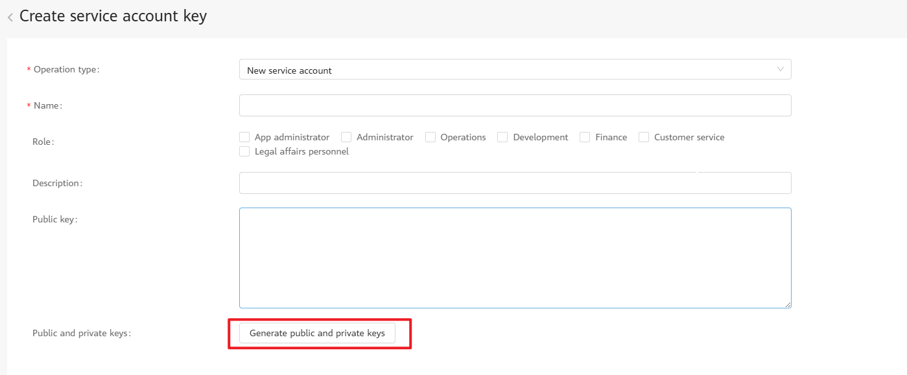

# Push Kit Server-Side Demo

This demo provides sample code for sending HarmonyOS scenario-specific messages based on Java.

## Supported Message Types

- [Notification message](src/main/java/com/huawei/push/NotificationExamples.java)
  - Actions triggered upon message tapping
    - Opening the app home page and passing data
    - Opening a specified in-app page and passing data
  - Notification format
    - Common notification
    - Notification badge
    - Large notification icon
    - Multi-line text
- [Widget update message](src/main/java/com/huawei/push/FormUpdateExamples.java)
  - Pushing a widget update message
- [Extended notification message](src/main/java/com/huawei/push/ExtensionExamples.java)
  - Pushing an extended notification message
- [Message recall](src/main/java/com/huawei/push/RevokeExamples.java)
  - Recalling a message
- [Live view message](src/main/java/com/huawei/push/LiveViewExamples.java)
  - Pushing a live view message
- [VoIP message](src/main/java/com/huawei/push/VOIPExamples.java)
  - Pushing a VoIP message

## Supported Java Versions

Java 8+

## Getting Started

### Download

Download the demo and open it in the IDE.

### Preparations

1. Enable Push Kit and obtain a push token by referring to the [Push Kit development guide](https://developer.huawei.com/consumer/en/doc/harmonyos-guides/push-kit-guide-0000001821033161).
2. Obtain the service account credential file.

- Sign in to HUAWEI Developers and go to [API Console](https://developer.huawei.com/consumer/en/console/setting/memberAccountDetail).
- Go to **HMS API Services** > **My APIs** and ensure that Push Kit has been enabled for your project. If Push Kit is not enabled, click: .
- Go to **My Credentials** > **API Credentials**, click **Create credential**, and then click **Service account key**: 
- Set mandatory parameters and click **Generate public and private keys**. Create and download a JSON file. The downloaded file is your service account credential file: .
- Rename the downloaded file **service_account.json** and replace the [service account credential file](src/main/resources/service_account.json) in the project.

#### Pushing a Notification Message
1. Install the [notification - Push Kit - client-side demo](https://gitee.com/harmonyos_samples/push-kit_-sample-code_-clientdemo_-arkts), or install the client-side demo developed based on the [guide](https://developer.huawei.com/consumer/en/doc/harmonyos-guides/push-send-alert#section17790171616598).
2. Obtain a push token based on the client-side demo and ensure that the notification function of the client-side demo is enabled.
3. Replace the token in the [notification sample code](src/main/java/com/huawei/push/NotificationExamples.java) with the token obtained by the client, run the main method, send a message, and check the display effect on the notification bar on the device.

#### Pushing a Widget Update Message
1. Install the [notification - Push Kit - client-side demo](https://gitee.com/harmonyos_samples/push-kit_-sample-code_-clientdemo_-arkts), or install the client-side demo developed based on the [guide](https://developer.huawei.com/consumer/en/doc/harmonyos-guides/push-form-update#section17903738421).
2. Obtain a push token based on the client-side demo, ensure that the notification function of the client-side demo is enabled, and add a widget to the home screen.
3. Replace the token in the [widget update message sample code](src/main/java/com/huawei/push/FormUpdateExamples.java) with the token obtained by the client, replace **formId** with the ID of the newly created widget, run the main method, send a message, and view the widget display effect on the device.

#### Recalling a Message
1. Install the [notification -Push Kit - client-side demo](https://gitee.com/harmonyos_samples/push-kit_-sample-code_-clientdemo_-arkts), or install the client-side demo developed based on the [guide](https://developer.huawei.com/consumer/en/doc/harmonyos-guides/push-revoke-alert#section1310252910014).
2. Obtain a push token based on the client-side demo and ensure that the notification function of the client-side demo is enabled.
3. Replace the token in the [notification sample code](src/main/java/com/huawei/push/NotificationExamples.java) with the token obtained by the client, set **notifyId** for the message body, run the main method, send a message, and check the display effect on the notification bar on the device.
4. Replace the token in the [message recall sample code](src/main/java/com/huawei/push/RevokeExamples.java) with the token obtained by the client, set **notifyId** to that used when the message is sent, run the main method, and check the message recall effect on the notification bar on the device.

#### Pushing an Extended Notification Message
1. Apply for the [extended notification message permission](https://developer.huawei.com/consumer/en/doc/harmonyos-guides/push-apply-right#section159981112245) first.
3. Obtain a push token based on the client-side demo and ensure that the notification function of the client-side demo is enabled.
4. Replace the token in the [extended notification message sample code](src/main/java/com/huawei/push/ExtensionExamples.java) with the token obtained by the client.
5. Keep the app running in the foreground, run the main method, send a message, and view the display effect in the app on the device.
6. Switch the app to the background, run the main method, send a message, and view the display effect on the notification bar of the device.

#### Pushing a Live View Message
1. [Enable the live view permission](https://developer.huawei.com/consumer/en/doc/harmonyos-guides/liveview-rights) first.
2. Install the [notification - Push Kit - client-side demo](https://gitee.com/harmonyos_samples/push-kit_-sample-code_-clientdemo_-arkts), or install the client-side demo developed based on the [guide](https://developer.huawei.com/consumer/en/doc/harmonyos-guides/push-update-liveview#section207201926151512).
3. Obtain a push token based on the client-side demo and ensure that the notification function of the client-side demo is enabled.
4. Replace the token in the [live view message sample code](src/main/java/com/huawei/push/LiveViewExamples.java) with the token obtained by the client, run the main method, send a message, and check the display effect on the notification bar on the device.

#### Pushing a VoIP Message
1. Apply for the [VoIP message permission](https://developer.huawei.com/consumer/en/doc/harmonyos-guides/push-apply-right#section7291115452410) first.
2. Install the [social communications – Call Service Kit demo](https://gitee.com/harmonyos_samples/callkit-samplecode-voipdemo-arkts), or install the client-side demo developed based on the [guide](https://developer.huawei.com/consumer/en/doc/harmonyos-guides/push-voip#section41452724812).
3. Obtain a push token based on the client-side demo and ensure that the notification function of the client-side demo is enabled.
4. Replace the token in the [VoIP message sample code](src/main/java/com/huawei/push/VOIPExamples.java) with the token obtained by the client, run the main method, send a message, and check the display effect on the notification bar on the device.
