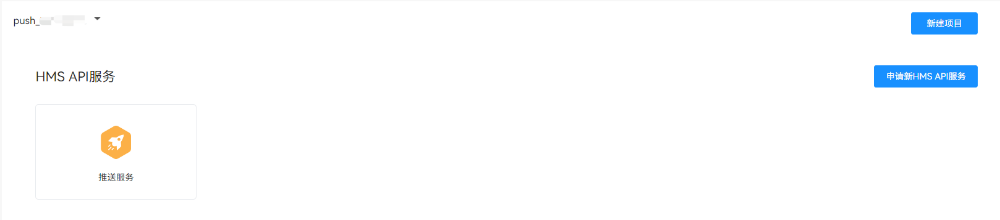

# Push Kit 服务端 demo

本 demo 为面向 Java 的鸿蒙场景化消息推送示例代码。

## 支持发送的消息

- [通知消息](src/main/java/com/huawei/push/NotificationExamples.java)
  - 点击消息动作
    - 点击消息进入应用首页并传递数据
    - 点击消息进入应用内页并传递数据
  - 通知样式
    - 普通通知
    - 通知角标
    - 通知大图标
    - 多行文本样式
- [卡片刷新消息](src/main/java/com/huawei/push/FormUpdateExamples.java)
  - 推送卡片刷新消息
- [通知扩展消息](src/main/java/com/huawei/push/ExtensionExamples.java)
  - 推送通知扩展消息
- [消息撤回](src/main/java/com/huawei/push/RevokeExamples.java)
  - 撤回通知消息
- [实况窗消息](src/main/java/com/huawei/push/LiveViewExamples.java)
  - 推送实况窗消息
- [应用内通话消息](src/main/java/com/huawei/push/VOIPExamples.java)
  - 推送应用内通话消息

## 支持的 Java 版本

Java 8+

## 快速开始

### 下载

下载此 demo 并在 IDE 中打开。

### 开发准备

1. 参考[Push Kit 开发指南](https://developer.huawei.com/consumer/cn/doc/harmonyos-guides/push-kit-guide)，开通推送服务，并获取 Push Token。
2. 获取 Service Account 凭据文件，具体步骤如下：

- 登录华为开发者联盟，进入[API Console](https://developer.huawei.com/consumer/cn/console/overview)。
- 在页面左侧的导航栏中，点击“我的API”，确保在项目名下已有推送服务，若无请点击右侧申请：
- 点击左侧导航栏中“API 服务->凭证”，在项目下点击”服务帐号密钥“下的”创建凭证“：
- 填写必填项，并点击创建公私钥。创建并下载 JSON，下载后的文件就是您的 Service Account 凭据文件：
- 将下载好的文件重命名为“service_account.json”，并替换工程中的[Service Account 凭据文件](src/main/resources/service_account.json)

#### 推送通知消息
1. 推送通知扩展消息前，请先完成[申请通知消息自分类权益](https://developer.huawei.com/consumer/cn/doc/harmonyos-guides/push-apply-right#section15173623155816)。
2. 安装[消息通知-推送服务-客户端DEMO](https://gitee.com/harmonyos_samples/push-kit_-sample-code_-clientdemo_-arkts)，或者安装根据[指导](https://developer.huawei.com/consumer/cn/doc/harmonyos-guides/push-send-alert#section17790171616598)开发的端侧DEMO。
3. 通过端侧DEMO获取Push Token，并确保端侧DEMO的通知开关已打开。
4. 将[通知消息示例代码](src/main/java/com/huawei/push/NotificationExamples.java)中的Token替换为端侧获取到的Token，运行其 main 方法，发送消息，在端侧查看通知栏展示效果。

#### 推送卡片刷新消息
1. 安装[消息通知-推送服务-客户端DEMO](https://gitee.com/harmonyos_samples/push-kit_-sample-code_-clientdemo_-arkts)，或者安装根据[指导](https://developer.huawei.com/consumer/cn/doc/harmonyos-guides/push-form-update#section17903738421)开发的端侧DEMO。
2. 通过端侧DEMO获取Push Token，并确保端侧DEMO的通知开关已打开，并添加服务卡片到桌面。
3. 将[卡片刷新消息示例代码](src/main/java/com/huawei/push/FormUpdateExamples.java)中的Token替换为端侧获取到的Token，将formId替换为新创建卡片的ID，运行其 main 方法，发送消息，在端侧查看桌面卡片展示效果。

#### 消息撤回
1. 安装[消息通知-推送服务-客户端DEMO](https://gitee.com/harmonyos_samples/push-kit_-sample-code_-clientdemo_-arkts)，或者安装根据[指导](https://developer.huawei.com/consumer/cn/doc/harmonyos-guides/push-revoke-alert#section1310252910014)开发的端侧DEMO。
2. 通过端侧DEMO获取Push Token，并确保端侧DEMO的通知开关已打开。
3. 将[通知消息示例代码](src/main/java/com/huawei/push/NotificationExamples.java)中的Token替换为端侧获取到的Token，并对消息体设置notifyId，运行其 main 方法，发送消息，在端侧查看通知栏展示效果。
4. 将[消息撤回示例代码](src/main/java/com/huawei/push/RevokeExamples.java)中的Token替换为端侧获取到的Token，notifyId设置为发送消息时的notifyId，运行其 main 方法，发送消息，在端侧查看通知栏消息消失。

#### 推送通知扩展消息
1. 推送通知扩展消息前，请先完成[申请推送通知扩展消息权益](https://developer.huawei.com/consumer/cn/doc/harmonyos-guides/push-apply-right#section159981112245)。
3. 通过端侧DEMO获取Push Token，并确保端侧DEMO的通知开关已打开。
4. 将[通知扩展消息示例代码](src/main/java/com/huawei/push/ExtensionExamples.java)中的Token替换为端侧获取到的Token。
5. 保持应用在前台，运行其 main 方法，发送消息，在端侧应用内查看展示效果。
6. 切换应用至后台，运行其 main 方法，发送消息，在端侧通知栏查看展示效果。

#### 推送实况窗消息
1. 推送通知扩展消息前，请先完成[开通实况窗权益](https://developer.huawei.com/consumer/cn/doc/harmonyos-guides/liveview-rights)。
2. 安装[消息通知-推送服务-客户端DEMO](https://gitee.com/harmonyos_samples/push-kit_-sample-code_-clientdemo_-arkts)，或者安装根据[指导](https://developer.huawei.com/consumer/cn/doc/harmonyos-guides/push-update-liveview#section207201926151512)开发的端侧DEMO。
3. 通过端侧DEMO获取Push Token，并确保端侧DEMO的通知开关已打开。
4. 将[实况窗消息示例代码](src/main/java/com/huawei/push/LiveViewExamples.java)中的Token替换为端侧获取到的Token，运行其 main 方法，发送消息，在端侧查看通知栏展示效果。

#### 推送应用内通话消息
1. 推送应用内通话消息前，请先完成[申请推送应用内通话消息权益](https://developer.huawei.com/consumer/cn/doc/harmonyos-guides/push-apply-right#section7291115452410)。
2. 安装[社交通信-通话服务DEMO](https://gitee.com/harmonyos_samples/callkit-samplecode-voipdemo-arkts)，或者安装根据[指导](https://developer.huawei.com/consumer/cn/doc/harmonyos-guides/push-voip#section41452724812)开发的端侧DEMO。
3. 通过端侧DEMO获取Push Token，并确保端侧DEMO的通知开关已打开。
4. 将[应用内通话消息示例代码](src/main/java/com/huawei/push/VOIPExamples.java)中的Token替换为端侧获取到的Token，运行其 main 方法，发送消息，在端侧查看通知栏展示效果。