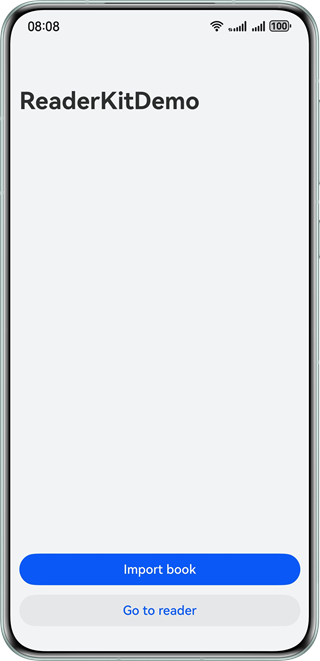
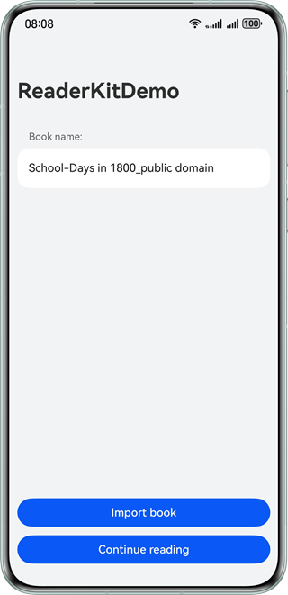
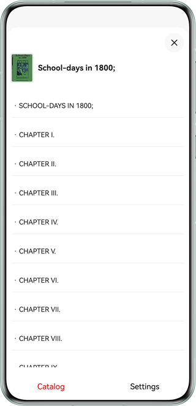
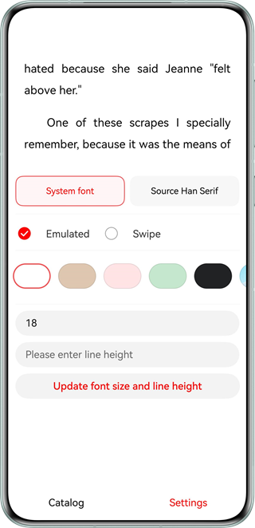

# Reading eBooks with Reader Kit
## Overview
Reader Kit offers capabilities for you to implement eBook reading functions. The sample code demonstrates Reader Kit's capability of parsing eBooks in various formats, typesetting, and implementing reading interactions, and how to efficiently build eBook reading functions by leveraging those capabilities and components.

## Preview
| **Home page (initial state)**                   | **Home page (after book import)**                           | **Reading page**                                |
|-------------------------------------------------|-----------------------------------------|-----------------------------------------|
|  |  |  | 

| **Catalog page**                            | **Settings page**                           |
|-----------------------------------------|-----------------------------------------|
|  |  |

### Using the Sample Project

1. Before running this sample project, download books in TXT, EPUB, MOBI, AZW, or AZW3 format to an SD card directory.
2. Before running this sample project, [download](https://github.com/adobe-fonts/source-han-serif/tree/release?tab=readme-ov-file) the Source Han Serif font file and save it to the **rawfile/fonts** directory.
3. After the project is successfully run, click the **Import book** button to import books to your app's sandbox path, and then click the **Go to reader** button to open the reading page.
4. On the reading page, you can turn pages by swiping left or right. You can also tap the center of the screen to display the menu bar. Then tap **Catalog** on the menu bar to check the book's catalog item list, or tap **Settings** to adjust reading settings.
5. On the catalog item list page, catalog items are displayed in hierarchical order. You can scroll vertically to view the book's catalog item list, or tap an item to jump to the corresponding chapter for reading.
6. On the settings page, you can change the font, font size, page-turning mode, background color, background image, and line height.

### Project Directory
````
├──entry/src/main/ets	            // Code area.
│  ├──common
│  │  ├──BookParserInfo.ets         // Information about the imported book.
│  │  ├──FontFileInfo.ets           // Font information.
│  │  └──LocalBookImporter.ets      // Local book import utility class.
│  ├──entryability
│  │  └──EntryAbility.ets           // Entry point class.
│  │  └──WindowAbility.ets          // Window management class.
│  ├──entrybackupability
│  │  └──EntryBackupAbility.ets     // Backup entry point class.
│  ├──pages        
│  │  ├──Index.ets                  // Page used to import books.
│  │  └──Reader.ets                 // Reading page.
│  └──utils
│     ├──BookUtils                  // Book utility class.
│     └──FileUtils.ets              // File operation utility class.
└──entry/src/main/resources/rawfile // App resource directory.
   ├──dark_sky_first.jpg            // Custom background image (dark).
   └──white_sky_first.jpg           // Custom background image (light).
````
### How to Implement
Implement book import and redirection to the reading page on the home page by referring to **Index.ets**.
* Use **picker.DocumentViewPicker** to implement book import. Use the **documentSelectOptions.fileSuffixFilters** attribute to filter supported book files. 
* After a book is imported, copy the book file to the app's sandbox path using **fileIo**. Transfer the book file in the sandbox path to the reading page for reading upon the tap event of the **Go to reader** button.
* On the home page, use the **@StorageLink** decorator to listen to the changes of the current reading page typesetting data. If a change is detected, display the **Continue reading** button. When the button is tapped, pass the reading progress to the reading page to continue reading from the saved progress.
* On the home page, use the **@StorageLink** decorator to listen to the value changes of the text scaling factor. If a change is detected in scenarios such as [Multi-Window](https://developer.huawei.com/consumer/en/doc/harmonyos-guides/multi-window-intro), restart the reading page for content re-typesetting.

Build the reading page by referring to **Reader.ets**.
* In the **build()** method, add **ReadPageComponent** for reading content display and reading interactions, and initialize the component controller and default settings.
* Obtain the book file path and reading progress passed from the index page through the **aboutToAppear()** method, initialize the book parser, and call the **startPlay()** method to render the reader page.
* Save the value of **colorMode** in real time by listening to the **onConfigurationUpdate()** method in **EntryAbility**. If a value change is detected, switch the theme accordingly.
* Use the **display.on ('change')** method to listen to the value changes of the text scaling factor. If a value change is detected, restart the reading page.
* Use the **readerComponentController.on('pageShow')** API to listen to the page display callback. Page typesetting information is returned in the callback. Save the page typesetting information to **AppStorage** and then notify the index page of page update.
* Use **WindowAbility** to listen to window size changes. If changes are detected in scenarios such as tablet landscape/portrait orientation switching, foldable screen unfolding/folding, and Multi-Window, update the viewport of the reading page to ensure proper page layout.

Display the catalog item list by referring to **Reader.ets**.
* Use the book parser to obtain the catalog item list, and then display it hierarchically based on the catalog level information.  Book information such as the book cover and book title is also obtained for display.
* When a catalog item is tapped, call the **getDomPosByCatalogHref()** and **getSpineList()** APIs of the book parser to navigate to the corresponding reading progress, and then call the **startPlay()** method for book reading. 

Modify reading settings by referring to **Reader.ets**.
* To customize the font and background image, store the custom font and background image files to the **rawfile** directory of the project or to the app sandbox path, call the **setPageConfig()** method of the **ReadPageComponent** controller, and implement the resource request callback to return **ArrayBuffer** of the corresponding resources.
* To implement switching between simulated page-turning and swipe page-turning in real time, change the value of the **flipMode** attribute and then call the **setPageConfig()** method of the **ReadPageComponent** controller.
* To implement real-time font size and line height change, change the values of **fontSize** and **lineHeight** and then call the **setPageConfig()** method of the **ReadPageComponent** controller.

## Constraints

* This sample is only supported on Huawei phones, tablets, PCs, and 2-in-1 devices with standard systems.

* This sample is based on the stage model, which supports API version 16.

* The HarmonyOS version must be HarmonyOS 5.0.4 Release or later.

* The DevEco Studio version must be DevEco Studio 5.0.4 Release or later.

* The HarmonyOS SDK version must be HarmonyOS 5.0.4 Release SDK or later.
