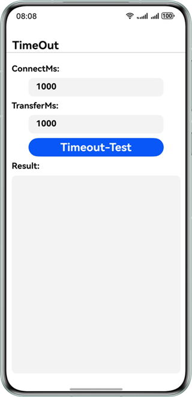
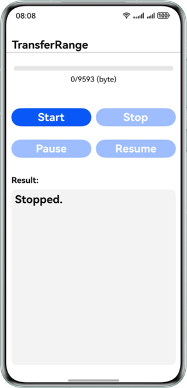
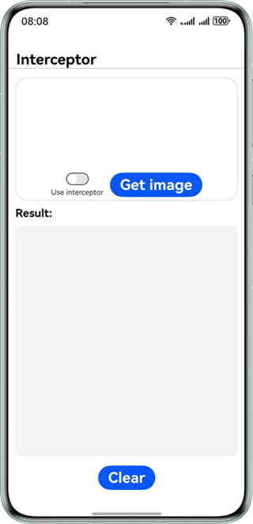
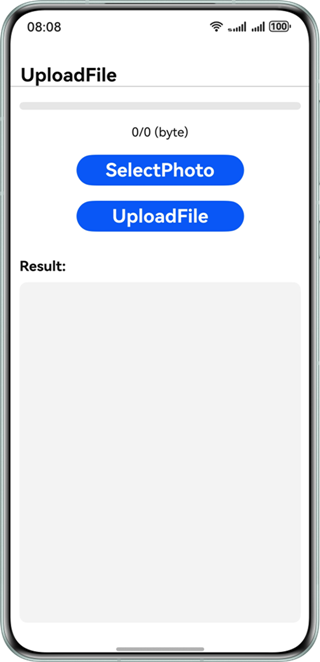
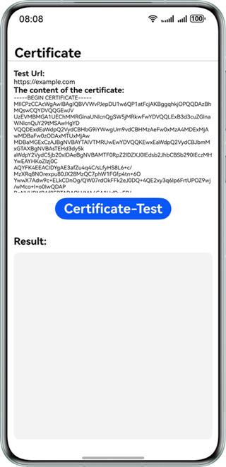

# 远场通信服务示例代码

## 简介

Remote Communication Kit是华为推出的一款专业的网络通信SDK，它通过对HTTP/HTTPS协议的封装实现了高效的数据请求功能。该服务为开发者提供了标准化的接口，支持应用系统快速、稳定、安全地与服务器进行数据交互。

## 开发前准备

- 开发HarmonyOS应用前，需先安装并配置开发环境。
- 了解远场通信服务代码结构。

## 效果预览








## 工程目录

```
└── entry/src/main/ets
    ├── entryability
    │   └── MainAbility.ets        // UI Ability
    ├── pages
    │   ├── BaseAddress.ets      // 基础URL测试页面
    │   ├── Certificate.ets      // 使用证书测试页面
    │   ├── Interceptor.ets      // 拦截器测试页面
    │   ├── MainPage.ets      // 主界面
    │   ├── TimeOut.ets      // 超时测试页面
    │   ├── TransferRange.ets      // 断点续传页面
    │   └── UploadFile.ets      // 上传文件测试页面
    └── utils
        └── FileSelectUtils.ets      // 选择文件的工具
```

## 具体实现

本示例主要展示的基础URL测试、超时测试、断点续传、拦截器、上传文件、使用证书功能，其相关接口均定义在 **@hms.collaboration.rcp.d.ts** 中。

- 基础URL(BaseAddress)：SessionConfiguration{baseAddress?: URLOrString;}。
- 超时测试(TimeOut)：TransferConfiguration{timeout?: Timeout;}。
- 断点续传(TransferRange)：TransferRange{from?: number; to?: number;}。
- 拦截器(Interceptor)：SessionConfiguration{interceptors?: Interceptor[];}。
- 上传文件(UploadFile)：uploadFromFile(url: URLOrString, uploadFrom: UploadFromFile): Promise<Response>。
- 使用证书(Certificate)：SecurityConfiguration {remoteValidation?: 'system' | 'skip' | CertificateAuthority | ValidationCallback;}。

在使用上述功能时，需首先导入 **@kit.RemoteCommunicationKit** 模块，然后根据实际需求对相关接口进行扩展和实现。详细实现可以参考本用例中 **“entry/src/main/pages”** 下的六个接口实现。

## 相关权限

本示例需要申请Internet访问和查询网络信息权限，请确保在配置文件 **module.json5** 中添加以下权限：

1. 允许使用Internet网络权限：ohos.permission.INTERNET

2. 允许应用获取数据网络信息：ohos.permission.GET_NETWORK_INFO

## 使用说明

如果在运行示例代码时遇到问题，请尝试在DevEco Studio中选择菜单栏的 **Build > Clean Project** 选项，清理工程。

## 约束与限制

1. 本示例仅支持标准系统上运行，支持设备：华为手机。  
2. HarmonyOS系统：HarmonyOS 5.0.0 Release及以上。  
3. DevEco Studio版本：DevEco Studio 6.0.0 Release及以上。  
4. HarmonyOS SDK版本：HarmonyOS 6.0.0 Release SDK及以上。