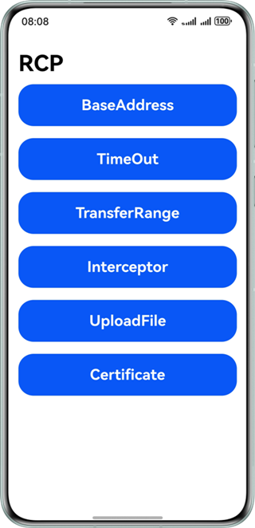
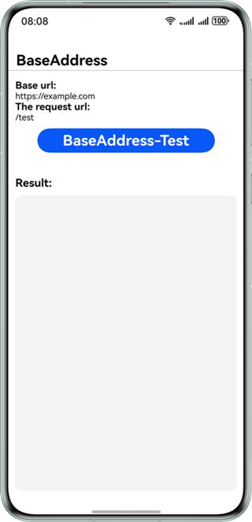
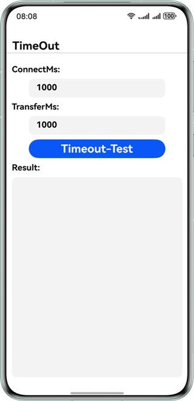
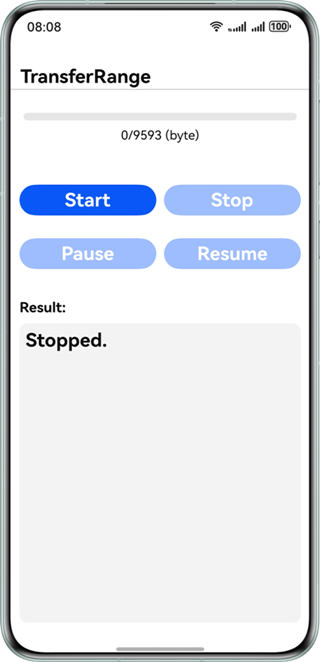
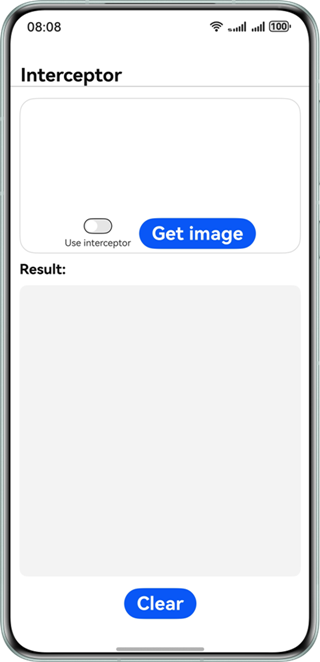
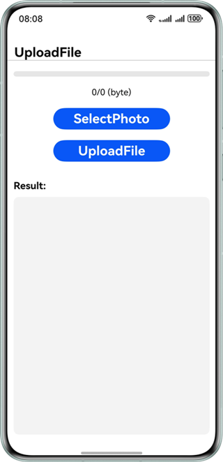
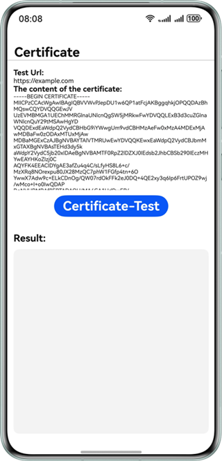

# Remote Communication Kit Sample Code

## Overview

The Remote Communication Kit is a professional network communication SDK launched by Huawei. It achieves efficient data request functionality through the encapsulation of HTTP/HTTPS protocols. This service provides developers with standardized interfaces, enabling application systems to interact with servers quickly, stably, and securely.

## Preparations

- Before developing HarmonyOS applications, you need to install and configure the development environment.
- Understand the code structure of Remote Communication Kit.

## Preview









## Project Directory

```
└── entry/src/main/ets
    ├── entryability
    │   └── MainAbility.ets        // UI Ability
    ├── pages
    │   ├── BaseAddress.ets      // Base URL test page
    │   ├── Certificate.ets      // Use the certificate test page
    │   ├── Interceptor.ets      // Interceptor test page
    │   ├── MainPage.ets      // Main UI
    │   ├── TimeOut.ets      // Timeout test page
    │   ├── TransferRange.ets      // Resumable transfer page
    │   └── UploadFile.ets      // Upload file test page
    └── utils
        └── FileSelectUtils.ets      // Tools for selecting files
```

## How to Implement

This example primarily demonstrates basic URL testing, timeout testing, resumable uploads, interceptors, upload file, and the use of certificate functionality. The relevant interfaces are all defined in **@hms.collaboration.rcp.d.ts**.

- Base URL test (BaseAddress): SessionConfiguration{baseAddress?: URLOrString;}.
- Timeout test (TimeOut): TransferConfiguration{timeout?: Timeout;}.
- Resumable transfer (TransferRange): TransferRange{from?: number; to?: number;}.
- Interceptor (Interceptor)：SessionConfiguration{interceptors?: Interceptor[];}。
- Upload file (UploadFile)：uploadFromFile(url: URLOrString, uploadFrom: UploadFromFile): Promise<Response>。
- Using certificates (Certificate)：SecurityConfiguration {remoteValidation?: 'system' | 'skip' | CertificateAuthority | ValidationCallback;}。

When using the aforementioned features, it is necessary to first import the **@kit.RemoteCommunicationKit** module, and then extend and implement the relevant interfaces according to actual requirements. For detailed implementation, please refer to the six interface implementations located under **"entry/src/main/pages"** in this use case.

## Required Permissions

This example requires applying for Internet access and query network information permissions. Please ensure that the following permissions are added in the configuration file **module.json5**:

1. **ohos.permission.INTERNET**: Allows an app to access the Internet.

2. **ohos.permission.GET_NETWORK_INFO**: Allow the app to access network information.

## How to Configure and Use

If you encounter any issues while running the sample code, please try selecting the **"Build > Clean Project"** option from the menu bar in DevEco Studio to clean the project.

## Constraints

1. The sample app is only supported on Huawei phones with standard systems. 
2. The HarmonyOS version must be HarmonyOS 5.0.0 Release or later. 
3. The DevEco Studio version must be DevEco Studio 6.0.0 Release or later. 
4. The HarmonyOS SDK version must be HarmonyOS 6.0.0 Release SDK or later.