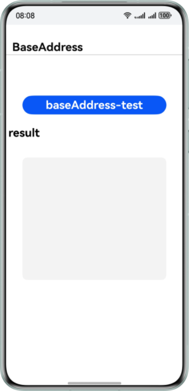

# Remote Communication Kit Sample Code

## Overview

The Remote Communication Kit is a professional network communication SDK launched by Huawei. It achieves efficient data request functionality through the encapsulation of HTTP/HTTPS protocols. This service provides developers with standardized interfaces, enabling application systems to interact with servers quickly, stably, and securely.

## Preparations

- Before developing HarmonyOS applications, you need to install and configure the development environment.
- Understand the code structure of Remote Communication Kit.

## Preview





## Project Directory

```
├── entry/src/main
    ├── cpp
    │   ├── CMakeLists.txt			// C file compilation script
    │   ├── napi_init.cpp			// The C interface is encapsulated as ArkTs.
    │   └── types 
    │       └── libentry
    │           ├── Index.d.ts		// Export the encapsulated ArkTs interface
    │           └── oh-package.json5	// ArkTs and dynamic library mapping
    └── ets
        ├── entryability
        │   └── MainAbility.ets               //UI Ability
        └── pages
            ├── BaseAddress.ets		// Base URL test page
            ├── MainPage.ets		// Main UI
            ├── TimeOut.ets			// Timeout test page
            └── TransferRange.ets   	// Resumable transfer page
```

## How to Implement

This example primarily demonstrates basic URL testing, timeout testing, and breakpoint resume functionality. The relevant interfaces are defined in the **rcp.h** file and are invoked in **napi_init.cpp**.

- Base URL test (BaseAddress)：First, configure the base URL, then set the URL in Rcp_Request to a relative address.
- Timeout test (TimeOut)：Set the connection timeout and transfer timeout through the connectMs and transferMs parameters of Rcp_Timeout.
- Resumable transfer (TransferRange)：Set the data transfer range for the request using the "from" and "to" parameters of Rcp_TransferRange.

When using the above features, please ensure that you first include the header file **#include "RemoteCommunicationKit/rcp.h"**, and then extend the use of the relevant interfaces according to actual needs. For detailed implementation, you can refer to the three interface implementations located under **"entry/src/main/pages"** in this use case.

## Required Permissions

This sample code requires the Internet access permission. Add the following permissions to the **module.json5** file:

1. **ohos.permission.INTERNET**: Allows an app to access the Internet.

## How to Configure and Use

If you encounter any issues while running the sample code, please try selecting the **"Build > Clean Project"** option from the menu bar in DevEco Studio to clean the project.

## Constraints

1. The sample app is only supported on Huawei phones with standard systems.
2. The HarmonyOS version must be HarmonyOS 5.0.0 Release or later.
3. The DevEco Studio version must be DevEco Studio 6.0.0 Release or later.
4. The HarmonyOS SDK version must be HarmonyOS 6.0.0 Release SDK or later.