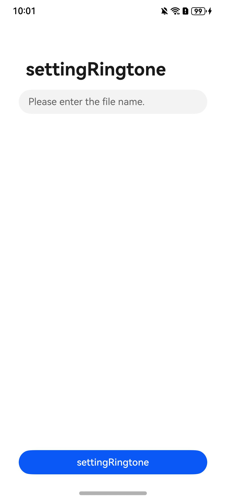

# Overview

Ringtone Kit is a tool library for setting ringtones. By using Ringtone Kit, you can set ringtones for HarmonyOS apps, providing users with a simple, consistent, secure, and high-quality ringtone setting experience.

|                     **App home screen**                      |
| :----------------------------------------------------------: |
|  |

# How to Use

Before use, `open the DEMO first`, then run `hdc` to push the audio file to a mobile phone.

```bash
// Command for pushing the audio file.
hdc file send *Audio file.mp3* /storage/media/100/local/files/Docs/Download/com.example.uiextension
```

Open the demo page for setting the ringtone.

- Enter the name of the audio file, for example, `6.mp3`, and tap `settingRingtone`.
- Display the ringtone setting dialog box.
- Tap buttons to set ringtone types.
- Tap **My ringtones** to go to the system settings page.

# Project Directory

```bash
├──entry/src/main
│  └──ets                           // Code area
│     ├──entryability
│     │  └──EntryAbility.ets        // Entry point class
│     └──pages                      // Page file
│        └──Index.ets               // App UI
└──entry/src/main/resources         // Directory for storing resource files
```

# Constraints

1. This sample can only be run on standard-system Huawei phones and tablets.
2. The HarmonyOS version must be HarmonyOS NEXT Developer Beta 3 or later.
3. The DevEco Studio version must be DevEco Studio NEXT Developer Beta 3 or later.
4. The HarmonyOS SDK version must be HarmonyOS NEXT Developer Beta 3 SDK or later.
