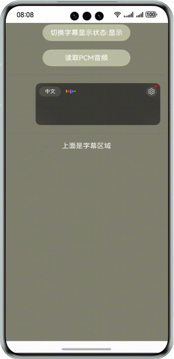

# AICaption

### 介绍
本示例展示了语音类AI能力中的AI字幕能力。

本示例模拟了在应用里，通过依次点击"切换字幕显示状态"->"读取pcm音频"按钮，拉起AI字幕控件并对音频进行实时语音转文字的场景。

需要使用HiAI引擎框架中的@kit.SpeechKit.d.ts接口。

### 效果预览


### 工程目录
```
├─entry/src/main/ets                         // 代码区
│  ├─entryability
│  │  └─EntryAbility.ets                     // EntryAbility
│  └─pages
│     └─Index.ets                            // 主页界面
├─entry/src/main/resources                   // 应用资源目录
│  └─chineseAudio.pcm                        // pcm音频文件
└─screenshots                                // 截图
```

### 具体实现

本示例模拟了在应用里，通过依次点击"切换字幕显示状态"->"读取pcm音频"按钮，拉起AI字幕控件并对音频进行实时语音转文字的场景。
业务使用时，需要先进行import导入Speech kit: `import { AICaptionComponent, AICaptionOptions, AICaptionController, AudioData } from '@kit.SpeechKit';`

涉及接口：
* `writeAudio(audioData: AudioData): void` [链接](https://developer.huawei.com/consumer/cn/doc/harmonyos-references/speech-aicaptioncomponent#section272302165)
* `AudioData` [链接](https://developer.huawei.com/consumer/cn/doc/harmonyos-references/speech-aicaptioncomponent#section1869988122518)
* `AICaptionOptions` [链接](https://developer.huawei.com/consumer/cn/doc/harmonyos-references/speech-aicaptioncomponent#section15787428226)

涉及组件：
* `AICaptionComponent` [链接](https://developer.huawei.com/consumer/cn/doc/harmonyos-references/speech-aicaptioncomponent#section7266241469)
* `AICaptionController` [链接](https://developer.huawei.com/consumer/cn/doc/harmonyos-references/speech-aicaptioncomponent#section816451553012)

具体参考entry/src/main/ets/pages/Index.ets.

### 相关权限
无

### 约束与限制

1. 本示例仅支持标准系统上运行，支持设备：Phone、Tablet、2in1。
2. HarmonyOS系统：HarmonyOS NEXT Developer Beta2及以上。
3. DevEco Studio版本：DevEco Studio NEXT Developer Beta2及以上。
4. HarmonyOS SDK版本：HarmonyOS NEXT Developer Beta2 SDK及以上。