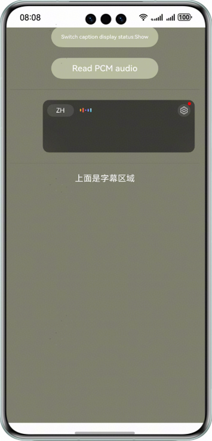

# AICaption

### Overview
This sample code illustrates how to use the AICaptionComponent in voice AI capabilities.

This example simulates a scenario where you tap **Switch caption display status** and **Read PCM audio** buttons in sequence to start the AICaptionComponent and convert the audio to text.

You need to use **@kit.SpeechKit.d.ts**, which contains related APIs.

### Preview


### Project Directory
```
├─entry/src/main/ets                         // Code area
│  ├─entryability
│  │  └─EntryAbility.ets                     // EntryAbility
│  └─pages
│     └─Index.ets                            // Home page
├─entry/src/main/resources                   // App resource directory
│  └─chineseAudio.pcm                        // PCM audio file
└─screenshots                                // Screenshots
```

### How to Implement

This example simulates a scenario where you tap **Switch caption display status** and **Read PCM audio** buttons in sequence to start the AICaptionComponent and convert the audio to text.
Before using the service, you need to perform the following operation: `import { AICaptionComponent, AICaptionOptions, AICaptionController, AudioData } from '@kit.SpeechKit'`

The following APIs are involved:
* `writeAudio(audioData: AudioData): void` [Link](https://developer.huawei.com/consumer/en/doc/harmonyos-references/speech-aicaptioncomponent#section272302165
)
* `AudioData` [Link](https://developer.huawei.com/consumer/en/doc/harmonyos-references/speech-aicaptioncomponent#section1869988122518)
* `AICaptionOptions` [Link](https://developer.huawei.com/consumer/en/doc/harmonyos-references/speech-aicaptioncomponent#section15787428226)

The following components are involved:
* `AICaptionComponent` [Link](https://developer.huawei.com/consumer/en/doc/harmonyos-references/speech-aicaptioncomponent#section7266241469)
* `AICaptionController` [Link](https://developer.huawei.com/consumer/en/doc/harmonyos-references/speech-aicaptioncomponent#section816451553012)

For details, please refer to **entry/src/main/ets/pages/Index.ets**.

### Required Permissions
None

### Constraints

1. The sample app is supported only on Huawei phones, tablets, and 2in1 devices running the standard system.
2. The HarmonyOS version must be HarmonyOS NEXT Developer Beta2 or later.
3. The DevEco Studio version must be DevEco Studio NEXT Developer Beta2 or later.
4. The HarmonyOS SDK version must be HarmonyOS NEXT Developer Beta2 or later.
