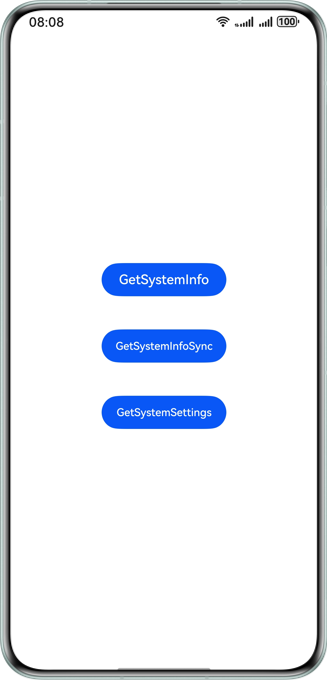
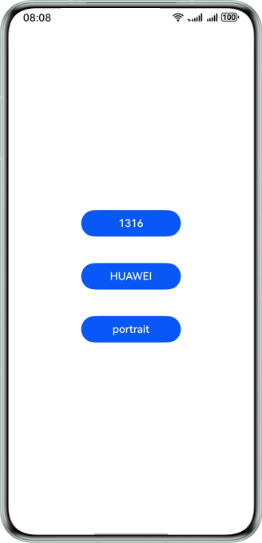

# 基于融合场景服务实现API获取系统属性

## 介绍

本示例展示了使用华为融合场景服务提供的场景化API，主要用于获取系统信息和设备位置。

需要使用华为融合场景服务接口 **@kit.ScenarioFusionKit**。

## 效果预览


| **示例应用主页面**                                    | **点击效果示意**                                     |
|------------------------------------------------|------------------------------------------------|
|  |  |

## 示例工程的配置与使用

### 在DevEco中配置本示例工程的步骤如下

1. [创建项目](https://developer.huawei.com/consumer/cn/doc/app/agc-help-create-project-0000002242804048)及[应用](https://developer.huawei.com/consumer/cn/doc/app/agc-help-create-app-0000002247955506)。
2. 详细可参见开发指南-[开发准备](https://developer.huawei.com/consumer/cn/doc/harmonyos-guides/scenario-fusion-preparations)。

## 工程目录
```
entry
  └─src                     
    ├─main                
    │  ├─ets              
    │  │  ├─entryability           // 程序入口类
    │  │    ├──EntryAbility.ets    // 本地启动ability
    │  │  └─pages             
    │  │     ├─Index.ets           // 入口界面
    │  │     ├─GetSystemInfoSync.ets      // 系统信息同步接口
    │  │     ├─GetSystemInfo.ets          // 系统信息异步接口
    │  │     └─GetSystemSetting.ets       // 系统设置接口
    │  └─resources        
    │      ├─base         
    │      │  ├─element       // 颜色、字体、字符串等资源
    │      │  ├─media         // 图片等资源  
    │      │  └─profile       // 页面配置
```  

## 具体实现
场景化API：
- 开发者调用 Scenario Fusion Kit 提供的 atomicService.getSystemSetting()接口，获取定位/蓝牙/wifi是否可用、设备方向等系统信息。
- 开发者调用 Scenario Fusion Kit 提供的 atomicService.getSystemInfo()接口，异步获取设备/网络状态/屏幕/语言/主题等系统信息。
- 开发者调用 Scenario Fusion Kit 提供的 atomicService.getSystemInfoSync()接口，获取设备/网络状态/屏幕/语言/主题等系统信息。

参考
1. 场景化API：entry\src\main\ets\pages\Index.ets

## 相关权限

参考开发指南-[开发准备](https://developer.huawei.com/consumer/cn/doc/harmonyos-guides/scenario-fusion-preparations)和[场景化API](https://developer.huawei.com/consumer/cn/doc/harmonyos-guides/scenario-fusion-api-information-attribute)章节。

## 依赖

无

## 约束与限制
1. 本示例仅支持标准系统上运行，支持设备:Phone、Tablet、Wearable、TV和2in1。
2. HarmonyOS系统: HarmonyOS 5.0.0 Release及以上。
3. DevEco Studio版本: DevEco Studio 5.0.0 Release及以上。
4. HarmonyOS SDK版本: HarmonyOS 5.0.0 Release SDK及以上。
