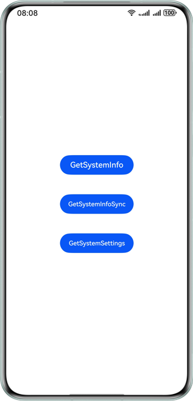
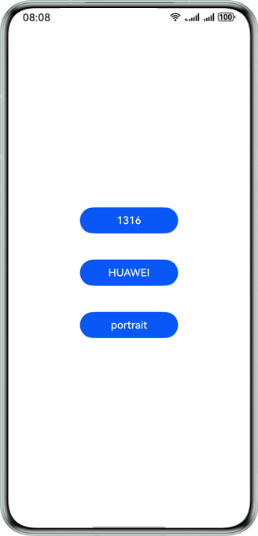

# Retrieval of system attributes via API calls based on Scenario Fusion Kit

## Overview

This sample code illustrates scenario-specific APIs provided by Scenario Fusion Kit, which can be used to obtain system information and location information.

The APIs that you need to use are packaged into **@kit.ScenarioFusionKit**.

## Preview


| **Home Screen**                                   | **Effect upon a Tap**                                    |
|------------------------------------------------|------------------------------------------------|
|  |  |

## How to Configure and Use

### Configuring the Sample App in DevEco Studio

1. [Create a project](https://developer.huawei.com/consumer/en/doc/app/agc-help-create-project-0000002242804048). Under the project, [create an app](https://developer.huawei.com/consumer/en/doc/app/agc-help-create-app-0000002247955506).
2. For details, please refer to the development guide > [Preparations](https://developer.huawei.com/consumer/en/doc/harmonyos-guides/scenario-fusion-preparations).

## Project Directory
```
entry
  └─src                     
    ├─main                
    │  ├─ets              
    │  │  ├─entryability           // Entry point class
    │  │    ├──EntryAbility.ets    // Ability for local startup
    │  │  └─pages             
    │  │     ├─Index.ets           // Main UI
    │  │     ├─GetSystemInfoSync.ets      // API for obtaining system information in synchronous mode
    │  │     ├─GetSystemInfo.ets          // API for obtaining system information in asynchronous mode
    │  │     └─GetSystemSetting.ets       // API for obtaining system settings
    │  └─resources        
    │      ├─base         
    │      │  ├─element       // Resources such as color, font, and character strings
    │      │  ├─media         // Resources such as images 
    │      │  └─profile       // Page configuration
```  

## How to Implement
Scenario-Specific APIs
- Call the **atomicService.getSystemSetting()** API provided by Scenario Fusion Kit to obtain system information such as the location, Bluetooth status, Wi-Fi status, and device direction.
- Call the **atomicService.getSystemInfo()** API provided by Scenario Fusion Kit to asynchronously obtain system information such as the device, network, screen, language, and color mode information.
- Call the **atomicService.getSystemInfoSync()** API provided by Scenario Fusion Kit to obtain system information such as the device, network, screen, language, and color mode information.

Reference
1. Scenario-specific APIs: entry\src\main\ets\pages\Index.ets

## Required Permissions

For details, please refer to [Preparations](https://developer.huawei.com/consumer/en/doc/harmonyos-guides/scenario-fusion-preparations) and **[Scenario-Specific APIs](https://developer.huawei.com/consumer/en/doc/harmonyos-guides/scenario-fusion-api-information-attribute)** in the development guide.

## Dependencies

None

## Constraints
1. The sample app is only supported on phones, tablets, wearables, TVs, and 2-in-1 devices with standard systems.
2. The HarmonyOS version must be HarmonyOS 5.0.0 Release or later.
3. The DevEco Studio version must be DevEco Studio 5.0.0 Release or later.
4. The HarmonyOS SDK version must be HarmonyOS 5.0.0 Release SDK or later.
