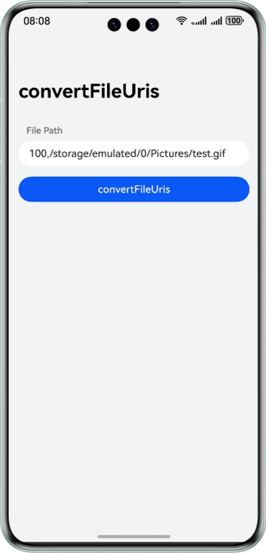
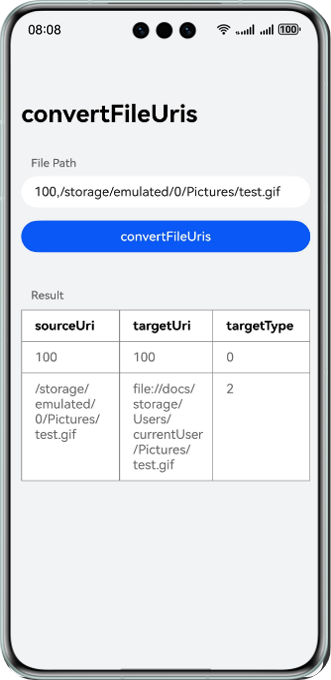

# 基于融合场景服务实现文件路径转换

## 介绍

本示例展示了使用华为融合场景服务提供的文件路径转换接口，主要用于在HarmonyOS 4及以下到HarmonyOS 5及以上的升级场景和克隆场景通过调用文件路径转换接口（convertFileUris），获取升级后目标文件路径和文件类型。

需要使用华为融合场景服务接口 **@kit.ScenarioFusionKit**。

## 效果预览

文件路径转换接口：

| **示例应用主页面**                                    | **点击效果示意**                                                 |
|------------------------------------------------|------------------------------------------------------------|
|  |  |

## 示例工程的配置与使用

### 在DevEco中配置本示例工程的步骤如下

1. [创建项目](https://developer.huawei.com/consumer/cn/doc/app/agc-help-create-project-0000002242804048)及[应用](https://developer.huawei.com/consumer/cn/doc/app/agc-help-create-app-0000002247955506)。
2. 详细可参见开发指南-[文件路径转换API](https://developer.huawei.com/consumer/cn/doc/harmonyos-guides/scenario-fusion-api-path-conversion)。

## 工程目录
```
├──entry/src/main/ets	        // 代码区
│  ├──entryability
│  │  └──EntryAbility.ets	// 程序入口类
│  ├──entrybackupability
│  │  └──EntryBackupAbility.ets // 备份能力类
│  └──pages
│     └──Index.ets		// 主界面	
└──entry/src/main/resources	// 资源文件目录  
``` 

## 具体实现
文件路径转换接口：
- 开发者调用 Scenario Fusion Kit 提供的 fileUriService.convertFileUris接口，系统文件路径转换，包括转换后文件类型。

参考
1. 文件路径转换接口：[entry\src\main\ets\pages\Index.ets](./Entry/src/main/ets/pages/Index.ets)

## 相关权限

无

## 依赖

无

## 约束与限制
1. 本示例仅支持标准系统上运行，支持设备:手机、平板。
2. HarmonyOS系统: HarmonyOS 5.0.2 Release 及以上。
3. DevEco Studio版本: DevEco Studio 5.0.2 Release 及以上。
4. HarmonyOS SDK版本: HarmonyOS 5.0.2 Release SDK及以上。
