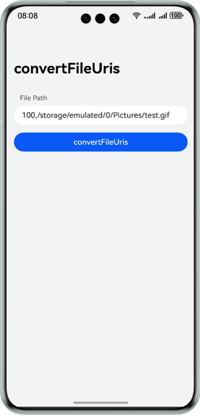
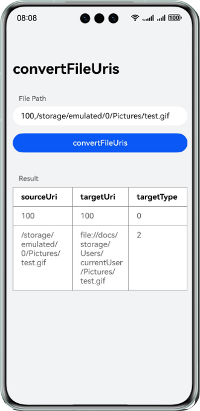

# File path conversion via calls based on Scenario Fusion Kit

## Overview

This sample project illustrates how to use the file path conversion API (convertFileUris) of Scenario Fusion Kit to implement capabilities for converting file paths in upgrade or clone scenarios from HarmonyOS 4 or earlier to HarmonyOS 5 or later.

The APIs that you need to use are packaged into **@kit.ScenarioFusionKit**.

## Preview

The following table shows the display effects of the file path conversion API.

| **Home Screen**                                            | **Effect upon a Tap**                                      |
|------------------------------------------------------------|------------------------------------------------------------|
|  |  |

## How to Configure and Use

### Configuring the Sample Project in DevEco Studio

1. [Create a project](https://developer.huawei.com/consumer/en/doc/app/agc-help-overview-0000001100246618). Under the project, [create an app](https://developer.huawei.com/consumer/en/doc/app/agc-help-overview-0000001100246618).
2. For details, please refer to the [file path conversion API](https://developer.huawei.com/consumer/en/doc/harmonyos-guides/scenario-fusion-api-path-conversion) .

## Project Directory
```  
├──entry/src/main/ets	        // Code area
│  ├──entryability
│  │  └──EntryAbility.ets	// Entry point class
│  ├──entrybackupability
│  │  └──EntryBackupAbility.ets // Backup ability class
│  └──pages
│     └──Index.ets		// Main page	
└──entry/src/main/resources	// Resource file path 
```  

## How to Implement
To implement the file path conversion API:
- Call the **fileUriService.convertFileUris** API provided by Scenario Fusion Kit to convert a system file path, during which the target file type needs to be specified.

References
1. File path conversion API: [entry\src\main\ets\pages\Index.ets](./Entry/src/main/ets/pages/Index.ets)

## Required Permissions

None

## Dependencies

None

## Constraints
1. The sample app is only supported on phones and tablets with standard systems.
2. The HarmonyOS version must be HarmonyOS 5.0.2 Release or later.
3. The DevEco Studio version must be DevEco Studio 5.0.2 Release or later.
4. The HarmonyOS SDK version must be HarmonyOS 5.0.2 Release SDK or later.
