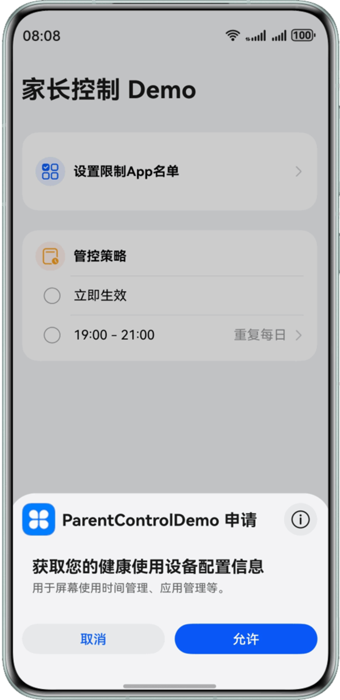
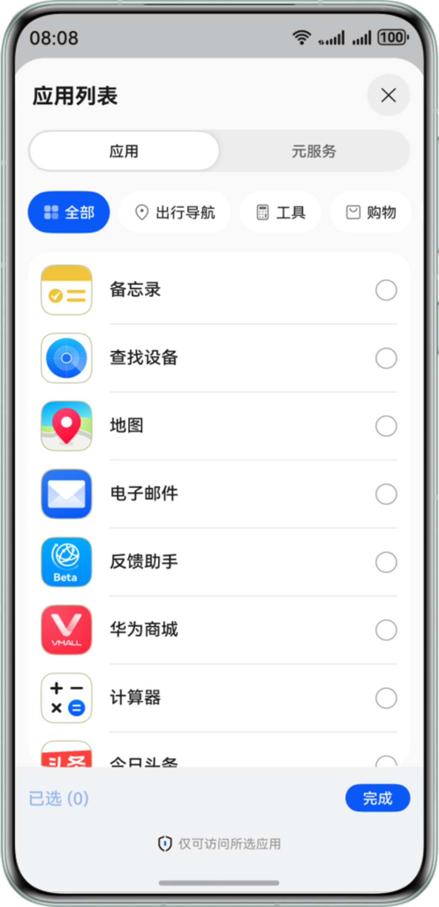
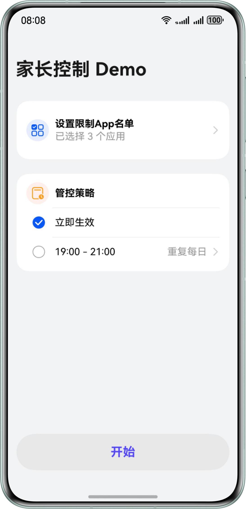
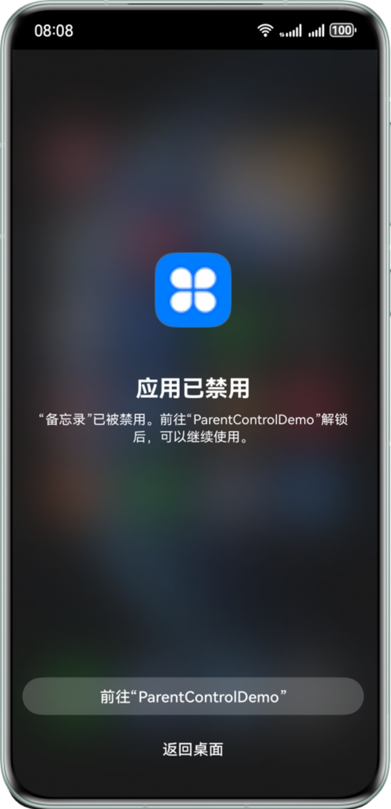
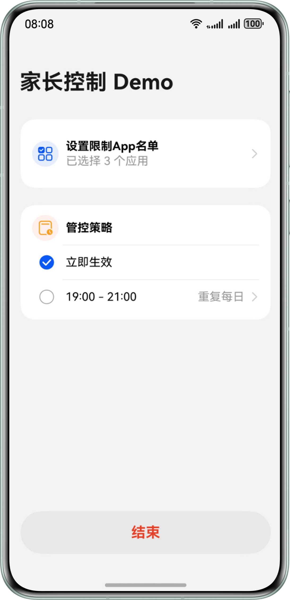
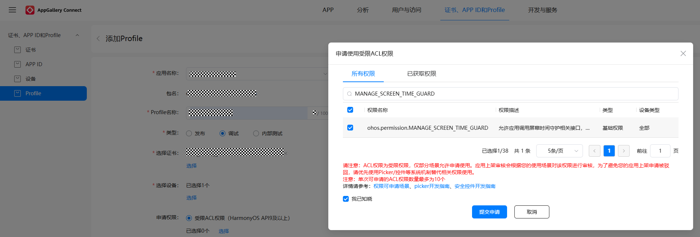

# 实现应用访问限制功能

## 介绍

Screen Time Guard Kit提供了屏幕使用时间管控、应用使用限制等开放能力。

本示例主要介绍在应用里如何进行屏幕使用时间管控和应用使用限制，包括请求用户授权、安全拉起应用列表picker页、应用访问限制、解除应用访问限制、添加管控策略、查询管控策略、修改管控策略、启动管控策略、停止管控策略、删除管控策略。

需要使用Screen Time Guard Kit接口 **@kit.ScreenTimeGuardKit**。

## 效果预览

| **请求用户授权页**                             | **拉起应用列表picker页** | **配置管控策略页** | **拦截页** |  **结束管控**  |
|-----------------------------------------|------------------------|-----------------|-------------|-------------|
|  |||||


## 相关权限
 
本示例需要调用Screen Time Guard Kit接口的相关接口，已在 module.json5 文件中添加管理屏幕使用时间权限"ohos.permission.MANAGE_SCREEN_TIME_GUARD"。


## 本示例工程的配置与使用

### 在DevEco中配置本示例工程的步骤如下

1. [创建项目](https://developer.huawei.com/consumer/cn/doc/app/agc-help-createproject-0000001100334664)及[应用](https://developer.huawei.com/consumer/cn/doc/app/agc-help-createharmonyapp-0000001945392297)。
2. 申请应用证书（.cer）、Profile（.p7b）文件，具体操作请参见[调试Harmony OS应用/元服务](https://developer.huawei.com/consumer/cn/doc/app/agc-help-debug-app-0000001914423098)。
3. 在添加Profile时，需要申请权限"ohos.permission.MANAGE_SCREEN_TIME_GUARD"。
   请在[AppGallery Connect](https://developer.huawei.com/consumer/cn/service/josp/agc/index.html)“添加Profile”页“申请权限 ”标签后选中“受限ACL权限（HarmonyOS API9及以上）”，点击下方的“选择”，在弹出的“申请使用受限ACL权限”选择框里选择权限"ohos.permission.MANAGE_SCREEN_TIME_GUARD"并提交申请。

3. 打开本示例，使用[AppGallery Connect](https://developer.huawei.com/consumer/cn/service/josp/agc/index.html)配置的应用包名替换app.json5文件中的bundleName属性值。同时，也需要在 module.json5 文件中添加权限"ohos.permission.MANAGE_SCREEN_TIME_GUARD"。


### 本示例工程使用说明

1. 首次运行本示例，点击“设置限制App名单”后，会拉起请求用户授权的确认窗。
2. 用户点击请求授权确认窗的“允许”按钮后，会拉起应用列表的picker页；如果点击请求授权确认窗的“取消”按钮，确认窗会关闭，示例不会执行后面的流程。
3. 在应用列表的picker页，选择了待管控的应用后，点击“完成”，该页面会关闭，回到demo页面。用户可以选择管控策略：“立即生效”或“19:00-21:00 重复每日”。
4. 点击demo页面下方的“开始”，会对已选择的应用生效管控策略。
5. 点击已被管控的应用图标，会拉起拦截页面，点击“前往“ParentControlDemo””按钮，会拉起本示例demo页面，点击demo页面下方的“结束”按钮，会停止并且删除已下发的管控策略。

## 工程目录

```
├─entry/src/main/ets                // 代码区
│ ├─common
│ │ ├─Constants.ets                 // 存放常量
│ │ └─ControlStrategyMode.ets       // 控制策略类型定义
│ ├─entryability  
│ │ └─EntryAbility.ets              // 程序入口类
│ ├─guard                           // 管控逻辑目录
│ │ └─StrategyGuardApps.ets         // 管控逻辑实现类：应用访问限制，解除应用访问限，设置管控策略(删改查)
│ ├─pages                           // 存放页面文件目录
│ │ └─ParentControlHomePage.ets     // 示例主页，在该页面可以选择管控策略，开启或停止管控
│ └─utils                           // 工具类目录
│   ├─TextModifier.ets              // 示例标题文本属性类
│   ├─ToastUtils.ets                // 弹出提示的公共方法
│   └─Utils.ets                     // 工具类: 保存示例的调用者bundleName、异常处理
└──entry/src/main/resources         // 资源文件目录
```

## 具体实现

在Constants中存放常量，参考Constants.ets：
* 包含通用错误码

使用ParentControlHomePage作为应用的主页，用户在该页面可以开启或者结束应用管控，参考ParentControlHomePage.ets：
* 使用guardService.requestUserAuth()请求用户授权
* 使用appPicker.startAppPicker()安全拉起应用列表的picker页，在该页面选择待管控的应用
* 在示例主页选择管控策略：立即生效，或某个周期性的时间段（示例是每天的19:00-21:00）
* 在示例主页下方的“开始”按钮，可以开启管控
* 如果应用已被管控，点击该应用图标，会拉起拦截页面，从拦截页面可以回到示例主页，在示例主页下方的“结束”按钮，可以停止管控并删除管控策略

使用Screen Time Guard Kit提供的接口配置灵活的管控策略，参考StrategyGuardApps.ets：
* 使用guardService.setAppsRestriction()进行应用访问限制
* 使用guardService.releaseAppsRestriction()进行解除应用访问限制
* 使用guardService.addGuardStrategy()添加管控策略
* 使用guardService.updateGuardStrategy()更新已下发的管控策略
* 使用guardService.queryGuardStrategies()查询已配置的管控策略
* 使用guardService.startGuardStrategy()启动管控策略
* 使用guardService.stopGuardStrategy()停止已生效的管控策略
* 使用guardService.removeGuardStrategy()移除管控策略

参考
1. entry\src\main\ets\common\Constants.ets
2. entry\src\main\ets\pages\ParentControlHomePage.ets
3. entry\src\main\ets\guard\StrategyGuardApps.ets


## 依赖

不涉及

## 约束与限制

1. 本示例仅支持标准系统上运行，支持的设备：Phone、Tablet、模拟器。
2. 本示例不支持大字体模式、隐私空间模式、深色模式，多语言仅支持中英文。
3. HarmonyOS系统：HarmonyOS 6.0.0 Beta1及以上。
4. DevEco Studio版本：DevEco Studio 6.0.0 Beta1及以上。
5. HarmonyOS SDK版本：HarmonyOS 6.0.0 Beta1 SDK及以上。