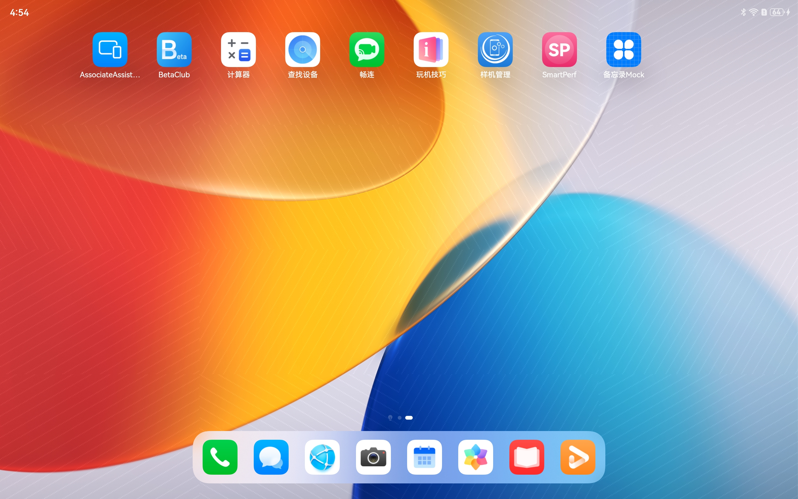
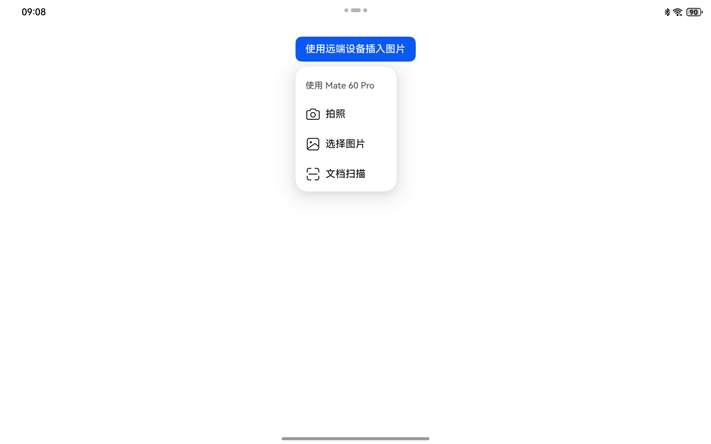
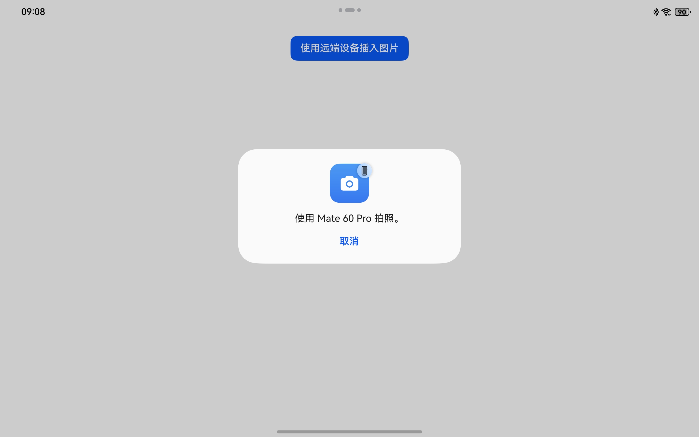
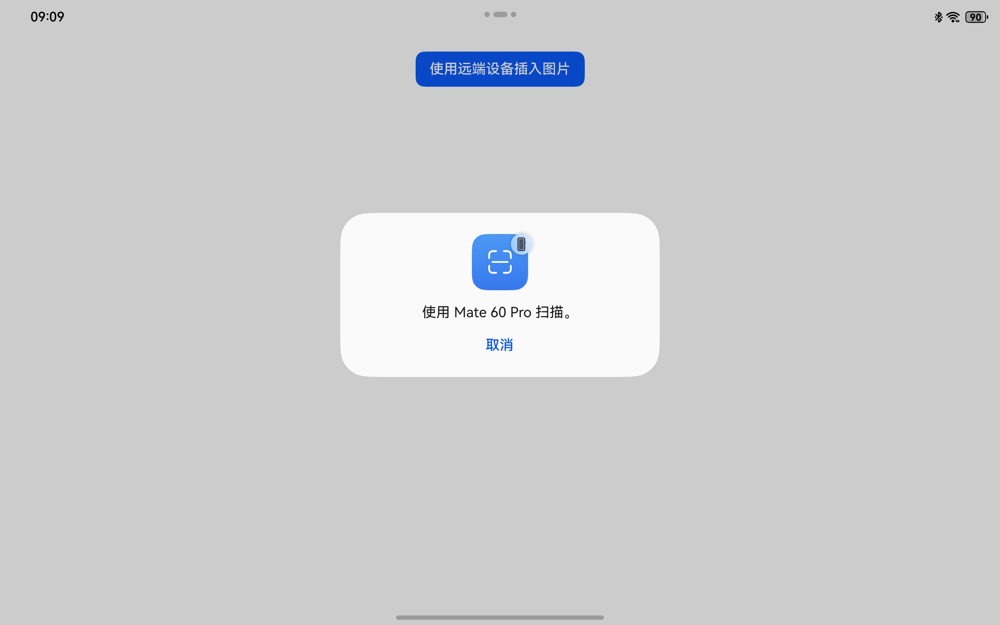
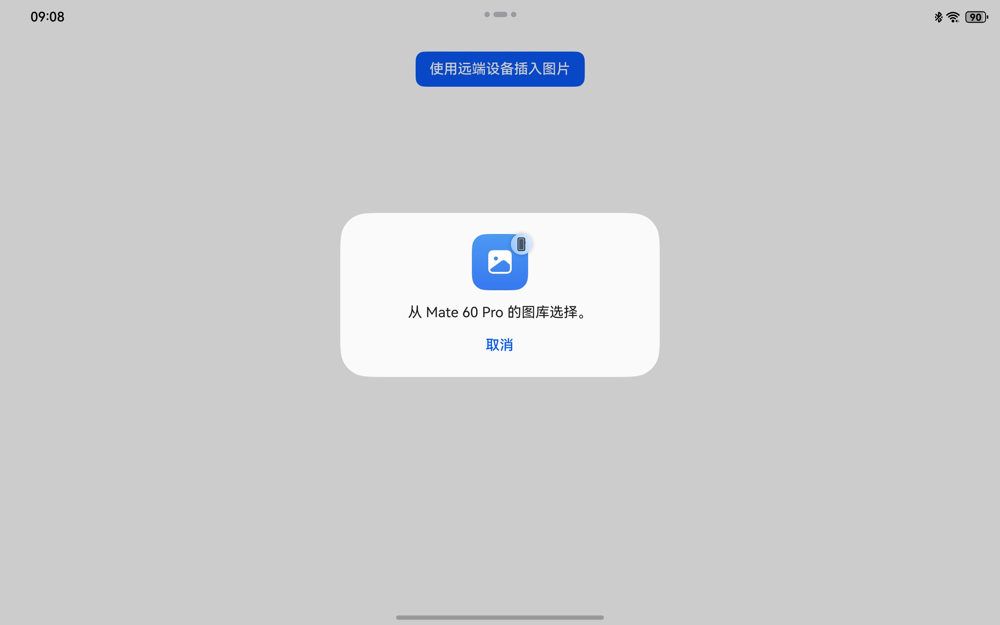
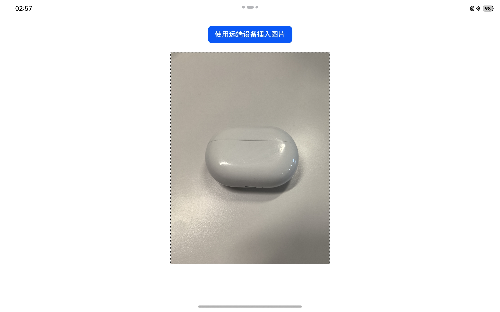

# 跨设备互通

## 介绍

本示例展示了使用分布式协同框架提供的跨设备互通的能力。

本示例模拟了在备忘录的应用里，唤起另一个设备的拍照应用，并将拍照的结果传回给备忘录。

同时您也可以使用跨设备互通中的文档扫描和图库能力，实现跨端操作。

需要使用协同框架跨设备互通接口@kit.ServiceCollaborationKit。

## 代码结构说明

```
├──entry/src/main/ets                         // 代码区
│  ├──entryability
│  │  └──EntryAbility.ets                     // 程序入口
│  └──pages
│     └──Index.ets                            // 主要页面
└──entry/src/main/resources                   // 应用资源目录
```

## 效果预览

|       **主窗口**       |      **应用首页**      |      **发现设备**      |      **拍照**      |
| :---------------------------------------: | :---------------------------------------: |:----------------------------------:|:----------------------------------:|
|  |  |  |  |
| **文档扫描** | **图库** | **图片回传** |  |
|  |  |  |                                             |


使用说明：

1. 前置步骤：
   * 准备一台2in1(或平板)和一台手机，2in1(或平板)安装此示例，手机安装具有跨端拍照能力的相机应用。
   * 在设置里面，两台设备登录**相同**的华为账号。

1. 在2in1(或平板)的主屏幕，点击”备忘录Mock“，启动应用，在主界面可见“使用远端设备插入图片”按钮。
2. 点击“使用远端设备插入图片”按钮，弹出菜单，在菜单里会列出可用的具有拍照能力的远端设备：手机。
3. 点击相应设备的"拍照"按钮，就会唤起手机的相机应用。
4. 在手机进行拍照，然后选择确认，照片就会回传到2in1类设备上并显示在应用的界面上。

## 具体实现

本示例展示的控件在@hms.collaboration.service.d.ets定义了跨端拍照生态API：

* createCollaborationServiceMenuItems(businessFilter?: Array\<CollaborationServiceFilter\>)
* CollaborationServiceStateDialog(onState: (stateCode: number, bufferType: string, buffer: ArrayBuffer))

业务使用时，需要先进行import导入CollaborationServiceStateDialog, createCollaborationServiceMenuItems与CollaborationServiceFilter。
在自定义的Menu控件内创建跨端拍照的菜单项，并在全局范围内声明对话框，并声明自己的照片接收处理回调。参考entry/src/main/ets/pages/Index.ets。

## 相关权限

不涉及。

## 依赖

依赖设备具备WIFI能力。

## 约束与限制
1. 本实例仅支持标准系统上运行。
2. HarmonyOS系统：HarmonyOS NEXT Developer Beta1及以上。
3. DevEco Studio版本：DevEco Studio NEXT Developer Beta1及以上。
4. HarmonyOS SDK版本：HarmonyOS NEXT Developer Beta1 SDK及以上。
5. 本示例需要先与远端设备组网。
6. API仅支持从当前设备调用更便携的设备，比如从2in1可以调用平板和手机，平板可以调用手机，如果在手机侧使用本用例，将不会出现设备菜单列表。


