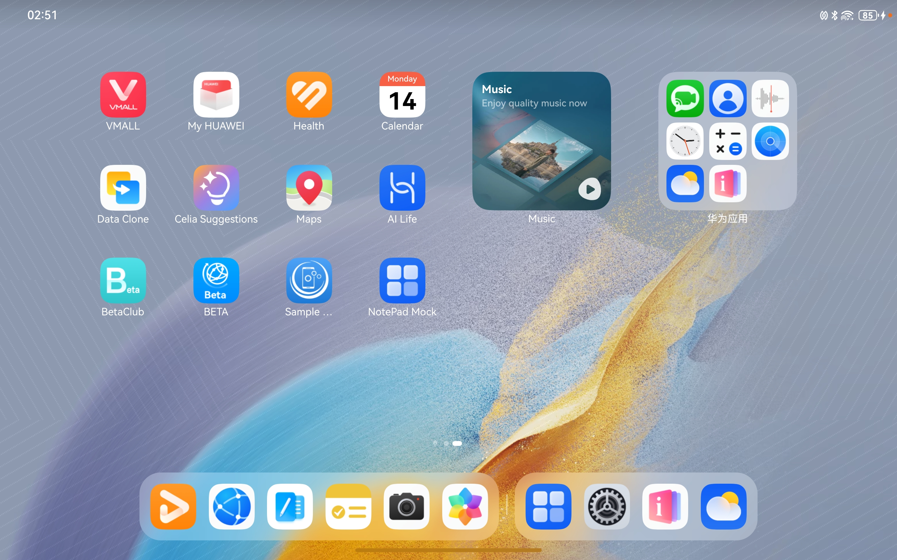
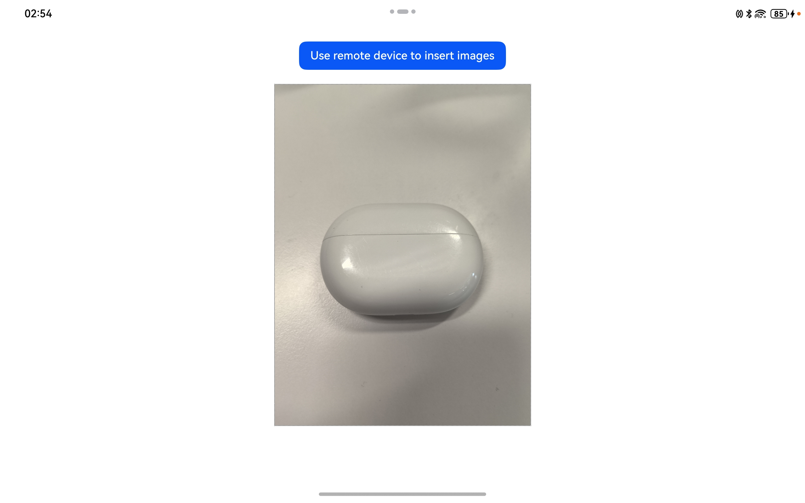

# Device Interconnectivity

## Introduction

This sample shows the Device Interconnectivity capability provided by the distributed collaboration framework.

It demonstrates the scenario where the NotePad Mock app invokes the camera app on another device to take a photo and obtains the photo.

Device Interconnectivity also provides the cross-device scan and gallery capabilities.

The Device Interconnectivity APIs provided by **@kit.ServiceCollaborationKit** needs to be used.

## Code Structure

```
├──entry/src/main/ets                         // Code area
│  ├──entryability
│  │  └──EntryAbility.ets                     // Entry ability
│  └──pages
│     └──Index.ets                            // Main entry point.
└──entry/src/main/resources                   // Static resources
```

## Preview

|            **Home screen**            |      **Main screen of the app**      |      **Device discovery**      |      **Photo-taking**      |
|:-------------------------------------:| :---------------------------------------: |:----------------------------------:|:----------------------------------:|
|    |  |  |  |
|               **Scan**                | **Gallery** | **Sending back images** |  |
|  |  |  |                                             |


How to Use

1. Make preparations.
   * Prepare a 2-in-1 device (or tablet) and a mobile phone. Install the sample app on the 2-in-1 device (or tablet), and install a camera app with the cross-device photographing capability on the mobile phone.
   * Sign in to the two devices with the **same** HUAWEI ID.

2. On the home screen of the 2-in-1 device (or tablet), touch **NotePad Mock** to start the app. The **Use remote device to insert images** button is displayed on the main screen of the app.
3. Touch **Use remote device to insert images**. A menu is displayed, listing the available remote device that can take photos, that is, mobile phone in this sample.
4. Touch **Take a photo** to wake up the camera app on the remote device.
5. Use the remote device to take a photo and make confirmation. The photo is sent back to the 2-in-1 device (or tablet) and displayed in the app.

## How to Implement

The controls define the cross-device photographing APIs in **@hms.collaboration.service.d.ets**.

* createCollaborationServiceMenuItems(businessFilter?: Array\<CollaborationServiceFilter\>)
* CollaborationServiceStateDialog(onState: (stateCode: number, bufferType: string, buffer: ArrayBuffer))

Before using the service, import **CollaborationServiceStateDialog**, **createCollaborationServiceMenuItems**, and **CollaborationServiceFilter**.
Create a menu item for cross-device photographing in the custom **Menu** control, declare the menu globally, and declare the photo receiving and processing callback. For details, please refer to the file in the following directory: **entry/src/main/ets/pages/Index.ets**.

## Permissions

N/A

## Dependency

The device where the sample code runs must support Wi-Fi.

## Constraints
1. The sample code can only run on devices with a standard system.
2. HarmonyOS: HarmonyOS NEXT Developer Beta1 or later
3. DevEco Studio: DevEco Studio NEXT Developer Beta1 or later
4. HarmonyOS SDK: HarmonyOS NEXT Developer Beta1 SDK or later
5. The Wi-Fi and Bluetooth of the device that runs the sample code and the remote device must be enabled and the same HUAWEI ID should be signed in.
6. The API calls can be initiated from a device to a more portable device, for example, from a 2-in-1 device to a tablet or mobile phone, or from a tablet to a mobile phone. If the sample code runs on a mobile phone, the device menu will not be displayed.
