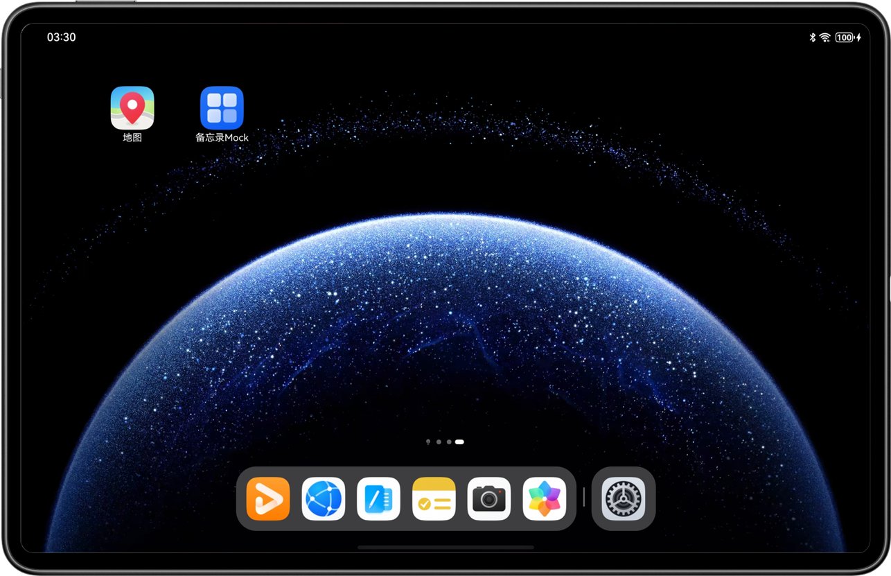
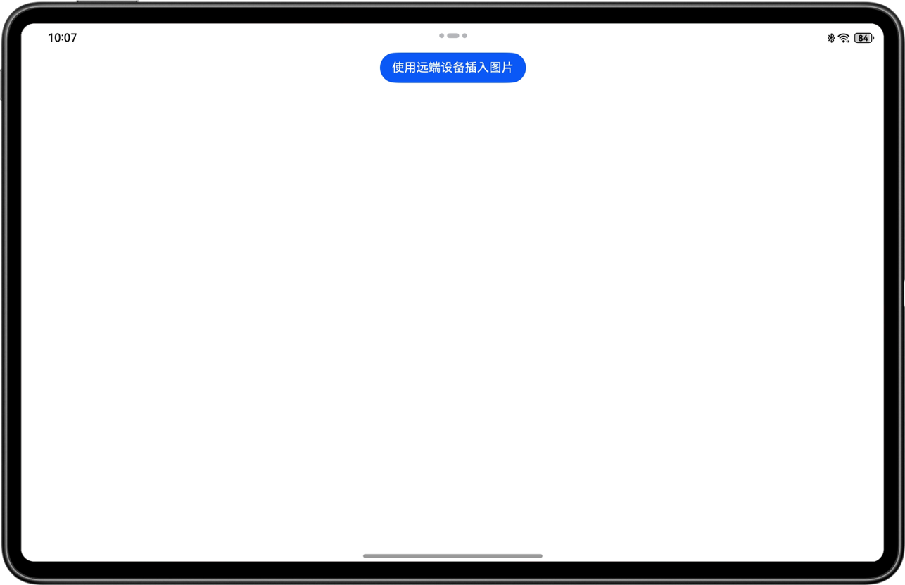
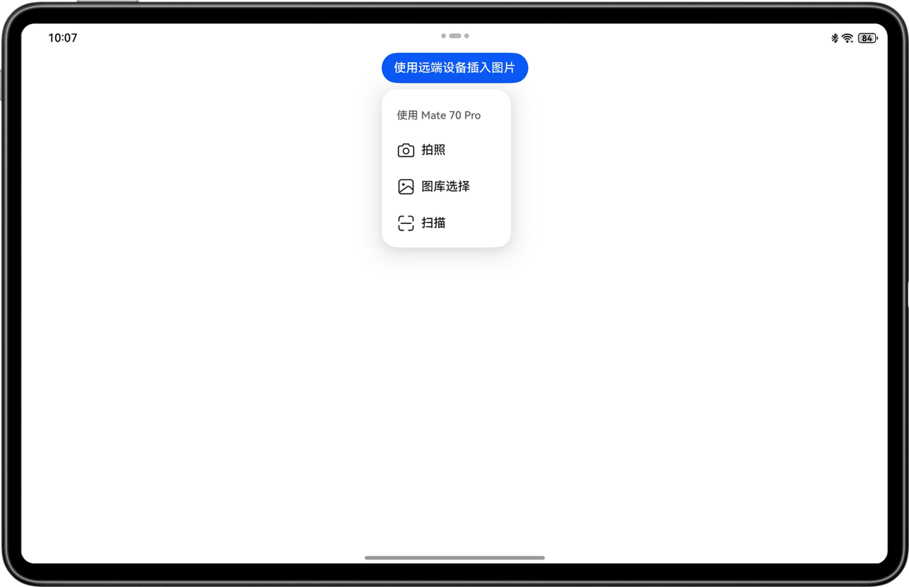
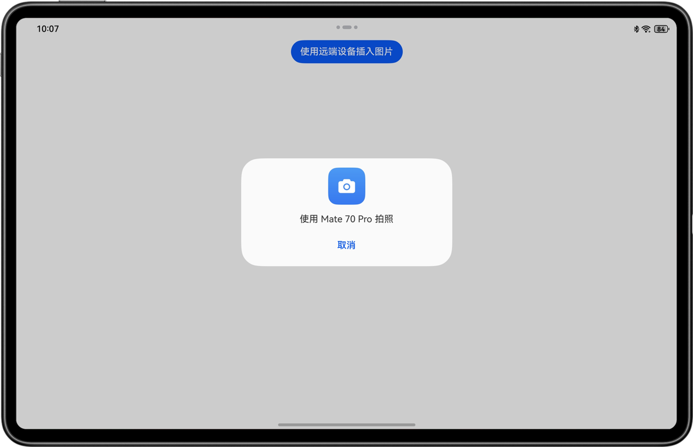
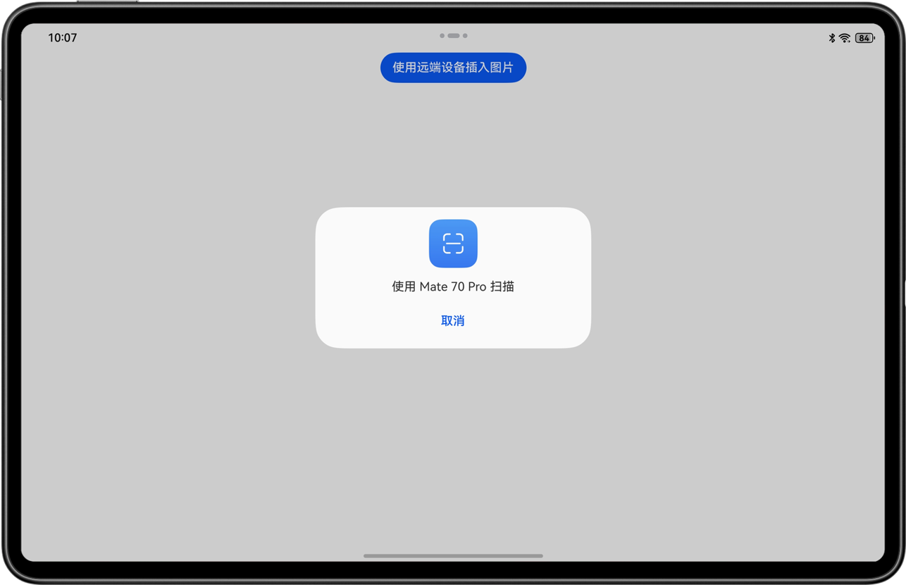
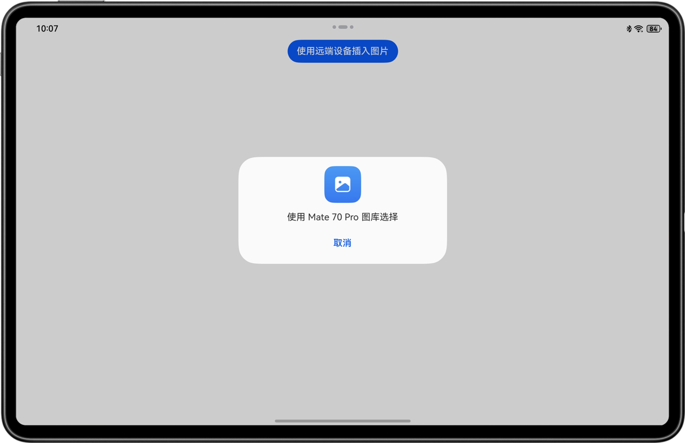
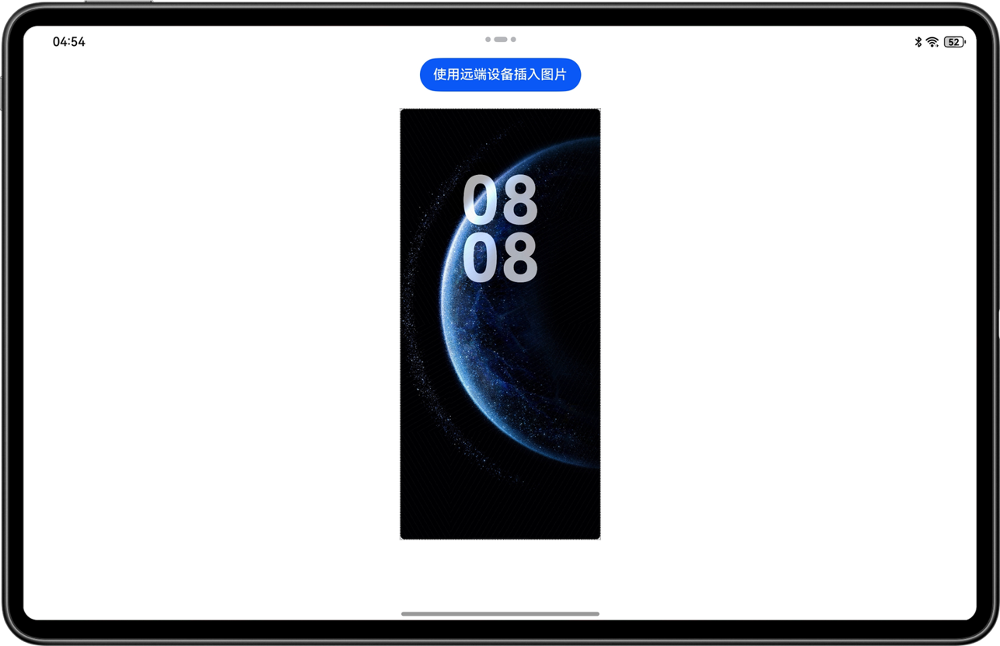

# 实现跨设备互通能力（C++）

## 介绍

本示例展示了使用分布式协同框架提供的跨设备互通的能力。

本示例基于Service Collaboration Kit提供的C++ API，模拟了在备忘录的应用里，唤起另一个设备的拍照应用，并将拍照的结果传回给备忘录。

同时您也可以使用跨设备互通中的文档扫描和图库能力，实现跨端操作。


## 代码结构说明

```
├──entry/src/main
│  ├──cpp
│  │  ├──CMakeLists.txt		          // C文件编译脚本
│  │  ├──napi_init.cpp		          // C接口封装为ArkTs
│  │  └──types 
│  │     └──libentry
│  │        ├──Index.d.ts		      // 导出封装的ArkTs接口
│  │        └──oh-package.json5	      // ArkTs与动态库映射
│  └──ets
│     ├──entryability
│     │  └──EntryAbility.ets	      // 程序入口类
│     └──pages
│        ├──CustomDialogExample.ets	  // 弹窗类
│        └──Index.ets   	          // 主界面
└──entry/src/main/resources           // 应用资源目录
```

## 效果预览

|               **主窗口**               |                  **应用首页**                   |                 **发现设备**                 |                  **拍照**                   |
|:-----------------------------------:|:-------------------------------------------:|:----------------------------------------:|:-----------------------------------------:|
|   |         |  |  |
|              **文档扫描**               |                   **图库**                    |                 **图片回传**                 |                                           |
|  |  |  |                                           |


使用说明：

1. 前置步骤：
    * 准备一台2in1(或平板)和一台手机，2in1(或平板)安装此示例，手机安装具有跨端拍照能力的相机应用。
    * 在设置里面，两台设备登录**相同**的华为账号。

1. 在2in1(或平板)的主屏幕，点击”备忘录Mock“，启动应用，在主界面可见“使用远端设备插入图片”按钮。
2. 点击“使用远端设备插入图片”按钮，弹出菜单，在菜单里会列出可用的具有拍照能力的远端设备：手机。
3. 点击相应设备的"拍照"按钮，就会唤起手机的相机应用。
4. 在手机进行拍照，然后选择确认，照片就会回传到2in1类设备上并显示在应用的界面上。

## 具体实现

本示例通过ArkTs控件侧的Index.ets来调用NAPI中间层napi_init.cpp中的核心函数，实现对底层跨设备互通功能的拉起与取消。各部分的内容为：
- index.ets：绘制主界面，实现点击按钮后展示设备列表和功能进行中展示提示窗；
- napi_init.cpp：作为NAPI中间层，接收Ts侧的用户请求，调用底层跨设备互通能力，核心函数为：
  * Demo_HMS_ServiceCollaboration_GetCollaborationDeviceInfos：调用HMS_ServiceCollaboration_GetCollaborationDeviceInfos获取支持跨设备互通能力的设备，获取规则：同账号组网，2in1设备可以调用平板和手机，平板可以调用手机，同类型设备不可调用。
  * Demo_HMS_ServiceCollaboration_StartCollaboration：调用HMS_ServiceCollaboration_StartCollaboration拉起跨设备互通服务，如拍照、图库选择或者扫描服务；
  * Demo_HMS_ServiceCollaboration_StopCollaboration：调用HMS_ServiceCollaboration_StopCollaboration取消跨设备互通服务，如取消对端相机的拍摄、图库选择或者扫描操作。
- index.d.ts：NAPI层实现的核心功能函数在本文件中进行声明。

## 相关权限

不涉及。

## 依赖

依赖设备具备WIFI能力。

## 约束与限制
1. 本实例仅支持标准系统上运行。
2. HarmonyOS系统：HarmonyOS NEXT Developer Beta1及以上。
3. DevEco Studio版本：DevEco Studio NEXT Developer Beta1及以上。
4. HarmonyOS SDK版本：HarmonyOS NEXT Developer Beta1 SDK及以上。
5. 本示例需要先与远端设备组网。
6. API仅支持从当前设备调用更便携的设备，比如从2in1可以调用平板和手机，平板可以调用手机，如果在手机侧使用本用例，将不会出现设备菜单列表。


