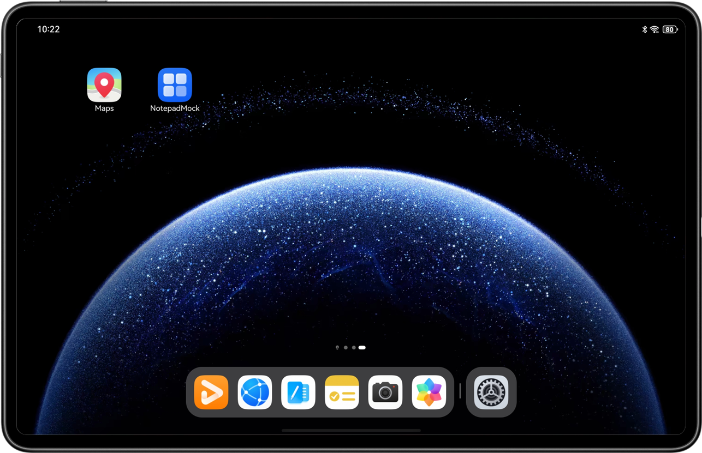
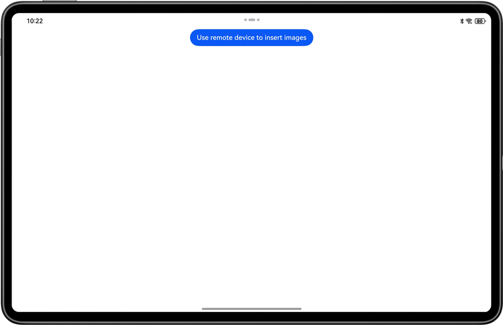
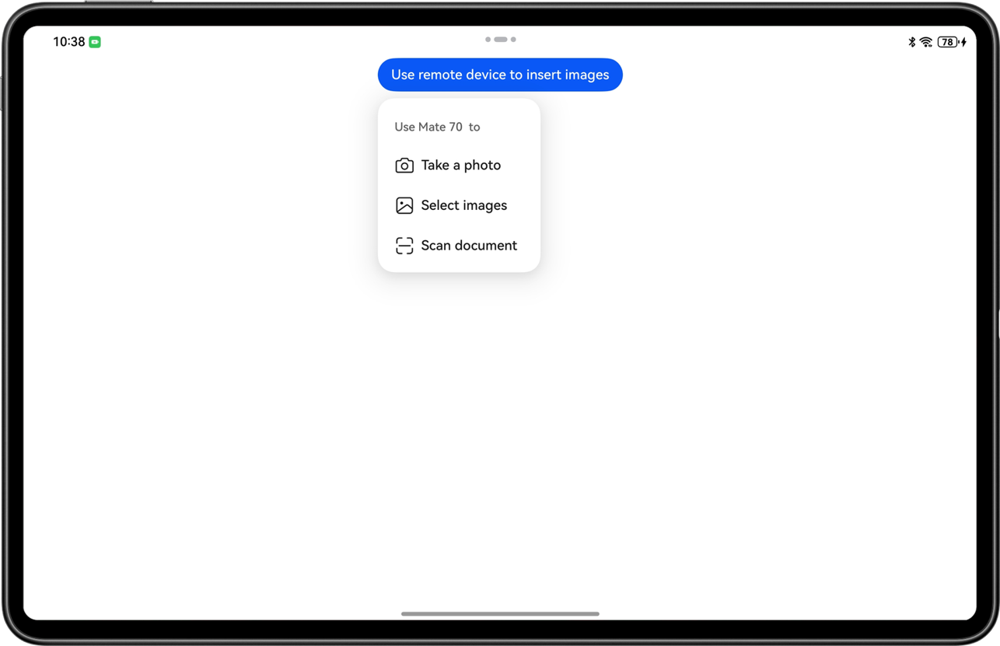
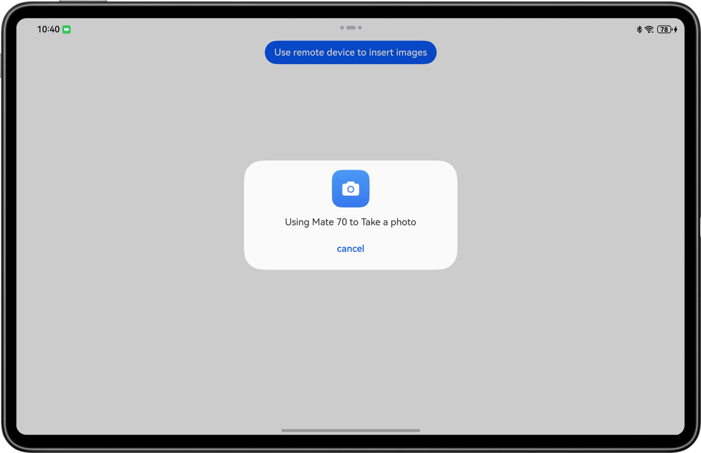
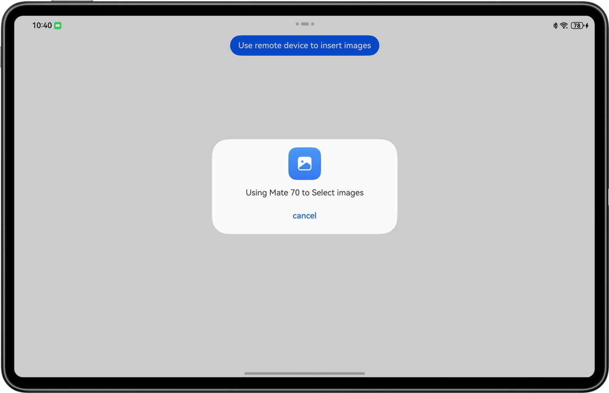
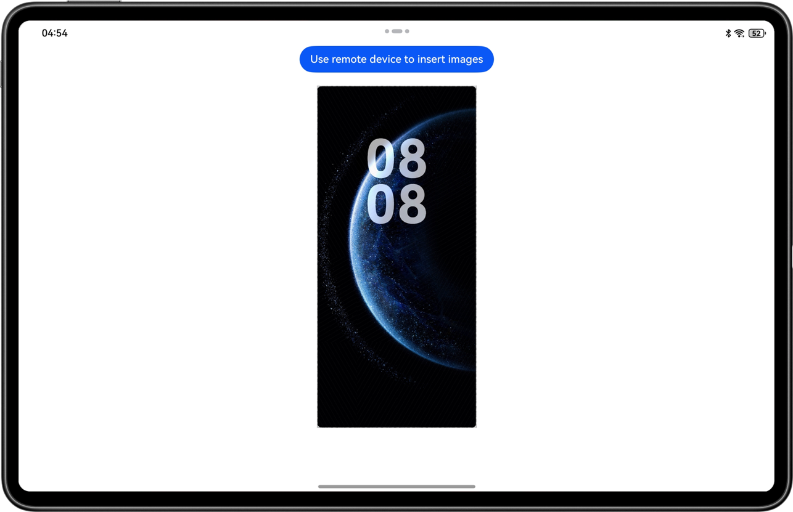

# Implementing Device Interconnectivity (C++)

## Overview

This sample shows the Device Interconnectivity capability provided by the distributed collaboration framework.

This sample uses the C++ APIs provided by Service Collaboration Kit to simulate the scenario where the notepad app on one device calls the camera app on another device to take a photo and then the camera app sends the photo back to the notepad app.

You can also use the document scanning and gallery features of Device Interconnectivity to achieve cross-device operations.


## Code Structure

```
├──entry/src/main
│  ├──cpp
│  │  ├──CMakeLists.txt		          // C file compilation script.
│  │  ├──napi_init.cpp		          // Encapsulate C APIs as ArkTS APIs.
│  │  └──types 
│  │     └──libentry
│  │        ├──Index.d.ts		      // Export the ArkTs APIs after the encapsulation.
│  │        └──oh-package.json5	      // Mapping between ArkTS APIs and dynamic libraries.
│  └──ets
│     ├──entryability
│     │  └──EntryAbility.ets	      // Entry point class.
│     └──pages
│        ├──CustomDialogExample.ets	  // Pop-up class.
│        └──Index.ets   	          // App's home screen.
└──entry/src/main/resources           // App resources.
```

## Preview

|      **Device's home screen**       |           **App's home screen**            |          **Device discovery**           |             **Photo taking**             |
| :---------------------------------: | :----------------------------------------: | :-------------------------------------: | :--------------------------------------: |
|   |         |  |  |
|        **Document scanning**        |                **Gallery**                 |         **Sending back images**         |                                          |
|  |  |  |                                          |


Instructions:

1. Make preparations.
    * Prepare a 2-in-1 device (or tablet) and a mobile phone. Install the sample app on the 2-in-1 device (or tablet), and install a camera app with the cross-device photographing capability on the mobile phone.
    * Sign in to the two devices with the **same** HUAWEI ID.

1. On the home screen of the 2-in-1 device (or tablet), tap **NotePad Mock** to start the app. The **Use remote device to insert images** button is displayed on the home screen of the app.
2. Tap **Use remote device to insert images**. A menu is displayed, listing the available remote device that can take photos, that is, mobile phone in this sample.
3. Tap the **Take a photo** button to wake up the camera app on the remote device.
4. Use the remote device to take a photo and tap **OK**. The photo is sent back to the 2-in-1 device (or tablet) and displayed on the app's home screen.

## How to Implement

In this example, the **Index.ets** file of the ArkTS component is used to call the core function in the NAPI intermediate layer **napi_init.cpp** to start or cancel the Device Interconnectivity capability. Below are the details:
- **index.ets**: Draw main UIs to show the device list upon button tap and show pop-ups during function use.
- **napi_init.cpp**: As the NAPI intermediate layer, it receives user requests on the ArkTS side and calls the Device Interconnectivity capability. The core functions are as follows:
  * **Demo_HMS_ServiceCollaboration_GetCollaborationDeviceInfos**: Call **HMS_ServiceCollaboration_GetCollaborationDeviceInfos** to obtain devices that support the Device Interconnectivity capability. Only devices with the same account signed in and also with Wi-Fi and Bluetooth enabled can be discovered. A 2-in-1 device can call a tablet or mobile phone, and a tablet can call a mobile phone. A device cannot call another device of the same type.
  * **Demo_HMS_ServiceCollaboration_StartCollaboration**: Call **HMS_ServiceCollaboration_StartCollaboration** to start the Device Interconnectivity capability, such as the photo taking, image picking, or document scanning.
  * **Demo_HMS_ServiceCollaboration_StopCollaboration**: Call **HMS_ServiceCollaboration_StopCollaboration** to stop the Device Interconnectivity capability, such as canceling the remote camera shooting, image picking, or document scanning.
- **index.d.ts**: Declare core functions of the NAPI layer in this file.

## Required Permissions

N/A.

## Dependency

The device where the sample code runs must support Wi-Fi.

## Constraints
1. The sample code can only run on devices with a standard system.
2. The HarmonyOS version must be HarmonyOS NEXT Developer Beta1 or later.
3. The DevEco Studio version must be DevEco Studio NEXT Developer Beta1 or later.
4. The HarmonyOS SDK version must be HarmonyOS NEXT Developer Beta1 SDK or later.
5. Wi-Fi and Bluetooth of the device that runs the sample code and the remote device must be enabled and the same HUAWEI ID should be signed in.
6. The API calls can be initiated from a device to a more portable device, for example, from a 2-in-1 device to a tablet or mobile phone, or from a tablet to a mobile phone. If the sample app runs on a mobile phone, the device menu will not be displayed.
