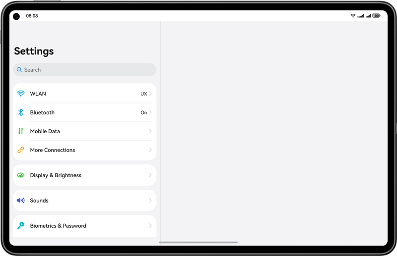

# Typical Setting Page

### Overview

This sample shows a typical page for setting an application. The page has different display effects in the small window and large window, reflecting the capability of one-time development for multi-device deployment. 

1. The adaptive layout and responsive layout are used to ensure that the app can be properly displayed on devices irrespective of screen sizes.
2. The **Navigation** component is used to display a small window in one column and a large window in two columns.

### Preview

Below shows the display effects of this sample in different window sizes.




### How to Use

1. Start the app and check tits display effect in full screen mode.
2. Go to `WLAN` > `More settings` to check the display effect of the app.
3. Choose `More Connections` > `NFC` to check the display effect of the app.

### Project Directory
```
├──features/settingitems/src/main/ets              // Code area
│  ├──components
│  │  ├──ItemDescription.ets                       // Title description of each unit group module
│  │  ├──ItemGroup.ets                             // Unit group
│  │  ├──MainItem.ets                              // Main framework
│  │  ├──SearchBox.ets                             // Search box
│  │  ├──SubItemArrow.ets                          // Arrow jump component
│  │  ├──SubItemToggle.ets                         // Status button component
│  │  └──SubItemWifi.ets                           // Subnet list module  
│  ├──moreconnections  
│  │  ├──MoreConnectionsItem.ets                   // More connections module
│  │  └──Nfc.ets                                   // NFC object operation class
│  ├──settinglist
│  │  └──SettingList.ets                           // Setting page
│  └──wlan                                    
│     ├──WlanMoreSetting.ets                       // More network settings
│     └──WlanSettingItem.ets                       // Network setting module
└──entry/src/main/resources                        // App resources
                                  
```

### How to Implement
This sample describes how to implement the single-column and dual-column design scenarios under different breakpoints. 
#### Single-/Dual-Column Display
The **Navigation** component is used to implement single-column or dual-column display. It consists of two areas: **Navbar** (main page) and **Content** (subpage). The **Navigation** component supports the **Stack**, **Split**, and **Auto** modes.   
1. Stack mode: The navigation bar and content area are displayed independently, which is equivalent to multiple pages. Display effect: The page jumps to **Content1** (WLAN page) from the **Navbar** page and then to Content2 (more WLAN modes). 
2. Split mode: The navigation bar and content are displayed in two columns. Display effect: Navbar+Content1. 
3. Auto mode: The **Navigation** component can automatically select a proper mode based on the application window size. If the window width is less than 520 vp, the **Stack** mode is applied. If the window width is greater than or equal to 520 vp, the **Split** mode is applied. When the window size changes, the **Navigation** component automatically switches between the Stack mode and the Split mode. For details about the source code, see [Source Code Reference] (products/default/src/main/ets/pages/Index.ets).

#### Redirect or Re-render upon a Tap
The **Navigation** component is usually used together with the **NavRouter** and **NavDestination** components.
* The **NavRouter** component controls  the page content display and re-renders of the **Navigation** component. It includes two child nodes. 
1. Container component: directly controls the display effect of **NavRouter**. 
2. **NavDestination** component: re-renders the content area of the **Navigation** component. 
3. The **NavRouter** component notifies you of the **NavRouter** status through the **onStateChange** callback event. When a user taps **NavRouter**, activates it, and loads its child component, the **onStateChange(true)** is called. 
4. **onStateChange(false)** is called when the **NavDestination** child component is not displayed.
* The **NavDestination** component is used to re-render the **Content** area of the **Navigation** component.
* In this sample, the WLAN function item is the first child node of **NavRouter**, and the redirected subpage WLAN is its second child node. For details about the source code, see [Source code reference](features/settingitems/src/main/ets/wlan/WlanSettingItem.ets).
#### Multi-level jump
The **Navigation** component can automatically switch between the single- and dual-column mode. In addition, the component can add the back button and respond to the back button event called by the system based on the current state. For details about the source code, see [Source Code Reference](features/settingitems/src/main/ets/wlan/WlanMoreSetting.ets). 
1. Activate **WLANSettingItem** in **SettingList** to load and display **WlanSetting**. 
2. Activate **WlanMoreSettingItem** in **WlanSetting** to load and display **WlanMoreSetting**.

### Required Permissions

N/A

### Dependencies

N/A

### Constraints

1. The sample app is supported only on Huawei phones, tablets running the standard system.

2. The HarmonyOS version must be HarmonyOS 5.0.5 Release or later.

3. The DevEco Studio version must be DevEco Studio 5.0.5 Release or later.

4. The HarmonyOS SDK version must be HarmonyOS 5.0.5 Release or later.
