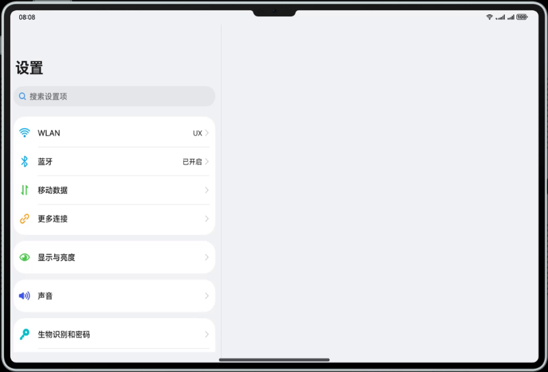

# 开发设置应用页面功能

### 介绍

本示例展示了设置应用的典型页面，其在小窗口和大窗口有不同的显示效果，体现一次开发、多端部署的能力。  

1. 本示例使用一次开发多端部署中介绍的自适应布局能力和响应式布局能力进行多设备（或多窗口尺寸）适配，保证应用在不同设备或不同窗口尺寸下可以正常显示。
2. 本示例使用Navigation组件，实现小窗口单栏显示、大窗口双栏显示的效果。

### 效果预览

本示例在不同窗口尺寸下的显示效果。




使用说明：

1. 启动应用，查看应用在全屏状态下的显示效果。
2. 依次点击`WLAN` -> `更多WLAN设置`，查看应用的显示效果。
3. 依次点击`更多连接`->`NFC`，查看应用的显示效果。

### 工程目录
```
├──features/settingitems/src/main/ets              // 代码区
│  ├──components
│  │  ├──ItemDescription.ets                       // 每个单元组模块前的标题描述模块
│  │  ├──ItemGroup.ets                             // 单元组模块
│  │  ├──MainItem.ets                              // 主体框架模块
│  │  ├──SearchBox.ets                             // 搜索框模块
│  │  ├──SubItemArrow.ets                          // 下一步模块(箭头跳转组件)
│  │  ├──SubItemToggle.ets                         // 状态按钮组件
│  │  └──SubItemWifi.ets                           // 子网络列表模块   
│  ├──moreconnections  
│  │  ├──MoreConnectionsItem.ets                   // 更多连接模块
│  │  └──Nfc.ets                                   // nfc对象操作类
│  ├──settinglist
│  │  └──SettingList.ets                           // 设置页面
│  └──wlan                                    
│     ├──WlanMoreSetting.ets                       // 更多网络设置模块
│     └──WlanSettingItem.ets                       // 网络设置模块
└──entry/src/main/resources                        // 应用资源目录
                                  
```

### 具体实现
本示例介绍如何实现不同断点下存在单栏和双栏设计的场景，主要有以下三方面：
#### 实现单/双栏的显示效果
通过Navigation组件实现单/双栏展示，由Navbar(设置主页面)和Content(跳转子页面)两部分区域组成，Navigation组件支持Stack、Split以及Auto三种模式。    
1、stack模式：导航栏与内容区独立显示，相当于多个页面。展示效果：从Navbar(设置主页面)跳转到Content1(WLAN页面)跳转到Content2(更多WLAN模式)。  
2、Split模式：导航栏与内容区分两栏显示。展示效果：Navbar+Content1。  
3、auto模式：Navigation组件可以根据应用窗口尺寸，自动选择合适的模式：窗口宽度小于520vp时，采用Stack模式显示；窗口宽度大于等于520vp时，采用Split模式显示。当窗口尺寸发生改变时，Navigation组件也会自动在Stack模式和Split模式之间切换。[源码参考](products/default/src/main/ets/pages/Index.ets )。

#### 实现点击跳转或刷新
Navigation组件通常搭配NavRouter组件以及NavDestination组件一起使用：
* NavRouter组件用于控制Navigation组件Content区域的显示和刷新逻辑：其必须包含两个孩子节点。  
1、容器类组件-直接控制NavRouter的显示效果。  
2、NavDestination组件：刷新Navigation组件Content区域的显示。  
3、NavRouter组件通过onStateChange回调事件，用于通知开发者NavRouter的状态：用户点击NavRouter，激活NavRouter并加载对应的NavDestination子组件时，回调onStateChange(true)；  
4、NavRouter对应的NavDestination子组件不再显示时，回调onStateChange(false)。
* NavDestination组件用于实际刷新Navigation组件Content区域的显示。
* 例如：在本示例中wlan功能项为NavRouter的第一个孩子节点，跳转的子页面WLAN为NavRouter的第二个孩子节点，[源码参考](features/settingitems/src/main/ets/wlan/WlanSettingItem.ets )。
#### 实现多级跳转
Navigation组件支持自动切换单栏和双栏的显示效果，同时可以根据当前状态自动添加返回键及响应系统的返回键事件。[源码参考](features/settingitems/src/main/ets/wlan/WlanMoreSetting.ets )。  
1、通过激活SettingList中的WLANSettingItem，可以加载及显示WlanSetting。  
2、激活WlanSetting中的WlanMoreSettingItem，可以加载及显示WlanMoreSetting。

### 相关权限

不涉及。

### 依赖

不涉及。

### 约束与限制

1.本示例仅支持标准系统上运行，支持设备：华为手机、平板。

2.HarmonyOS系统：HarmonyOS 5.0.5 Release及以上。

3.DevEco Studio版本：DevEco Studio 5.0.5 Release及以上。

4.HarmonyOS SDK版本：HarmonyOS 5.0.5 Release SDK及以上。