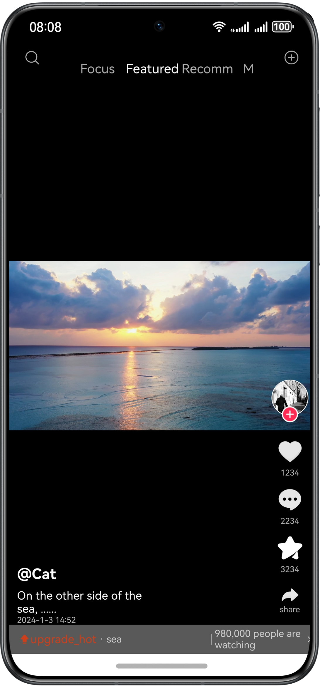

# Short Video Switching

### Overview

This sample demonstrates the switching of short videos based on the **Swiper** component.

### Preview


### How to Use

1. Open the app, and the short video screen is displayed.

2. Swipe up or down to switch between short videos.

### Project Directory
```
├──entry/src/main/ets               
│  ├──common
│  │  └──CommonConstants.ets       // Common constants              
│  ├──entryability  
│  │  └──EntryAbility.ets          // Entry ability
│  ├──model
│  │  ├──BasicDataSource.ets       // Lazy loading data sources
│  │  └──DataModel.ets             // Data classes
│  ├──pages                                     
│  │  └──Index.ets                 // Home page
│  └──view
│     ├──Side.ets                  // Video information
│     └──VideoSwiper.ets           // Video swiper components
└──entry/src/main/resources        // Static resources
```

### Required Permissions

N/A

### Constraints

1. The sample app is supported only on Huawei phones running the standard system.

2. The HarmonyOS version must be HarmonyOS 5.0.5 Release or later.

3. The DevEco Studio version must be DevEco Studio 5.0.5 Release or later.

4. The HarmonyOS SDK version must be HarmonyOS 5.0.5 Release or later.
