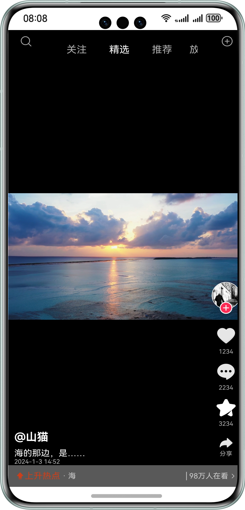

# 基于Swiper组件实现短视频切换功能

### 简介

本示例基于Swiper组件实现了短视频的滑动上下切换，便于用户进行基础的视频切换功能开发。

### 效果预览


使用说明：

1.启动应用后显示短视频界面。

2.上下滑动切换短视频。

### 工程目录
```
├──entry/src/main/ets               
│  ├──common
│  │  └──CommonConstants.ets       // 常量类               
│  ├──entryability  
│  │  └──EntryAbility.ets          // 程序入口
│  ├──model
│  │  ├──BasicDataSource.ets       // 懒加载DataSource
│  │  └──DataModel.ets             // 数据类
│  ├──pages                                     
│  │  └──Index.ets                 // 首页
│  └──view
│     ├──Side.ets                  // 视频信息
│     └──VideoSwiper.ets           // 视频滑动组件
└──entry/src/main/resources        // 应用资源目录
```

### 相关权限

不涉及

### 约束与限制

1.本示例仅支持标准系统上运行，支持设备：华为手机。

2.HarmonyOS系统：HarmonyOS 5.0.5 Release及以上。

3.DevEco Studio版本：DevEco Studio 5.0.5 Release及以上。

4.HarmonyOS SDK版本：HarmonyOS 5.0.5 Release SDK及以上。
