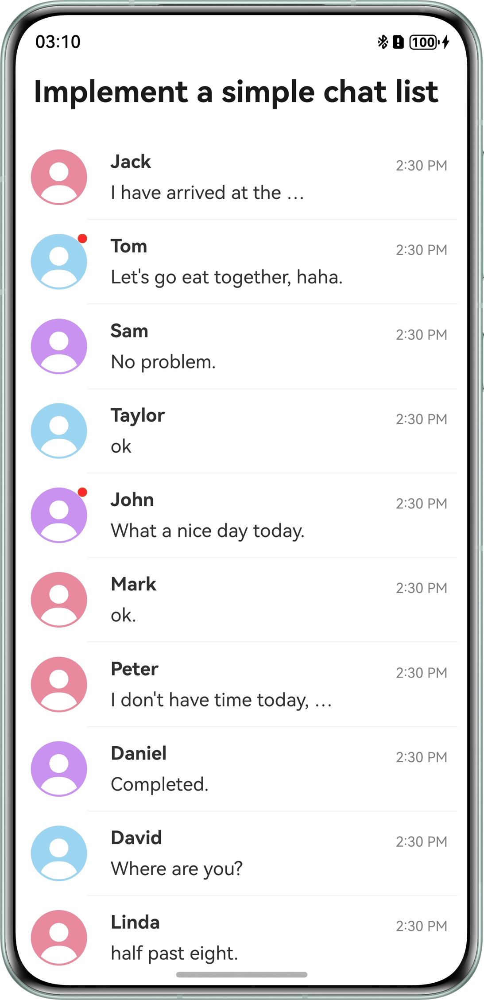

# Simple Chat List

## Overview
This sample demonstrates how to implement a simple chat list using the List component, covering the contacts page and chat page. Users can swipe left to delete, pin to the top, return to the top, drag to sort, add chat records, and pull down to load more.

## Preview


## Project Directory
```
├──entry/src/main/ets       // Code area 
│ ├──common 
│ |  └──CommonConstants.ets // List data 
│ ├──entryability 
│ |  └──EntryAbility.ets    // Application entry 
│ ├──entrybackupability 
│ |  └──EntryBackupAbility.ets 
│ └──pages 
│    ├──ChatPage.ets        // Chat page 
│    └──Index.ets           // Contacts page 
└──entry/src/main/resources // Application resources

```
## How to Use
1.	Open the application home page, swipe left on a list item, and tap the corresponding button to pin or delete the list item.
2.	Swipe down on the page and tap the corresponding button to return to the top.
3.	Press and hold a list item and drag it to reorder.
4.	Tap a list item to open the chat page. By default, it shows the latest messages at the bottom. You can swipe down to load more chat records.
5.	Tap the text box to type and send your message. The latest message is displayed in real time.

## Required Permissions
N/A

## Constraints
* The sample is only supported on Huawei phones with standard systems.

* The HarmonyOS version must be HarmonyOS 5.0.5 Release or later.

* The DevEco Studio version must be DevEco Studio 5.0.5 Release or later.

* The HarmonyOS SDK version must be HarmonyOS 5.0.5 Release SDK or later.

