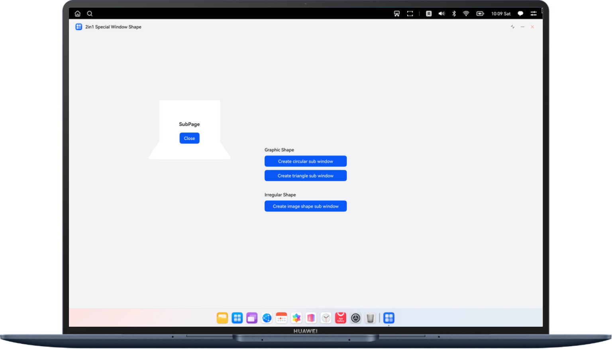

# Creating Irregularly Shaped Windows on a 2-in-1 Device

### Overview

This sample describes how to use APIs such as **setWindowMask()** to create subwindows in irregular shapes such as circles, triangles, and image shapes on a 2-in-1 device, helping you develop non-rectangular subwindows.

### Preview
|                                  |
|----------------------------------|
| Circular subwindow               |
|  |
| Triangular subwindow             |
|  |
| Image shape subwindow            |
|  |


### How to Use

After entering the app, click the Creating a Circular Subwindow, Creating a Triangular Subwindow, or Creating an Image Shape Subwindow button to create and display the corresponding subwindow. Clicking the close button in the subwindow can close the subwindow.


### Project Directory

```
├───entry/src/main/ets
│   ├───common
│   │   └───Constants.ets                            // Common constants
│   ├───entryability
│   │   └───EntryAbility.ets                         // Ability lifecycle
│   ├───pages
│   │   ├───Index.ets                                // Home page
│   │   └───SubPage.ets                              // Subwindow page
│   └───utils
│       ├───ImageUtils.ets                           // Image utilities
│       └───WindowUtils.ets                          // Window utilities
└───entry/src/main/resources                         // App resource directory
```

### How to Implement

1. Add **SystemCapability.Window.SessionManager** to the **syscap.json** file in the **module/src/main** directory.
2. Use **createSubWindow()** to create a subwindow in the code, set the position, size, and other attributes of the subwindow, and set the page to be loaded by using **setUIContent()**.
3. Calculate the 2D array mask **windowMask** based on the shape of the irregularly shaped subwindow to be implemented, and use **setWindowMask(windowMask)** to set the subwindow shape.
4. Call the **showWindow()** API to display the irregularly shaped subwindow.

### Permissions

N/A

### Constraints

1. The sample is only supported on Huawei 2-in-1 devices with standard systems.

2. The HarmonyOS version must be HarmonyOS 5.0.5 Release or later.

3. The DevEco Studio version must be DevEco Studio 5.0.5 Release or later.

4. The HarmonyOS SDK version must be HarmonyOS 5.0.5 Release SDK or later.