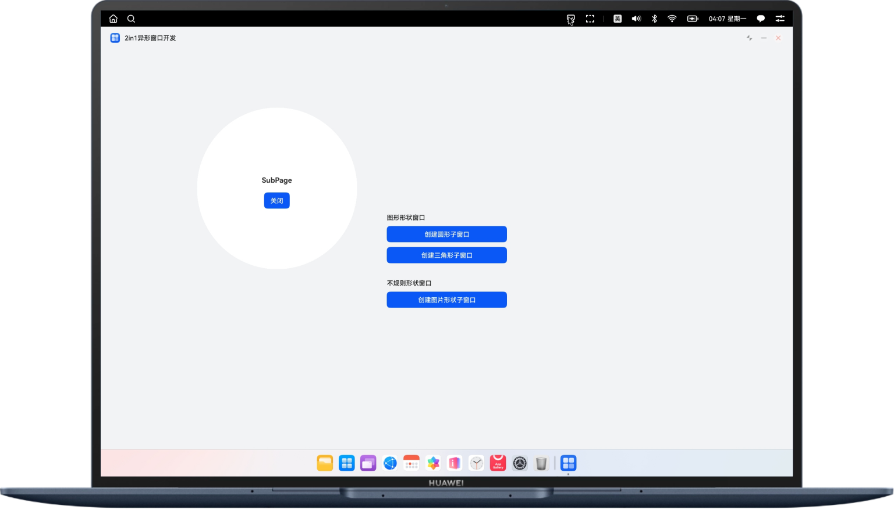
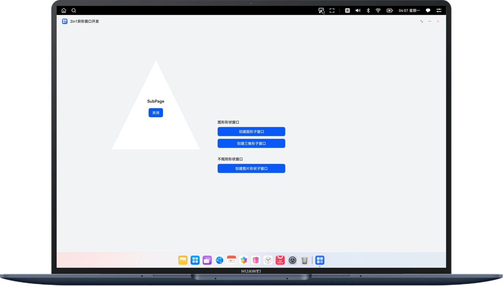
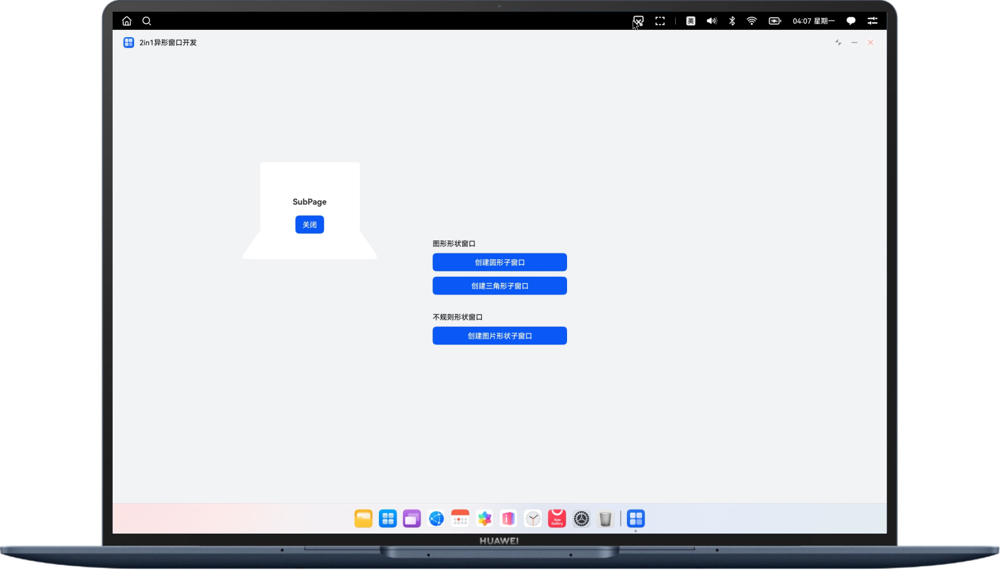

# 实现PC/2in1异形窗口功能

### 介绍

本示例通过使用setWindowMask()等接口，实现了在PC/2in1设备上创建圆形、三角形、图片形状等异形子窗口的功能，帮助开发者掌握非矩形窗口的场景开发。

### 效果预览
|                              | 
|-----------------------------------|
| 圆形子窗口                             | 
|      | 
| 三角形子窗口                            | 
|      | 
| 图片形状子窗口                           | 
|      | 


### 使用说明

进入应用后，点击创建圆形子窗口/创建三角形子窗口/创建图片形状子窗口，创建并显示对应形状子窗口，点击子窗口中关闭按钮，子窗口关闭。


### 工程目录

   ```
    ├───entry/src/main/ets                             
    │   ├───common
    │   │   └───Constants.ets                            // 公用常量
    │   ├───entryability
    │   │   └───EntryAbility.ets                         // Ability生命周期
    │   ├───pages
    │   │   ├───Index.ets                                // 主页面
    │   │   └───SubPage.ets                              // 子窗口页面
    │   └───utils
    │       ├───ImageUtils.ets                           // 图片工具类
    │       └───WindowUtils.ets                          // 窗口工具类
    └───entry/src/main/resources                         // 应用资源目录
   ```

### 具体实现

1. 在模块/src/main目录下，配置syscap.json文件，添加"SystemCapability.Window.SessionManager"。
2. 代码中使用createSubWindow()创建子窗口，设置窗口位置、大小及其他属性等，使用setUIContent()接口设置加载的page页面。
3. 根据要实现的异形窗口形状，计算二维数组掩码windowMask，使用setWindowMask(windowMask)，设置窗口形状。
4. 使用showWindow()接口显示异形子窗口。

### 相关权限

不涉及

### 约束与限制

1.本示例仅支持标准系统上运行，支持设备：PC/2in1。

2.HarmonyOS系统：HarmonyOS 5.0.5 Release及以上。

3.DevEco Studio版本：DevEco Studio 5.0.5 Release及以上。

4.HarmonyOS SDK版本：HarmonyOS 5.0.5 Release SDK及以上。