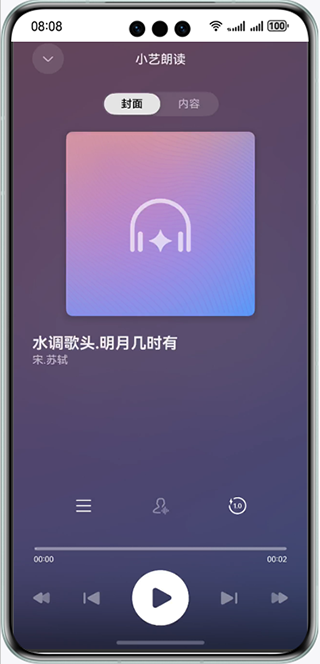

# Speech Kit

### 介绍
本示例展示了语音类AI能力中的朗读控件能力。

本示例模拟了在应用里，通过点击朗读听筒，跳转朗读控件播放面板并对文章进行朗读的场景。

需要使用HiAI引擎框架中的@kit.SpeechKit.d.ts接口。

### 效果预览


### 工程目录
```
├─entry/src/main/ets                         // 代码区
│  ├─entryability
│  │  └─EntryAbility.ets       
│  ├─model
│  │  ├─Article.ets                          // 文章数据结构
│  └─pages
│     └─Index.ets                            // 主页界面
├─entry/src/main/resources                   // 应用资源目录
└─screenshots                                // 截图
```

### 具体实现

本示例模拟了在应用里，通过点击朗读听筒，跳转朗读控件播放面板并对文章进行朗读的场景。
业务使用时，需要先进行import导入Speech kit: `import { TextReader, TextReaderIcon, ReadStateCode } from '@kit.SpeechKit';`

涉及接口：
* `init(context: common.BaseContext, readParams: ReaderParam): Promise<void>` [链接](https://developer.huawei.com/consumer/cn/doc/harmonyos-references/speech-textreader-api#section173751154134515)
* `start(readInfoList: ReadInfo[], articleId?: string): Promise<void>` [链接](https://developer.huawei.com/consumer/cn/doc/harmonyos-references/speech-textreader-api#section143611912403)
* `on(type: 'setArticle', callback: Callback<string>): void` [链接](https://developer.huawei.com/consumer/cn/doc/harmonyos-references/speech-textreader-api#section19795822172419)
* `on(type: 'clickArticle' | 'clickAuthor' | 'clickNotification', callback: Callback<string>): void` [链接](https://developer.huawei.com/consumer/cn/doc/harmonyos-references/speech-textreader-api#section580115319280)
* `on(type: 'showPanel' | 'hidePanel', callback: Callback<void>): void` [链接](https://developer.huawei.com/consumer/cn/doc/harmonyos-references/speech-textreader-api#section4889437173513)
* `on(type: 'stop' | 'release', callback: Callback<void>): void` [链接](https://developer.huawei.com/consumer/cn/doc/harmonyos-references/speech-textreader-api#section1444125912412)
* `on(type: 'stateChange', callback: Callback<ReadState>): void` [链接](https://developer.huawei.com/consumer/cn/doc/harmonyos-references/speech-textreader-api#section1518073310454)
* `on(type: 'requestMore', callback: Callback<void>): void` [链接](https://developer.huawei.com/consumer/cn/doc/harmonyos-references/speech-textreader-api#section14269319175019)

涉及组件：
* `TextReaderIcon` [链接](https://developer.huawei.com/consumer/cn/doc/harmonyos-references/speech-textreadericon#section71306437290)

调用验证结果接口，接收处理返回的结果。参考entry/src/main/ets/pages/Index.ets.

### 相关权限
获取联网权限: ohos.permission.INTERNET

### 约束与限制

1. 本示例仅支持标准系统上运行，支持设备：Phone、Tablet、和2in1。
2. HarmonyOS系统：HarmonyOS NEXT Developer Beta1及以上。
3. DevEco Studio版本：DevEco Studio NEXT Developer Beta1及以上。
4. HarmonyOS SDK版本：HarmonyOS NEXT Developer Beta1 SDK及以上。