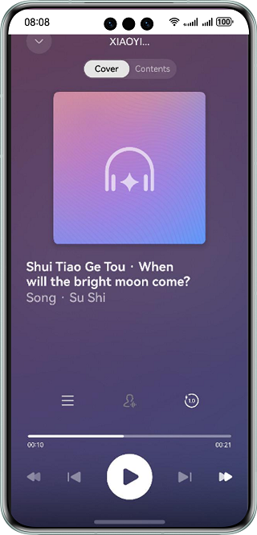

# Speech Kit

### Overview
This sample code illustrates how to use the TextReader in voice AI capabilities.

This example simulates a scenario in which you tap the read receiver to jump to the TextReader playback panel and the TextReader reads text.

You need to use **@kit.SpeechKit.d.ts**, which contains related APIs.

### Preview


### Project Directory
```
├─entry/src/main/ets                         // Code area
│  ├─entryability
│  │  └─EntryAbility.ets       
│  ├─model
│  │  ├─Article.ets                          // Article data structure
│  └─pages
│     └─Index.ets                            // Home page
├─entry/src/main/resources                   // App resource directory
└─screenshots                                // Screenshots
```

### How to Implement

This example simulates a scenario in which you tap the read receiver to jump to the TextReader playback panel and the TextReader reads text.
Before using the service, you need to perform the following operation: `import { TextReader, TextReaderIcon, ReadStateCode } from '@kit.SpeechKit'`

The following APIs are involved:
* `init(context: common.BaseContext, readParams: ReaderParam): Promise<void>` [Link](https://developer.huawei.com/consumer/en/doc/harmonyos-references/speech-textreader-api#section173751154134515)
* `start(readInfoList: ReadInfo[], articleId?: string): Promise<void>` [Link](https://developer.huawei.com/consumer/en/doc/harmonyos-references/speech-textreader-api#section143611912403)
* `on(type: 'setArticle', callback: Callback<string>): void` [Link](https://developer.huawei.com/consumer/en/doc/harmonyos-references/speech-textreader-api#section19795822172419)
* `on(type: 'clickArticle' | 'clickAuthor' | 'clickNotification', callback: Callback<string>): void` [Link](https://developer.huawei.com/consumer/en/doc/harmonyos-references/speech-textreader-api#section580115319280)
* `on(type: 'showPanel' | 'hidePanel', callback: Callback<void>): void` [Link](https://developer.huawei.com/consumer/en/doc/harmonyos-references/speech-textreader-api#section4889437173513)
* `on(type: 'stop' | 'release', callback: Callback<void>): void` [Link](https://developer.huawei.com/consumer/en/doc/harmonyos-references/speech-textreader-api#section1444125912412)
* `on(type: 'stateChange', callback: Callback<ReadState>): void` [Link](https://developer.huawei.com/consumer/en/doc/harmonyos-references/speech-textreader-api#section1518073310454)
* `on(type: 'requestMore', callback: Callback<void>): void` [Link](https://developer.huawei.com/consumer/en/doc/harmonyos-references/speech-textreader-api#section14269319175019)

The following components are involved:
* `TextReaderIcon` [Link](https://developer.huawei.com/consumer/en/doc/harmonyos-references/speech-textreadericon#section71306437290)

Call the TextReader verification API and receive the processing result. For details, please refer to **entry/src/main/ets/pages/Index.ets**.

### Required Permissions
Permission to access the Internet: ohos.permission.INTERNET

### Constraints

1. The sample app is supported only on Huawei phones, tablets, and 2in1 devices running the standard system.
2. The HarmonyOS version must be HarmonyOS NEXT Developer Beta1 or later.
3. The DevEco Studio version must be DevEco Studio NEXT Developer Beta1 or later.
4. The HarmonyOS SDK version must be HarmonyOS NEXT Developer Beta1 or later.
