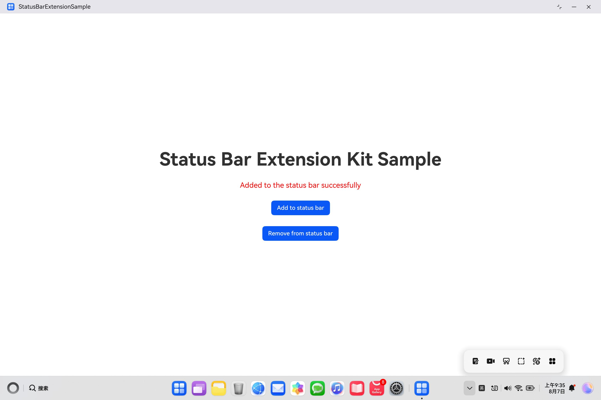

# 状态栏开放服务
## 介绍
本示例展示了应用如何接入状态栏，将图标添加到状态栏中显示
需要使用状态栏管理服务@kit.StatusBarExtensionKit

## 效果预览

### 添加图标



### 移除图标


## 使用说明

1.运行demo

2.点击demo运行界面中的“Add to status bar”按键，demo中自定义的图标被添加到状态栏中

3.点击demo运行界面中的“Remove from status bar”按键，状态栏中的图标被移除

## 工程目录

```
├─entry/src/main/ets    
│ ├─entryability    
│ │ └─EntryAbility.ets  // 本地启动ability     
│ ├─pages                
│ │ └─Index.ets  // demo展示界面                 
│ │ └─StatusBarPage.ets   // 状态栏左键弹窗显示页面                
│ ├─statusbarviewextensionability   
│ │ └─MyStatusBarViewAbility.ets  // 自定义StatusBarViewExtensionAbility  
├─entry/src/main/resources
│ ├─rawfile
│ │ └─testBlack.svg  // 浅色壁纸下展示的图标
│ │ └─testWhite.svg  // 深色壁纸下展示的图标
```

## 具体实现
在@kit.StatusBarExtensionKit定义了状态栏管理服务的接口API：
使用了如下接口进行业务实现：


```
addToStatusBar(context: common.Context, statusbarItem: StatusBarItem): void;
removeFromStatusBar(context: common.Context): void;
```

自定义StatusBarExtensionAbility时，需要导入对应模块：
import { StatusBarViewExtensionAbility } from '@kit.StatusBarExtensionKit';
参考 entry\src\main\ets\statusbarviewextensionability\MyStatusBarViewAbility.ets 文件

使用添加移除等功能时，需要导入statusBarManager模块：
import { statusBarManager } from '@kit.StatusBarExtensionKit';
参考 entry\src\main\ets\pages\Index.ets 文件

## 相关权限
无

## 依赖
无

## 约束与限制
1.设备类型：2in1。

2.HarmonyOS系统：HarmonyOS NEXT Developer Beta1及以上。

3.DevEco Studio版本：DevEco Studio NEXT Developer Beta1及以上。

4.HarmonyOS SDK版本：HarmonyOS NEXT Developer Beta1 SDK及以上。