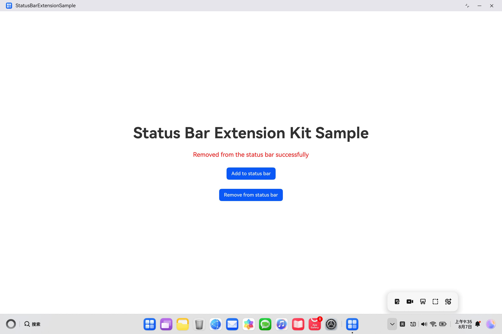

# Status Bar Extension Kit

## Introduction

This example shows how to connect an application to the status bar and add an icon to the status bar.
The Status Bar Extension Kit API @kit.StatusBarExtensionKit is required.

## Preview

### AddToStatusBar


### RemoveFromStatusBar



## Direction for use
1.Start up the demo.

2.Click "Add to status bar" on the demo running page. The customized icon is added to the status bar.

3.Click "Remove from status bar" on the demo running page. The customized icon is removed from the status bar

## Project Directory

```
├─entry/src/main/ets    
│ ├─entryability    
│ │ └─EntryAbility.ets  // Ability for local startup.     
│ ├─pages                
│ │ └─Index.ets  //  Demo display page.               
│ │ └─StatusBarPage.ets   // The pop-up display window when usrs click an app icon in the status bar.            
│ ├─statusbarviewextensionability   
│ │ └─MyStatusBarViewAbility.ets  // The custom StatusBarViewExtensionAbility.
├─entry/src/main/resources
│ ├─rawfile
│ │ └─testBlack.svg  // The icon displayed on a light-colored wallpaper
│ │ └─testWhite.svg  // The icon displayed on a dark-colored wallpaper
```

## Implementation Details

Define the APIs of Preview Kit in @kit.StatusBarExtensionKit. The following APIs are used to implement services:

The following APIs are used to implement services:


```
addToStatusBar(context: common.Context, statusbarItem: StatusBarItem): void;
removeFromStatusBar(context: common.Context): void;
```

Before customizing StatusBarExtensionAbility, you need to import the following:
import { StatusBarViewExtensionAbility } from '@kit.StatusBarExtensionKit';
See the entry\src\main\ets\statusbarviewextensionability\MyStatusBarViewAbility.ets file.

Before using apis such as addToStatusBar or removeFromStatusBar, you need to import statusBarManager:
import { statusBarManager } from '@kit.StatusBarExtensionKit';
See the entry\src\main\ets\pages\Index.ets file.

## Required Permissions

None

## Dependency

None

## Constraints

1.Device：Huawei 2-in-1 devices。

2.HarmonyOS：HarmonyOS NEXT Developer Beta1 or later。

3.DevEco Studio：DevEco Studio NEXT Developer Beta1 or later。

4.HarmonyOS SDK：HarmonyOS NEXT Developer Beta1 SDK or later。